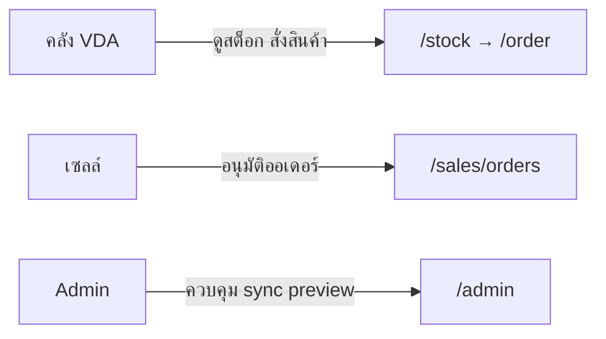

# VMI Project Wiki — หน้าแรก

> **Vendor Managed Inventory (VMI)** — ระบบจัดการสต็อกคลัง VDA แนะนำการสั่งสินค้า และ workflow อนุมัติคำสั่งซื้อโดยทีมเซลล์

---

## สารบัญ Wiki

| หน้า | หัวข้อ | สำหรับใคร |
|------|--------|-----------|
| [01 — ภาพรวมโปรเจกต์](./01-overview.md) | วัตถุประสงค์ บทบาทผู้ใช้ Tech stack | ทุกคน |
| [02 — สถาปัตยกรรม](./02-architecture.md) | Data flow โครงโฟลเดอร์ Middleware | Dev / Architect |
| [03 — การยืนยันตัวตน](./03-authentication.md) | VDA login, Microsoft OAuth, Admin | Dev / IT |
| [04 — คู่มือผู้ใช้](./04-user-guide.md) | หน้าจอและ flow การใช้งาน | VDA / เซลล์ / Admin |
| [05 — API Reference](./05-api-reference.md) | รายการ API ทั้งหมด | Dev |
| [06 — Fabric / OneLake](./06-fabric-integration.md) | Sync, scheduler, cache, env | Dev / Ops |
| [07 — Data Model](./07-data-model.md) | Prisma schema, ข้อมูลจากไหน | Dev / DBA |
| [08 — กฎทางธุรกิจ](./08-business-rules.md) | CVD, ออเดอร์, โปร C4 | Business / Dev |
| [09 — Production Deploy](./09-deployment.md) | Docker, nginx, Azure | Ops / Dev |
| [10 — ปฏิบัติการ & แก้ปัญหา](./10-operations-troubleshooting.md) | Health, backup, FAQ | Ops / Support |

---

## Quick Links

| รายการ | ค่า |
|--------|-----|
| Repository | `VMI` (Next.js monorepo) |
| Dev URL | http://localhost:3000 |
| Production (Docker) | http://127.0.0.1:3001 |
| Health check | `/api/health` |
| Admin panel | `/admin` |
| เอกสาร env | `.env.example` |

---

## บทบาทผู้ใช้ (สรุป)

| บทบาท | เข้าสู่ระบบ | หน้าหลัก |
|-------|-------------|----------|
| **คลัง VDA** | เลือกรหัส VDA (ไม่ใช้ password) | `/stock`, `/order` |
| **เซลล์** | Microsoft Entra ID | `/sales/orders` |
| **Admin** | Microsoft + อีเมลใน `ADMIN_EMAILS` | `/admin` |

---

## สถานะโปรเจกต์

- UI ภาษาไทย
- รองรับจอแคบ (iPad / ครึ่งจอ) — breakpoint หลักที่ **1280px**
- โหมดข้อมูล: `dummy` (dev) / `fabric` (production)
- PO export: stub JSON ที่ `logs/po-export/`

---

## นำเข้า Notion

ดูคู่มือที่ [NOTION-IMPORT.md](./NOTION-IMPORT.md)
