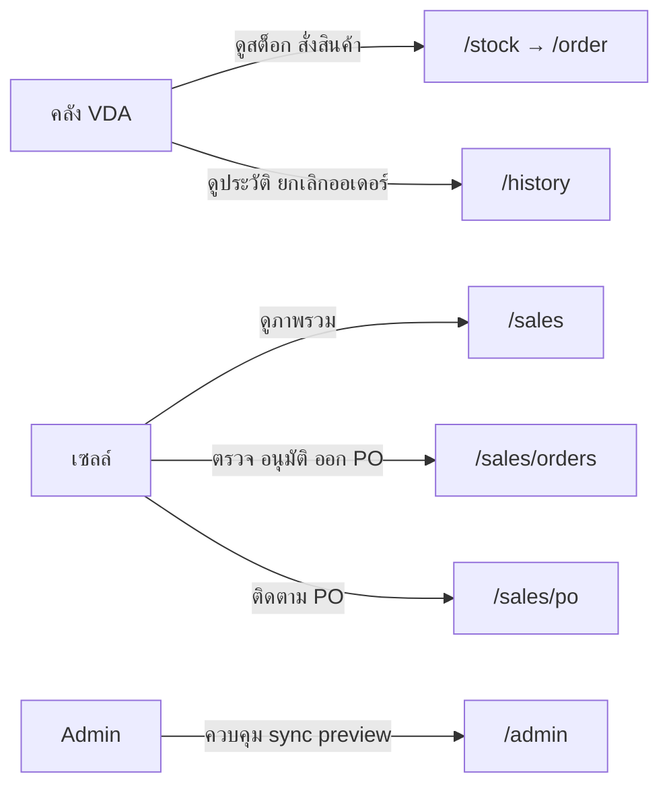

# VMI Project Wiki — หน้าแรก

> **Vendor Managed Inventory (VMI)** — ระบบจัดการสต็อกคลัง VDA แนะนำการสั่งสินค้า และ workflow อนุมัติคำสั่งซื้อโดยทีมเซลล์

---

## สารบัญ Wiki

### เริ่มที่นี่

| ถ้าคุณคือ | อ่านอันนี้ |
|---|---|
| 🧑‍💼 **ผู้ใช้งาน** (ร้าน / เซลล์ / แอดมิน) | [04 — คู่มือผู้ใช้](./04-user-guide.md) |
| 👩‍💻 **นักพัฒนาที่เพิ่งรับช่วงงาน** | [11 — คู่มือนักพัฒนา](./11-developer-guide.md) |
| 🛠️ **คนดูแลระบบ (Ops)** | [09 — Deploy](./09-deployment.md) → [10 — แก้ปัญหา](./10-operations-troubleshooting.md) |

### สารบัญเต็ม

| หน้า | หัวข้อ | สำหรับใคร |
|------|--------|-----------|
| [01 — ภาพรวมโปรเจกต์](./01-overview.md) | วัตถุประสงค์ บทบาทผู้ใช้ Tech stack | ทุกคน |
| [02 — สถาปัตยกรรม](./02-architecture.md) | Data flow โครงโฟลเดอร์ Middleware | Dev / Architect |
| [03 — การยืนยันตัวตน](./03-authentication.md) | Login ร้าน, Microsoft OAuth, Admin | Dev / IT |
| [04 — คู่มือผู้ใช้](./04-user-guide.md) | หน้าจอและ flow การใช้งาน + แก้ปัญหาหน้างาน | VDA / เซลล์ / Admin |
| [05 — API Reference](./05-api-reference.md) | รายการ API ทั้งหมด | Dev |
| [06 — Fabric / OneLake](./06-fabric-integration.md) | Sync, scheduler, cache, env | Dev / Ops |
| [07 — Data Model](./07-data-model.md) | Prisma schema, ข้อมูลจากไหน | Dev / DBA |
| [08 — กฎทางธุรกิจ](./08-business-rules.md) | CVD, ออเดอร์, โปร C4 | Business / Dev |
| [09 — Production Deploy](./09-deployment.md) | Docker, nginx, Azure | Ops / Dev |
| [10 — ปฏิบัติการ & แก้ปัญหา](./10-operations-troubleshooting.md) | Health, backup, FAQ | Ops / Support |
| [11 — คู่มือนักพัฒนา](./11-developer-guide.md) | รับช่วงงาน: setup, กับดัก, วิธีทำงานที่พบบ่อย | Dev (คนใหม่) |

---

## Quick Links

| รายการ | ค่า |
|--------|-----|
| Repository | `VMI` (Next.js App Router) |
| Dev URL | http://localhost:3000/vmi |
| Production (Docker) | host port **3002** → container 3000 · เข้าผ่าน nginx ที่ path `/vmi/` |
| Health check | `/vmi/api/health` |
| Admin panel | `/vmi/admin` |
| เอกสาร env | `.env.example` |
| เทสต์ | `npm test` (vitest · 305 เคส / 27 ไฟล์) |

> **basePath คือ `/vmi`** — ทุก URL ของแอปมี prefix นี้เสมอ (ตั้งใน `next.config.ts`)

---

## บทบาทผู้ใช้ (สรุป)

```mermaid
flowchart LR
    VDA["คลัง VDA"] -->|ดูสต็อก สั่งสินค้า| Stock["/stock → /order"]
    VDA -->|ดูประวัติ ยกเลิกออเดอร์| History["/history"]
    Sales["เซลล์"] -->|ดูภาพรวม| Dash["/sales"]
    Sales -->|ตรวจ อนุมัติ ออก PO| Orders["/sales/orders"]
    Sales -->|ติดตาม PO| Po["/sales/po"]
    Admin["Admin"] -->|ควบคุม sync preview| AdminPage["/admin"]
```

| บทบาท | เข้าสู่ระบบ | หน้าหลัก |
|-------|-------------|----------|
| **คลัง VDA / ร้านค้า** | อีเมล + รหัสผ่าน (`StoreAccount`) | `/stock`, `/order`, `/history`, `/manage` |
| **เซลล์** | Microsoft Entra ID | `/sales` (ภาพรวม), `/sales/orders`, `/sales/po`, `/sales/notifications` |
| **Admin** | Microsoft + อีเมลใน `ADMIN_EMAILS` | `/admin` · เข้าดูร้านได้โดยเลือกรหัส VDA |

---

## สถานะโปรเจกต์

- UI ภาษาไทยทั้งหมด
- รองรับจอแคบ (iPad / ครึ่งจอ) — breakpoint หลักที่ **1280px**
- โหมดข้อมูล: `dummy` (dev) / `fabric` (production)
- PO ออกเลขจริงและมีสถานะติดตาม (ดู [08 — กฎทางธุรกิจ](./08-business-rules.md))
- งานที่ยังค้างอยู่ใน [`docs/IMPROVEMENT-PLAN.md`](../IMPROVEMENT-PLAN.md)

---

## นำเข้า Notion

ดูคู่มือที่ [NOTION-IMPORT.md](./NOTION-IMPORT.md)
