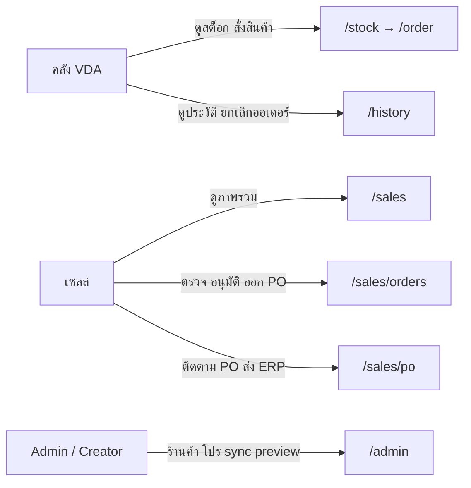

# VMI Project Wiki — หน้าแรก

> **Vendor Managed Inventory (VMI)** — ระบบจัดการสต็อกคลัง VDA แนะนำการสั่งสินค้า
> workflow อนุมัติออเดอร์โดยทีมเซลล์ ออกเลข PO และส่ง PO เข้า ERP

---

## เริ่มที่นี่

| ถ้าคุณคือ | อ่านตามลำดับนี้ |
|---|---|
| 🧑‍💼 **ผู้ใช้งาน** (ร้าน / เซลล์ / แอดมิน) | [01 — ภาพรวม](./01-overview.md) → [04 — คู่มือผู้ใช้](./04-user-guide.md) → [08 — กฎทางธุรกิจ](./08-business-rules.md) (ถ้าอยากรู้ว่าตัวเลขมาจากไหน) |
| 👩‍💻 **นักพัฒนาที่รับช่วงต่อ** | [01 — ภาพรวม](./01-overview.md) → [02 — สถาปัตยกรรม](./02-architecture.md) → [12 — โครงสร้างโปรเจกต์](./12-project-structure.md) → [11 — คู่มือนักพัฒนา](./11-developer-guide.md) → [07 — Data Model](./07-data-model.md) · [05 — API](./05-api-reference.md) |
| 🛠️ **ผู้ดูแลระบบ server** | [09 — Deploy](./09-deployment.md) → [10 — ปฏิบัติการ & แก้ปัญหา](./10-operations-troubleshooting.md) → [06 — Fabric / OneLake](./06-fabric-integration.md) · [03 — การยืนยันตัวตน](./03-authentication.md) |

## สารบัญเต็ม

| หน้า | เนื้อหา | สำหรับใคร |
|------|--------|-----------|
| [00 — หน้าแรก](./00-home.md) | สารบัญ ทางเริ่มอ่านตามบทบาท และสถานะปัจจุบัน | ทุกคน |
| [01 — ภาพรวมโปรเจกต์](./01-overview.md) | ปัญหาทางธุรกิจ บทบาทผู้ใช้ flow หลัก และคำศัพท์สำคัญ (VDA, C4, CVD, MIN/MAX, PO) | ทุกคน |
| [02 — สถาปัตยกรรม](./02-architecture.md) | ผังระบบ data flow ชั้นการยืนยันตัวตน scheduler และรูปแบบที่ใช้ซ้ำ | Dev / Ops |
| [03 — การยืนยันตัวตน](./03-authentication.md) | Login ร้าน, Microsoft Entra ID, Admin/Creator, session และ cookie | Dev / IT |
| [04 — คู่มือผู้ใช้](./04-user-guide.md) | หน้าจอและขั้นตอนการใช้งานของแต่ละบทบาท + แก้ปัญหาหน้างาน | VDA / เซลล์ / Admin |
| [05 — API Reference](./05-api-reference.md) | รายการ API route ทั้งหมดและสิทธิ์ที่ต้องมี | Dev |
| [06 — Fabric / OneLake](./06-fabric-integration.md) | ชุดข้อมูลที่ sync, scheduler, cache และ env | Dev / Ops |
| [07 — Data Model](./07-data-model.md) | Prisma schema และข้อมูลแต่ละส่วนมาจากไหน | Dev / DBA |
| [08 — กฎทางธุรกิจ](./08-business-rules.md) | สูตร CVD/จำนวนแนะนำ, ออเดอร์, การแบ่ง PO, โปร C4 และของแถม | Business / Dev |
| [09 — Production Deploy](./09-deployment.md) | Docker, nginx, Azure, ขั้นตอน deploy | Ops / Dev |
| [10 — ปฏิบัติการ & แก้ปัญหา](./10-operations-troubleshooting.md) | Health check, backup/restore, อาการที่พบบ่อย | Ops / Support |
| [11 — คู่มือนักพัฒนา](./11-developer-guide.md) | รับช่วงงาน: setup, กับดัก, วิธีทำงานที่พบบ่อย | Dev (คนใหม่) |
| [12 — โครงสร้างโปรเจกต์](./12-project-structure.md) | แผนที่โฟลเดอร์และไฟล์สำคัญ ว่าอะไรอยู่ตรงไหน | Dev (คนใหม่) |

เอกสารแผนงาน (นอก wiki)

- [`docs/IMPROVEMENT-PLAN.md`](../IMPROVEMENT-PLAN.md) — งานค้าง เรื่องที่ยังติดตาม และ changelog
- [`docs/ERP-PO-PLAN.md`](../ERP-PO-PLAN.md) — งานส่ง PO เข้า ERP ทีละเฟส

---

## สถานะปัจจุบัน (29 ก.ย. 2569)

**งานฝั่งโค้ดที่สั่งไว้เสร็จครบแล้ว** — ที่เหลือส่วนใหญ่อยู่นอกโค้ด (แหล่งที่มา: [`IMPROVEMENT-PLAN.md`](../IMPROVEMENT-PLAN.md) · [`ERP-PO-PLAN.md`](../ERP-PO-PLAN.md))

**รอทีมข้อมูล**
- **3.6 อ่านสถานะกลับจาก ERP** — ต้องได้สิทธิ์อ่านไฟล์ `ocr_order_to_bill.csv` บน OneLake ก่อน
- **vda6** — ยังไม่มีข้อมูลสต็อกใน `stock_cover_day`

**รอฝั่งผู้ใช้**
- แก้ `LOOKBACK_DAYS` 30 → 120 ใน notebook ของ Fabric (ตัวที่รันจริงใน workspace) แล้วรอสะสมข้อมูลจนครบ 90 วัน
- ตรวจ `.env` ของ production: `NEXTAUTH_SECRET` ตัวจริง (≥ 32 ตัว) และตั้ง `SENDER_EMAIL` (+ `ALERT_EMAIL` ถ้าจะส่งให้คนอื่น) แล้วยิงอีเมลทดสอบ 1 ฉบับ
- ซ้อมกู้คืนฐานข้อมูลจาก backup 1 ครั้ง
- เปิดใช้บนมือถือจริง (จอแคบตรวจผ่าน iframe แล้ว แต่ยังไม่เคยเปิดบนเครื่องจริง)

**ข้อเสนอที่ผู้ใช้เลือกยังไม่ทำ**
- อีเมลเตือนเซลล์เมื่อไม่มีใครเปิดแอป / ร้านไม่ตอบคำขอยืนยันเกิน 24 ชม.

**รอเจ้าของงานตัดสินใจ (เจอตอนตรวจเอกสาร 29 ก.ย.)** — PO ค้าง «กำลังส่ง ERP» ไม่มีทางออกจากหน้าจอ ·
บรรทัด 0 หีบในกลุ่มโปรทำให้ส่ง ERP ไม่ผ่าน · backup ก่อน migrate ล้มแล้วยัง migrate ต่อ · มุมมองทดสอบร้านยังเขียนได้ ·
seed ลบออเดอร์รออนุมัติ — รายละเอียดและทางเลือกอยู่หัวข้อแรกของ "งานค้าง" ใน [`IMPROVEMENT-PLAN.md`](../IMPROVEMENT-PLAN.md)

---

## Quick Links

| รายการ | ค่า |
|--------|-----|
| Repository | `VMI` (Next.js 15 App Router + Prisma/SQLite) |
| Dev URL | http://localhost:3000/vmi/ |
| Production (Docker) | host port **3002** → container 3000 · เข้าผ่าน nginx ที่ path `/vmi/` |
| Health check | `/vmi/api/health/` |
| Admin panel | `/vmi/admin` |
| เอกสาร env | `.env.example` |
| เทสต์ | `npm test` · เครื่องช้าใช้ `npx vitest run --no-file-parallelism` (600 เคส / 59 ไฟล์ ณ 29 ก.ย. 2569) |

> **basePath คือ `/vmi`** — ทุก URL ของแอปมี prefix นี้เสมอ (ตั้งใน `next.config.ts`)

---

## บทบาทผู้ใช้ (สรุป)

```mermaid
flowchart LR
    VDA["คลัง VDA"] -->|ดูสต็อก สั่งสินค้า| Stock["/stock → /order"]
    VDA -->|ดูประวัติ ยกเลิกออเดอร์| History["/history"]
    Sales["เซลล์"] -->|ดูภาพรวม| Dash["/sales"]
    Sales -->|ตรวจ อนุมัติ ออก PO| Orders["/sales/orders"]
    Sales -->|ติดตาม PO ส่ง ERP| Po["/sales/po"]
    Admin["Admin / Creator"] -->|ร้านค้า โปร sync preview| AdminPage["/admin"]
```

| บทบาท | เข้าสู่ระบบ | หน้าหลัก |
|-------|-------------|----------|
| **คลัง VDA / ร้านค้า** | อีเมล + รหัสผ่าน (`StoreAccount`) | `/stock`, `/order`, `/history`, `/manage` |
| **เซลล์** | Microsoft Entra ID (หรืออีเมลอ้างอิงที่แอดมินกำหนดให้รหัสเซลล์) | `/sales` (ภาพรวม), `/sales/orders`, `/sales/po`, `/sales/promotions` · แจ้งเตือนที่กระดิ่ง (หน้ารวม `/sales/notifications`) |
| **Admin** | Microsoft + อีเมลที่ Creator เพิ่มในตาราง `Admin` | `/admin` เฉพาะแท็บที่มีสิทธิ์ (บัญชีร้าน, โปร C4, สิทธิ์เซลล์-VDA) |
| **Creator (dev)** | Microsoft + อีเมลใน `ADMIN_EMAILS` | `/admin` ทุกแท็บ · เข้าดูร้าน/เซลล์ได้ผ่านมุมมองทดสอบ |

---

## นำเข้า Notion

ดูคู่มือที่ [NOTION-IMPORT.md](./NOTION-IMPORT.md)
