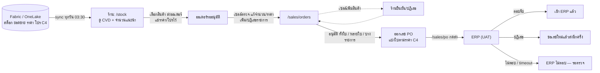

[← กลับหน้าแรก](./00-home.md)

# 01 — ภาพรวมโปรเจกต์

## ปัญหาที่ระบบนี้แก้

คลัง VDA ต้องสั่งสินค้าเข้ามาเติมเองทุกสัปดาห์ เดิมใช้ประสบการณ์ล้วน ๆ ทำให้

- สินค้าขายดี**ขาด** เพราะสั่งไม่ทัน
- สินค้าขายช้า**ค้างสต็อก** เพราะสั่งเผื่อมากเกิน
- ไม่รู้ว่าตัวไหนติดโปรอยู่ สั่งไม่ถึงขั้นเลยพลาดส่วนลด/ของแถม
- เซลล์ตรวจออเดอร์จากไฟล์ Excel ที่ส่งกันไปมา ไม่มีหลักฐานว่าใครแก้อะไร

ระบบนี้ดึงยอดขายและสต็อกจริงจาก Microsoft Fabric มาคำนวณว่า**ควรสั่งเท่าไร** ให้ร้านส่งออเดอร์
แล้วให้เซลล์ตรวจ/อนุมัติ ระบบออกเลข PO แบ่งใบตามราคา และส่ง PO เข้า ERP
โดยเก็บหลักฐานราคา/โปร/ของแถมไว้ทั้งหมด ณ วันที่ร้านกดส่ง

## Flow หลัก

1. **ร้านสั่ง** — ร้านเปิด `/stock` เห็นสต็อก CVD จำนวนแนะนำ ราคาและโปร C4 เลือกสินค้าแล้วตรวจที่ `/order` ก่อนส่ง
   ตอนกดส่ง ระบบ**แช่**ราคา ส่วนลด โปร และของแถมลง `OrderItem` ทันที
2. **เซลล์อนุมัติ** — เซลล์ที่ดูแลคลังนั้นเห็นออเดอร์ที่ `/sales/orders` แก้จำนวน/ราคา ปฏิเสธรายการ
   หรือเพิ่มสินค้าใหม่ (รายการที่เพิ่มต้องรอร้านยืนยันก่อน) แล้วอนุมัติทั้งใบ หลายใบรวด หรือเฉพาะบางรายการ
   (รายการที่ไม่ได้เลือกแยกเป็นออเดอร์ใหม่รออนุมัติ)
3. **ออก PO** — อนุมัติแล้วระบบออกเลข PO แบ่งใบ "ราคาตรง C4" กับ "ราคาไม่ตรง C4" ให้อัตโนมัติ
   ย้ายรายการข้ามใบหรือรวมใบได้ แต่กลุ่มโปรเดียวกันต้องอยู่ใบเดียวกันเสมอ
4. **ส่ง ERP** — จากหน้า `/sales/po` กดส่งเข้า ERP (ตอนนี้ชี้ UAT เท่านั้น) · ผลถูกแจ้งเตือนไปยังเซลล์ในคลังและร้าน

ทุกขั้นมีแจ้งเตือนที่กระดิ่ง (กดแล้วเปิดใบออเดอร์นั้น)

## ผู้ใช้ 4 กลุ่ม

### 1. คลัง VDA / ร้านค้า
เข้าระบบด้วย **อีเมล + รหัสผ่าน** (ส่งคำขอแล้วรอแอดมินอนุมัติ) หน้าหลักคือ `/stock`

- **สต็อกคงเหลือ** (หน่วยหีบ + เศษชิ้น) และ **ขายเฉลี่ยต่อวัน** (ดูกราฟย้อนหลังได้ 7 / 30 / 90 วัน)
- **CVD**, **จำนวนแนะนำสั่ง**, **ราคาและโปรโมชัน C4** ณ วันนั้น
- ตั้ง MIN/MAX และรายการหยุดสั่งเองที่ `/manage` · ดูประวัติและของแถมที่ควรได้ที่ `/history`

### 2. เซลล์
เข้าด้วยบัญชี Microsoft ขององค์กร เห็นเฉพาะคลังที่รหัสเซลล์ของตัวเองดูแล
(รหัสเซลล์ ↔ คลังหาจากข้อมูล Fabric และทะเบียน VDA · แอดมินผูกอีเมลเพิ่มให้รหัสได้)

- **หน้าภาพรวม `/sales`** — ออเดอร์ค้าง อัตราอนุมัติ ร้านที่ติดธงแดงบ่อย
- ตรวจ/แก้/อนุมัติออเดอร์ พร้อมบันทึกว่าใครแก้อะไรเมื่อไร
- ติดตาม PO ส่ง ERP พิมพ์ และโหลด Excel ที่ `/sales/po` · ดูโปรที่ `/sales/promotions`

### 3. Admin
อีเมลที่ Creator เพิ่มไว้ในหน้า «ระบบ › ผู้ดูแล» — ใช้ `/admin` ได้**เฉพาะบางแท็บ**:
บัญชีร้าน (ดู/อนุมัติ/สร้าง/รีเซ็ตรหัสผ่าน), โปร C4, ตารางสิทธิ์เซลล์-VDA (เพิ่มอีเมลได้ ลบไม่ได้)
ถ้าผูกรหัสเซลล์ไว้จะใช้หน้าเซลล์ได้ด้วย · สิทธิ์ทั้งหมดอยู่ที่ `lib/auth/permissions.ts`

### 4. Creator (dev)
อีเมลใน `ADMIN_EMAILS` ของ `.env` — ทำได้ทุกอย่าง `/admin` แบ่ง 5 หมวด:
**ข้อมูล** (sync, ดูข้อมูลดิบ, ทะเบียนคลัง VDA) · **ร้านค้า** (บัญชีร้าน, MIN/MAX & หยุดสั่ง) ·
**โปรโมชั่น** (โปร C4 เดือนนี้) · **มุมมองทดสอบ** (ดูเป็น VDA/เซลล์คนอื่น) ·
**ระบบ** (ผู้ดูแล, สิทธิ์เซลล์-VDA, บันทึกการทำงาน) · เห็นออเดอร์ทุกร้าน กรองตามรหัสเซลล์ได้

## คำศัพท์และแนวคิดสำคัญ

| คำ | ความหมาย |
|---|---|
| **VDA** | คลัง/ร้านค้าตัวแทนที่ระบบดูแล (รหัส `vda1`, `vda2`, …) · หนึ่งคลังผูกได้หลายรหัสลูกค้า · ทะเบียนอยู่ในตาราง `VdaWarehouse` แก้ที่ `/admin/data/warehouses` |
| **ราคา / โปร C4** | ราคาและโปรโมชันจากตาราง `cft_promotion_cash` บน OneLake (บริบท `E\|98`) · มีโปรบันได (ซื้อถึงขั้นได้ส่วนลด/ของแถม) และ**โปรกลุ่ม** (รวมยอดหลาย SKU ในกลุ่มเดียวกัน) · ร้านแก้ราคาเองไม่ได้ เซลล์แก้ได้ |
| **CVD** (Cover Days) | สต็อกพอขายได้กี่วัน = สต็อก ÷ ขายเฉลี่ยต่อวัน · **CVD Est.** = (สต็อก + จำนวนสั่ง) ÷ ขายเฉลี่ย |
| **ธง CVD** | 🟢 / 🟡 / 🔴 จาก CVD Est. เทียบ MIN/MAX (`getCvdFlag`) · ธงแดงเป็นคำเตือนให้ยืนยัน ไม่ใช่ข้อห้าม — ของหมดหรือสั่งขั้นต่ำ 1 หีบส่งได้เสมอ |
| **MIN / MAX** | จำนวนวันขั้นต่ำ/สูงสุดที่ควรมีของ (default 7 / 15 วัน) · ตั้งได้รายสินค้าหรือรายแบรนด์ · ต่ำกว่า MIN → ระบบแนะนำสั่งให้ถึง MAX + ของที่จะขายระหว่างรอ 3 วัน ปัดขึ้นเป็นหีบเต็ม |
| **หยุดสั่ง** (stop-order) | รายการสินค้าที่ร้าน/แอดมินตั้งไว้ว่าไม่ต้องแนะนำสั่งในช่วงวันที่กำหนด (ไม่ใส่วันสิ้นสุด = ถาวร) · ระหว่างนั้นจำนวนแนะนำเป็น 0 |
| **หน่วยหีบ** | ออเดอร์ ราคา และโปรนับเป็นหีบเสมอ · ชิ้นใช้แสดงเศษที่ไม่ครบหีบเท่านั้น |
| **การแบ่ง PO** | ออเดอร์หนึ่งใบอาจกลายเป็นหลาย PO (เลขต่อท้าย A/B…) แยกราคาตรง C4 / ไม่ตรง C4 / จำนวนถูกแก้ · กลุ่มโปรเดียวกันห้ามแยกคนละใบ |
| **`erp_unknown`** | สถานะ PO «ERP ไม่ตอบ — รอตรวจ» — ส่งแล้วแต่ไม่รู้ผล (timeout / เน็ตหลุด / HTTP error) อาจเข้า ERP ไปแล้ว **ห้ามส่งซ้ำ** ต้องตรวจกับทีม ERP แล้วกดบันทึกผลในรายละเอียด PO |

สูตรและกฎละเอียดอยู่ใน [08 — กฎทางธุรกิจ](./08-business-rules.md)

## Tech Stack

| ชั้น | เทคโนโลยี |
|---|---|
| Framework | Next.js 15 (App Router) + React 19 + TypeScript 5.8 |
| UI | Tailwind CSS 4 + Radix UI + คอมโพเนนต์สไตล์ shadcn ใน `components/ui` |
| State / ข้อมูลฝั่ง client | TanStack Query 5 · TanStack Virtual (ตารางสต็อกยาว) |
| DB | Prisma 6 + SQLite (dev `prisma/dev.db` · Docker `/app/data/vmi.db`) |
| ข้อมูล master | Microsoft Fabric / OneLake → CSV cache ที่ `data/cache/` |
| Auth | Microsoft Entra ID (PKCE ฝั่งเบราว์เซอร์) + session cookie ที่เซ็น HMAC |
| Export | ExcelJS |
| เทสต์ | Vitest — logic ล้วนเป็นหลัก + `*.db.test.ts` ที่ใช้ SQLite ชั่วคราว |

## สิ่งที่ควรรู้ก่อนแก้โค้ด

1. **หน่วยเป็น "หีบ" เสมอ** — จำนวนชิ้นใช้แค่แสดงเศษที่ไม่ครบหีบ
2. **ราคาและโปรถูกแช่ไว้ตอนร้านกดส่ง** ห้ามคำนวณใหม่ตอนอ่าน เพราะแคมเปญเปลี่ยนทุกวัน
3. **basePath คือ `/vmi`** ใช้ helper `appPath()` เสมอเวลาต่อ URL
4. **หยุด `npm run dev` ก่อน `npm run build`** — ใช้โฟลเดอร์ `.next/` ร่วมกัน
5. **ตัวตนร้านมาจาก `getAuthorizedStore()` เท่านั้น** ห้ามอ่าน cookie `vmi_store_id` ตรง ๆ
   (มันเป็นค่าดิบที่ไม่ได้เซ็น ปลอมได้) · ฝั่ง client ใช้ `apiFetch` ไม่ใช่ `fetch`
6. **ห้ามใช้ `window.confirm` / `alert` / `prompt`** — บล็อก main thread ทั้งหน้า และบน webview
   กล่องอาจไม่แสดงให้ผู้ใช้เห็นเลย อาการที่ได้คือ "กดแล้วเว็บค้าง" · ใช้ `ConfirmDialog`
   หรือ `Modal` ใน `components/ui` แทน (ทั้งคู่มีกับดักโฟกัสจาก `hooks/use-focus-trap.ts` ให้แล้ว
   กล่องที่เขียน portal เองต้องเรียก `useFocusTrap` เอง)
7. **แก้ `schema.prisma` ต้องมี migration จริง** (`npm run db:migrate`) ห้าม `db push`
8. **ห้ามเรียก endpoint `send-erp` ระหว่างพัฒนา/ทดสอบ** — ยิงผิดใบเดียว เลขออเดอร์ถูกล็อกฝั่ง ERP 6 เดือน

รายละเอียดทั้งหมดอยู่ใน [11 — คู่มือนักพัฒนา](./11-developer-guide.md)

## อ่านต่อ

- [02 — สถาปัตยกรรม](./02-architecture.md)
- [08 — กฎทางธุรกิจ](./08-business-rules.md) (สูตร CVD, การแบ่ง PO, โปรกลุ่ม)
- [12 — โครงสร้างโปรเจกต์](./12-project-structure.md)
