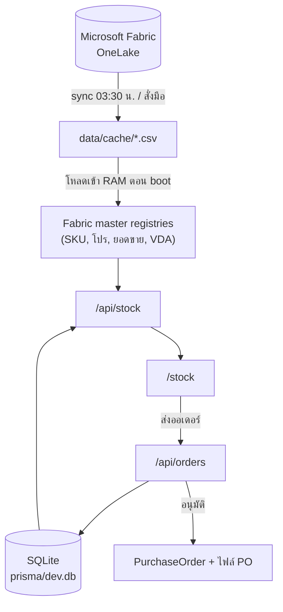

[← กลับหน้าแรก](./00-home.md)

# 02 — สถาปัตยกรรม

## ภาพรวมการไหลของข้อมูล



**หลักสำคัญ:** ข้อมูล master (สินค้า ราคา โปร ยอดขาย) มาจาก Fabric แบบอ่านอย่างเดียว
ส่วน SQLite เก็บเฉพาะสิ่งที่ระบบนี้สร้างเอง — ออเดอร์ PO บัญชีร้าน threshold แจ้งเตือน

## โครงโฟลเดอร์

```
app/
  api/           # API routes ทั้งหมด (ดู 05-api-reference)
  stock/         # หน้าสต็อก — หน้าหลักของคลัง
  order/         # หน้าตรวจก่อนส่งออเดอร์
  history/       # ประวัติการสั่งของร้าน
  manage/        # ตั้งค่า MIN/MAX รายกลุ่ม
  sales/         # ฝั่งเซลล์: orders, po, notifications
  admin/         # ศูนย์ควบคุม
components/
  stock/ order/ history/ sales/ admin/ manage/ promo/ layout/ ui/
lib/
  fabric/        # อ่าน OneLake, parse CSV, cache, scheduler (ไฟล์เยอะสุด)
  repositories/  # ชั้นคุยกับ Prisma + แปลงเป็น row ที่ UI ใช้
  po/            # เลข PO, การแบ่งใบ, เอกสาร, สถานะ
  promo/         # โปร C4, กลุ่มโปร, ของแถม
  calculations/  # สูตร CVD, ราคา, โปรบันได
  auth/          # session ของทุกบทบาท
  stock/         # ตัวกรอง, การเรียง, export Excel
  orders/        # สิทธิ์เข้าถึงออเดอร์, แจ้งเตือน
hooks/           # React hooks ที่ใช้ร่วมหลายหน้า
tests/           # Vitest
prisma/          # schema, migrations, seed
scripts/         # sync, backup, verify
```

## จุดเข้าโปรแกรม (entrypoints)

| ไฟล์ | หน้าที่ |
|---|---|
| `instrumentation.ts` | รันตอน boot — โหลด Fabric master เข้า RAM ล่วงหน้า และเริ่ม scheduler |
| `middleware.ts` | ตรวจ cookie แล้ว redirect ไปหน้า login ที่ถูกต้องตามบทบาท |
| `next.config.ts` | ตั้ง `basePath: "/vmi"` และ `trailingSlash` |

> `instrumentation.ts` สำคัญมาก — ถ้าไม่ preload ผู้ใช้คนแรกของวันจะต้องรอ parse ไฟล์ SKU 68MB
> บน request thread (เคยวัดได้ 2,852ms → หลัง preload เหลือ 0ms)

## รูปแบบที่ใช้ซ้ำทั้งโปรเจกต์

### 1. แช่ค่าไว้ ไม่คำนวณใหม่ตอนอ่าน
ราคา C4, ส่วนลด, threshold MIN/MAX, โปร และของแถม ถูกเขียนลง `OrderItem` ตอนร้านกดส่ง
เพราะ master เปลี่ยนทุกวัน ถ้าคำนวณใหม่ตอนเปิดดู หลักฐานจะเพี้ยนย้อนหลัง

### 2. CSS variable คุมความหนาแน่นของตาราง
`--vmi-row-fs`, `--vmi-row-h` ฯลฯ ใน `app/globals.css` — คอมโพเนนต์ลูกใช้ `.vmi-t-sm` / `.vmi-t-xs`
แทนการ hardcode `text-[10px]` เพื่อให้ปรับขนาดทั้งระบบได้ที่เดียว

### 3. Virtualized table
ตารางสต็อกมี 500+ แถว ใช้ TanStack Virtual · ความสูงแถวอ่านจาก `--vmi-row-h`
ตอน runtime แล้ว re-measure จึงเปลี่ยนขนาดตัวอักษรได้โดยไม่ต้องแก้ TS

### 4. `useAsyncAction`
ห่อปุ่มที่ยิง async ให้มี pending/error และกดซ้ำไม่ได้ — กันอาการ "กดแล้วไม่มีอะไรเกิดขึ้น"

### 5. แจ้งเตือนต้องไม่ทำให้งานหลักล้ม
`notifyStore()` / `notifySales()` ครอบ try/catch เสมอ — ถ้าเขียนแจ้งเตือนพลาด
การอนุมัติหรือส่งออเดอร์ต้องยังสำเร็จ

## อ่านต่อ

- [05 — API Reference](./05-api-reference.md)
- [06 — Fabric / OneLake](./06-fabric-integration.md)
- [07 — Data Model](./07-data-model.md)
