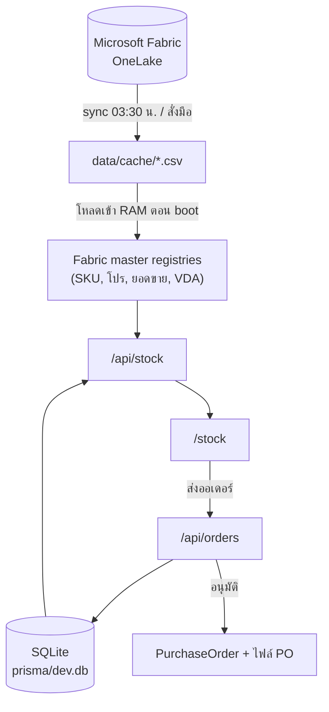

[← กลับหน้าแรก](./00-home.md)

# 02 — สถาปัตยกรรม

## ภาพรวมการไหลของข้อมูล



**หลักสำคัญ:** ข้อมูล master (สินค้า ราคา โปร ยอดขาย) มาจาก Fabric แบบอ่านอย่างเดียว
ส่วน SQLite เก็บเฉพาะสิ่งที่ระบบนี้สร้างเอง — ออเดอร์ PO บัญชีร้าน threshold แจ้งเตือน

## โครงโฟลเดอร์

```
app/
  api/           # API routes ทั้งหมด (ดู 05-api-reference)
  login/  auth/callback/     # หน้า login และปลายทาง OAuth
  stock/         # หน้าสต็อก — หน้าหลักของคลัง
  order/         # หน้าตรวจก่อนส่งออเดอร์
  history/       # ประวัติการสั่งของร้าน
  manage/        # ตั้งค่า MIN/MAX รายกลุ่ม
  sales/         # ฝั่งเซลล์: page.tsx = แดชบอร์ด, orders, po, notifications
  admin/         # ศูนย์ควบคุม 5 หมวด (data/ stores/ promotions/ preview/ system/)
  error.tsx  global-error.tsx  not-found.tsx
components/
  stock/ order/ history/ sales/ admin/ manage/ promo/ auth/ layout/ ui/
  providers.tsx  # QueryClient + ตัวจัดการ 401 กลาง
lib/
  fabric/        # อ่าน OneLake, parse CSV, cache, scheduler (มีจำนวนไฟล์มากที่สุด)
  repositories/  # ชั้นคุยกับ Prisma + แปลงเป็น row ที่ UI ใช้
  po/            # เลข PO, การแบ่งใบ, เอกสาร, สถานะ
  promo/         # โปร C4, กลุ่มโปร, ของแถม
  calculations/  # สูตร CVD, ราคา, โปรบันได
  auth/          # session ทุกบทบาท + store-context + rate-limit + session-secret
  stock/         # ตัวกรอง, การเรียง, export Excel
  orders/        # สิทธิ์เข้าถึงออเดอร์, แจ้งเตือน
  sales/         # ตรรกะแดชบอร์ดเซลส์
  admin/         # ผังเมนู admin, data explorer
  api-fetch.ts  paths.ts  prisma.ts
hooks/           # React hooks ที่ใช้ร่วมหลายหน้า
tests/           # Vitest · helpers/ = ตัวช่วยสร้าง DB ชั่วคราว
prisma/          # schema, migrations, seed
scripts/         # sync, backup, verify, probe
```

## จุดเข้าโปรแกรม (entrypoints)

| ไฟล์ | หน้าที่ |
|---|---|
| `instrumentation.ts` | รันตอน boot (ดูลำดับด้านล่าง) |
| `middleware.ts` | ตรวจ cookie แล้ว redirect ไปหน้า login ที่ถูกต้องตามบทบาท |
| `next.config.ts` | ตั้ง `basePath: "/vmi"` และ `trailingSlash` |
| `app/error.tsx` · `global-error.tsx` · `not-found.tsx` | ตาข่ายรับ error / 404 ทั้งแอป |

ลำดับใน `instrumentation.register()` — **ลำดับสำคัญ**

1. `assertSessionSecret()` — production ตายทันทีถ้า `NEXTAUTH_SECRET` ไม่ปลอดภัย
   (ต้องเป็นลำดับแรก มิฉะนั้นจะตรวจพบเมื่อมีผู้ใช้เข้าสู่ระบบรายแรกซึ่งช้าเกินไป)
2. `bootstrapAdminsFromEnv()`
3. `initVdaWarehouseRegistry()` — ต้องมาก่อน warm masters เพราะชั้น fabric อ่านแบบ sync
4. `startMasterRefreshScheduler()`
5. `warmFabricMasters()` + `checkPromoContextCoverage()`
6. `catchUpIfStale()` — ไม่ await เพราะ boot ต้องรับ traffic ได้ก่อน

> `instrumentation.ts` สำคัญมาก — ถ้าไม่ preload ผู้ใช้คนแรกของวันจะต้องรอ parse ไฟล์ SKU 68MB
> บน request thread (เคยวัดได้ 2,852ms → หลัง preload เหลือ 0ms)

## รูปแบบที่ใช้ซ้ำทั้งโปรเจกต์

### 1. แช่ค่าไว้ ไม่คำนวณใหม่ตอนอ่าน
ราคา C4, ส่วนลด, threshold MIN/MAX, โปร และของแถม ถูกเขียนลง `OrderItem` ตอนร้านกดส่ง
เพราะ master เปลี่ยนทุกวัน ถ้าคำนวณใหม่ตอนเปิดดู หลักฐานจะเพี้ยนย้อนหลัง

### 2. CSS variable คุมความหนาแน่นของตาราง
`--vmi-row-fs`, `--vmi-row-h` ฯลฯ ใน `app/globals.css` — คอมโพเนนต์ลูกใช้ `.vmi-t-sm` / `.vmi-t-xs`
แทนการ hardcode `text-[10px]` เพื่อให้ปรับขนาดทั้งระบบได้ที่เดียว

### 3. Virtualized table
ตารางสต็อกมี 500+ แถว ใช้ TanStack Virtual · ความสูงแถวอ่านจาก `--vmi-row-h`
ตอน runtime แล้ว re-measure จึงเปลี่ยนขนาดตัวอักษรได้โดยไม่ต้องแก้ TS

### 4. `useAsyncAction`
ห่อปุ่มที่ยิง async ให้มี pending/error และกดซ้ำไม่ได้ — กันอาการ "กดแล้วไม่มีอะไรเกิดขึ้น"

### 5. แจ้งเตือนต้องไม่ทำให้งานหลักล้ม
`notifyStore()` / `notifySales()` ครอบ try/catch เสมอ — ถ้าเขียนแจ้งเตือนพลาด
การอนุมัติหรือส่งออเดอร์ต้องยังสำเร็จ

### 6. `apiFetch` แทน `fetch` ทุกที่ฝั่ง client
`lib/api-fetch.ts` โยน `UnauthorizedError` เมื่อเจอ 401 แล้ว `components/providers.tsx`
(QueryCache/MutationCache `onError`) จะนำผู้ใช้ไปยัง `/login` พร้อมโหมดที่ถูกต้อง
การใช้ `fetch` โดยตรงจะทำให้ผู้ใช้ที่ session หมดอายุพบข้อความแสดงข้อผิดพลาดค้างอยู่
พร้อมปุ่มลองใหม่ที่ไม่มีทางสำเร็จ

### 7. ตัวตนร้านมาจาก session ที่เซ็นแล้ว
`getAuthorizedStore()` ใน `lib/auth/store-context.ts` เป็นทางเดียว —
ห้ามอ่าน cookie `vmi_store_id` โดยตรง รายละเอียดที่ [03 — การยืนยันตัวตน](./03-authentication.md)

## อ่านต่อ

- [11 — คู่มือนักพัฒนา](./11-developer-guide.md) — ข้อควรระวังและขั้นตอนการทำงานที่พบบ่อย
- [05 — API Reference](./05-api-reference.md)
- [06 — Fabric / OneLake](./06-fabric-integration.md)
- [07 — Data Model](./07-data-model.md)
