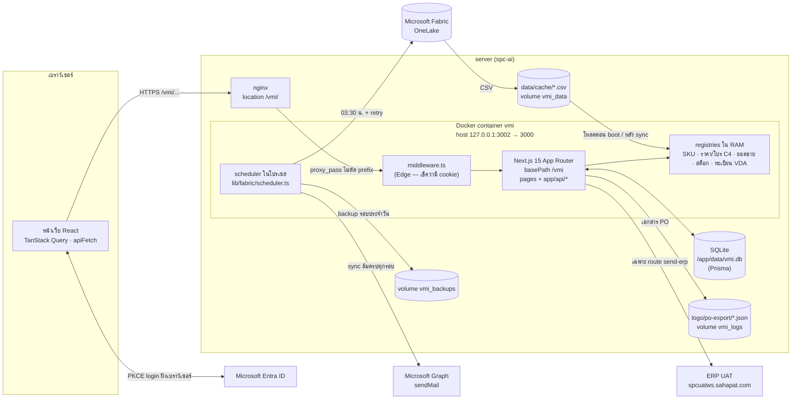
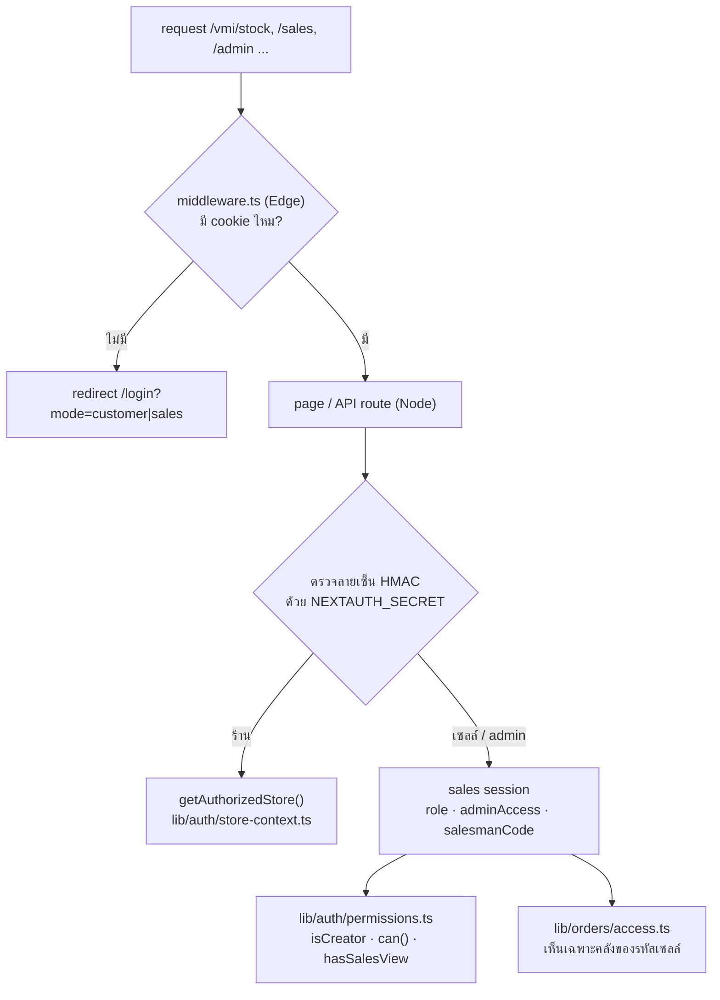

[← กลับหน้าแรก](./00-home.md)

# 02 — สถาปัตยกรรม

## ผังระบบ


```mermaid
flowchart LR
    subgraph Client["เบราว์เซอร์"]
        UI["หน้าเว็บ React<br/>TanStack Query · apiFetch"]
    end

    subgraph Server["server (spc-ai)"]
        Nginx["nginx<br/>location /vmi/"]
        subgraph Container["Docker container vmi<br/>host 127.0.0.1:3002 → 3000"]
            MW["middleware.ts<br/>(Edge — เช็คว่ามี cookie)"]
            App["Next.js 15 App Router<br/>basePath /vmi<br/>pages + app/api/*"]
            Reg["registries ใน RAM<br/>SKU · ราคา/โปร C4 · ยอดขาย · สต็อก · ทะเบียน VDA"]
            Sched["scheduler ในโปรเซส<br/>lib/fabric/scheduler.ts"]
        end
        DB[("SQLite<br/>/app/data/vmi.db<br/>(Prisma)")]
        Cache[("data/cache/*.csv<br/>volume vmi_data")]
        Logs[("logs/po-export/*.json<br/>volume vmi_logs")]
        Bak[("volume vmi_backups")]
    end

    OneLake[("Microsoft Fabric<br/>OneLake")]
    Entra["Microsoft Entra ID"]
    ERP["ERP UAT<br/>spcuatws.sahapat.com"]
    Graph["Microsoft Graph<br/>sendMail"]

    UI -->|HTTPS /vmi/...| Nginx -->|proxy_pass ไม่ตัด prefix| MW --> App
    UI <-->|PKCE login ฝั่งเบราว์เซอร์| Entra
    App <--> DB
    App --> Reg
    Cache -->|โหลดตอน boot / หลัง sync| Reg
    Sched -->|03:30 น. + retry| OneLake
    OneLake -->|CSV| Cache
    Sched -->|backup รอบประจำวัน| Bak
    Sched -->|sync ล้มครบทุกรอบ| Graph
    App -->|เฉพาะ route send-erp| ERP
    App -->|เอกสาร PO| Logs
```

**หลักสำคัญ**

- ข้อมูล master (สินค้า ราคา โปร ยอดขาย สต็อก) มาจาก Fabric แบบ**อ่านอย่างเดียว** → เก็บเป็น CSV ที่ `data/cache/`
  → parse ขึ้น registry ใน RAM · ฝั่ง request อ่านจาก RAM ไม่ยิง OneLake
- SQLite เก็บเฉพาะสิ่งที่ระบบนี้สร้างเอง — ออเดอร์ PO บัญชีร้าน MIN/MAX หยุดสั่ง แจ้งเตือน ทะเบียน VDA ผู้ดูแล audit log
- ออกข้างนอกมีแค่ 3 ทาง: OneLake (อ่าน), Microsoft Graph (อีเมลแจ้งเตือน), ERP (ส่ง PO)

## Data flow ของออเดอร์

```mermaid
flowchart TB
    Reg["registries ใน RAM"] --> StockAPI["/api/stock"]
    DB[("SQLite")] --> StockAPI
    StockAPI --> StockPage["/stock → /order"]
    StockPage -->|ส่งออเดอร์ + แช่ราคา/โปร| OrdersAPI["/api/orders"]
    OrdersAPI --> DB
    SalesPage["/sales/orders"] -->|แก้ / อนุมัติ| OrdersAPI
    OrdersAPI -->|อนุมัติ → แบ่งใบ ออกเลข| PO["PurchaseOrder + PoSequence<br/>+ logs/po-export/{poNumber}.json"]
    PoPage["/sales/po"] -->|POST .../send-erp| SendErp["send-erp route"]
    SendErp -->|erpEndpoint()| ERP["ERP UAT"]
    SendErp -->|ผล: sent_erp / erp_unknown / ถูกปฏิเสธ| DB
    SendErp -->|notifySales / notifyStore| DB
```

## ERP — ทางเดียวที่ออกไปหา ERP

- ปลายทางอยู่ในโค้ดที่ `lib/po/erp-endpoint.ts` (**ไม่ใช่ env**) และมีแค่ `ERP_UAT_URL`
  (`https://spcuatws.sahapat.com/spc/ocr/insertOCROrderToBill`) timeout 15 วินาที
  · โฮสต์ production **ไม่มีในโค้ดที่รันได้เลย** — การสลับไป prod ต้องแก้โค้ดแล้ว deploy โดยตั้งใจ
- `SEND_ENABLED` เปิดแล้ว (14 ก.ย. 2569) · `ERP_SEND_DISABLED=1` ใน env เป็นเบรกฉุกเฉินที่**ปิดได้อย่างเดียว**
  (ใช้บนเครื่อง dev / รอบทดสอบ)
- route ที่ยิงจริงมีตัวเดียว: `POST /api/sales/purchase-orders/[poNumber]/send-erp`
  (`clone-for-erp` = ขอเลขใหม่หลังถูกปฏิเสธ · `erp-resolve` = บันทึกผลของใบที่ค้าง `erp_unknown`)
- ⚠️ ยิงผิดใบเดียว = คู่ `orderNo` + `customerCode` ถูกล็อกฝั่ง ERP 6 เดือน — **ห้ามเรียก send-erp ระหว่างพัฒนา/ทดสอบ**
- การอ่านสถานะกลับจาก ERP (ข้อ 3.6) ยังไม่ทำ รอสิทธิ์อ่าน `ocr_order_to_bill.csv` จากทีมข้อมูล —
  ดู [`docs/ERP-PO-PLAN.md`](../ERP-PO-PLAN.md)

## ชั้นการยืนยันตัวตน


```mermaid
flowchart TB
    Req["request /vmi/stock, /sales, /admin ..."] --> MW{"middleware.ts (Edge)<br/>มี cookie ไหม?"}
    MW -->|ไม่มี| Login["redirect /login?mode=customer|sales"]
    MW -->|มี| Page["page / API route (Node)"]
    Page --> Verify{"ตรวจลายเซ็น HMAC<br/>ด้วย NEXTAUTH_SECRET"}
    Verify -->|ร้าน| Store["getAuthorizedStore()<br/>lib/auth/store-context.ts"]
    Verify -->|เซลล์ / admin| Sales["sales session<br/>role · adminAccess · salesmanCode"]
    Sales --> Perm["lib/auth/permissions.ts<br/>isCreator · can() · hasSalesView"]
    Sales --> Access["lib/orders/access.ts<br/>เห็นเฉพาะคลังของรหัสเซลล์"]
```

1. **middleware.ts (Edge)** — ด่านแรก เช็คแค่ว่า**มี** cookie (`vmi_store_id` หรือ `vmi_store_session` สำหรับ
   `/stock` `/order` `/manage` `/history` · `vmi_sales_session` สำหรับ `/sales` `/admin`) แล้ว redirect ไป
   `/login` ด้วย `appPath()` · Edge ตรวจลายเซ็นเองไม่ได้ · เข้า `/admin` จะล้าง cookie มุมมองทดสอบเซลล์ทิ้ง ·
   matcher ไม่รวม `/` โดยตั้งใจ (บั๊ก Next.js basePath + middleware ที่ index)
2. **session ที่เซ็นแล้ว (Node)** — cookie ร้านและเซลล์เซ็นด้วย HMAC-SHA256 จาก `NEXTAUTH_SECRET`
   (production ไม่ start ถ้า secret ไม่ปลอดภัย — `lib/auth/session-secret.ts`) · ตัวตนร้านมาจาก
   `getAuthorizedStore()` เท่านั้น
3. **Microsoft login** — เบราว์เซอร์แลก code แบบ PKCE เอง แล้วส่ง `id_token` ให้เซิร์ฟเวอร์ตรวจลายเซ็นกับกุญแจ
   ของ Microsoft (`lib/auth/microsoft-id-token.ts`) — อีเมลที่ใช้มาจาก token ที่ตรวจแล้วเท่านั้น
4. **สิทธิ์** — `role: "admin"` = Creator (`ADMIN_EMAILS`) ทำได้ทุกอย่าง · Admin ที่ Creator เพิ่มมี
   `adminAccess: "admin"` แต่ `role` เป็น sales และผ่านเฉพาะสิทธิ์ใน `ADMIN_PERMISSIONS` · เซลล์เห็นเฉพาะคลังของรหัสตัวเอง
5. **rate limit** — route login/ตั้งรหัสผ่าน/ขอรีเซ็ตของร้านนับครั้งแบบ sliding window ในหน่วยความจำ
   (`lib/auth/rate-limit.ts` — process เดียว รีสตาร์ทแล้วรีเซ็ต)

รายละเอียดที่ [03 — การยืนยันตัวตน](./03-authentication.md)

## จุดเข้าโปรแกรม (entrypoints)

| ไฟล์ | หน้าที่ |
|---|---|
| `instrumentation.ts` | รันตอน boot (เฉพาะ `NEXT_RUNTIME === "nodejs"`) ดูลำดับด้านล่าง |
| `middleware.ts` | ด่าน cookie → redirect ไปหน้า login ที่ถูกต้องตามบทบาท |
| `next.config.ts` | `basePath: "/vmi"` · `trailingSlash: true` · `compress` · ปิด `X-Powered-By` |
| `docker/entrypoint.sh` | สำรอง DB ก่อน (`VMI_BACKUP_ON_START`) → `prisma migrate deploy` → start |
| `app/error.tsx` · `global-error.tsx` · `not-found.tsx` | ตาข่ายรับ error / 404 ทั้งแอป |

ลำดับใน `instrumentation.register()` — **ลำดับสำคัญ**

1. `assertSessionSecret()` — production ตายทันทีถ้า `NEXTAUTH_SECRET` ไม่ปลอดภัย
   (ต้องเป็นลำดับแรก มิฉะนั้นจะตรวจพบเมื่อมีผู้ใช้เข้าสู่ระบบรายแรกซึ่งช้าเกินไป)
2. `bootstrapAdminsFromEnv()` — ลงทะเบียน Creator จาก `ADMIN_EMAILS`
3. `initVdaWarehouseRegistry()` — ต้องมาก่อน warm masters เพราะชั้น fabric อ่านทะเบียนแบบ sync
4. `startMasterRefreshScheduler()`
5. `warmFabricMasters()` + `checkPromoContextCoverage()` — preload registry และเตือนถ้าบริบทโปร C4 ค้นไม่เจอ
6. `catchUpIfStale()` — ไม่ await เพราะ boot ต้องรับ traffic ได้ก่อน

> `instrumentation.ts` สำคัญมาก — ถ้าไม่ preload ผู้ใช้คนแรกของวันจะต้องรอ parse ไฟล์ SKU 68MB
> บน request thread (เคยวัดได้ 2,852ms → หลัง preload เหลือ 0ms)

## Background scheduler

`lib/fabric/scheduler.ts` — ตัวจับเวลาในโปรเซสเดียวกับเว็บ (กันเริ่มซ้ำด้วย flag บน `globalThis`)

| เรื่อง | พฤติกรรม |
|---|---|
| เวลา | ทุกวัน `MASTER_REFRESH_HOUR:MINUTE` (default **03:30**) เวลา Asia/Bangkok · ปิดด้วย `MASTER_REFRESH_ENABLED=false` (compose ตั้ง `true`) |
| retry | ล้มแล้วลองใหม่ 3 ครั้ง ห่าง 5 / 15 / 30 นาที · ล้มครบ → อีเมลผ่าน Microsoft Graph ถึง `ALERT_EMAIL` (ต้องมี `SENDER_EMAIL` ด้วย ไม่งั้นแค่ log) |
| backup | รอบประจำวันสำรอง DB ทุกครั้ง (`scripts/backup-db.mjs`) **ไม่ขึ้นกับผล sync** · ปุ่มที่คนกดไม่สำรอง |
| C4 เดือนใหม่ | ทุกชั่วโมง: ไฟล์ C4 ไม่มีแถวที่ทับเดือนปัจจุบัน (ปฏิทินไทย) → ดึงเฉพาะ `promotion_c4` (trigger `promo_month`) จนกว่าจะเจอ · Fabric โหลดตาราง C4 ใหม่ราว 14:30 ทุกวัน รอบ 03:30 ของวันที่ 1 จึงได้ไฟล์ของเดือนก่อน หน้าโปรจึงเคยว่างทั้งวัน (1 ต.ค. 2569) · ไม่ backup · ไม่มี env ให้ตั้ง |
| boot catch-up | โหลดไฟล์ที่ยังไม่มีทันที · ถ้ารอบสำเร็จล่าสุดเก่ากว่า `MASTER_REFRESH_MAX_AGE_HOURS` (20) ไล่ตามในอีก 30 วินาที |
| ทางเข้าเดียว | ทุกทริกเกอร์ (scheduler / promo_month / boot / ปุ่มแอดมิน / ปุ่มร้าน / CLI) ผ่าน `runMasterRefresh` → reload registry → bump data version |
| แท็บที่เปิดค้าง | poll `/api/data-version` ทุก 5 นาที เจอ version ใหม่ก็ invalidate cache เอง |

รายละเอียดชุดข้อมูลและ env ที่ [06 — Fabric / OneLake](./06-fabric-integration.md)

## โครงโฟลเดอร์ (ย่อ)

```
app/          # pages + app/api/* (ดู 05-api-reference)
components/   # UI แยกตามหน้า + ui/ (คอมโพเนนต์พื้นฐาน)
lib/          # fabric/ repositories/ po/ promo/ calculations/ auth/ stock/ orders/ sales/ admin/
hooks/        # React hooks ที่ใช้ร่วม
tests/        # Vitest · helpers/ = DB ชั่วคราว
prisma/       # schema, migrations, seed
scripts/      # sync, backup, verify, probe
docker/       # Dockerfile, entrypoint.sh
```

แผนที่ละเอียดรายไฟล์อยู่ที่ [12 — โครงสร้างโปรเจกต์](./12-project-structure.md)

## รูปแบบที่ใช้ซ้ำทั้งโปรเจกต์

### 1. แช่ค่าไว้ ไม่คำนวณใหม่ตอนอ่าน
ราคา C4, ส่วนลด, threshold MIN/MAX, โปร และของแถม ถูกเขียนลง `OrderItem` ตอนร้านกดส่ง
เพราะ master เปลี่ยนทุกวัน ถ้าคำนวณใหม่ตอนเปิดดู หลักฐานจะเพี้ยนย้อนหลัง

### 2. CSS variable คุมความหนาแน่นของตาราง
`--vmi-row-fs`, `--vmi-row-h` ฯลฯ ใน `app/globals.css` — คอมโพเนนต์ลูกใช้ `.vmi-t-sm` / `.vmi-t-xs`
แทนการ hardcode `text-[10px]` เพื่อให้ปรับขนาดทั้งระบบได้ที่เดียว

### 3. Virtualized table
ตารางสต็อกมี 500+ แถว ใช้ TanStack Virtual · ความสูงแถวอ่านจาก `--vmi-row-h`
ตอน runtime แล้ว re-measure จึงเปลี่ยนขนาดตัวอักษรได้โดยไม่ต้องแก้ TS

### 4. `useAsyncAction`
ห่อปุ่มที่ยิง async ให้มี pending/error และกดซ้ำไม่ได้ — กันอาการ "กดแล้วไม่มีอะไรเกิดขึ้น"

### 5. แจ้งเตือนต้องไม่ทำให้งานหลักล้ม
`notifyStore()` / `notifySales()` ครอบ try/catch เสมอ — ถ้าเขียนแจ้งเตือนพลาด
การอนุมัติหรือส่งออเดอร์ต้องยังสำเร็จ

### 6. `apiFetch` แทน `fetch` ทุกที่ฝั่ง client
`lib/api-fetch.ts` โยน `UnauthorizedError` เมื่อเจอ 401 แล้ว `components/providers.tsx`
(QueryCache/MutationCache `onError`) จะนำผู้ใช้ไปยัง `/login` พร้อมโหมดที่ถูกต้อง
การใช้ `fetch` โดยตรงจะทำให้ผู้ใช้ที่ session หมดอายุพบข้อความแสดงข้อผิดพลาดค้างอยู่
พร้อมปุ่มลองใหม่ที่ไม่มีทางสำเร็จ

### 7. ตัวตนร้านมาจาก session ที่เซ็นแล้ว
`getAuthorizedStore()` ใน `lib/auth/store-context.ts` เป็นทางเดียว —
ห้ามอ่าน cookie `vmi_store_id` โดยตรง รายละเอียดที่ [03 — การยืนยันตัวตน](./03-authentication.md)

### 8. คอนฟิกอยู่ในโค้ด ไม่ใช่ env
ที่อยู่ไฟล์ต้นทาง ตาราง C4 client/tenant id ของ Azure และปลายทาง ERP มีค่าที่ถูกต้องในโค้ดพร้อมเทสต์คุม
env มีไว้ override เท่านั้น — ค่าใน `.env` ชนะโค้ดเสมอและเงียบเวลาตั้งผิด

## อ่านต่อ

- [11 — คู่มือนักพัฒนา](./11-developer-guide.md) — ข้อควรระวังและขั้นตอนการทำงานที่พบบ่อย
- [12 — โครงสร้างโปรเจกต์](./12-project-structure.md)
- [05 — API Reference](./05-api-reference.md)
- [06 — Fabric / OneLake](./06-fabric-integration.md)
- [07 — Data Model](./07-data-model.md)
- [09 — Production Deploy](./09-deployment.md)
