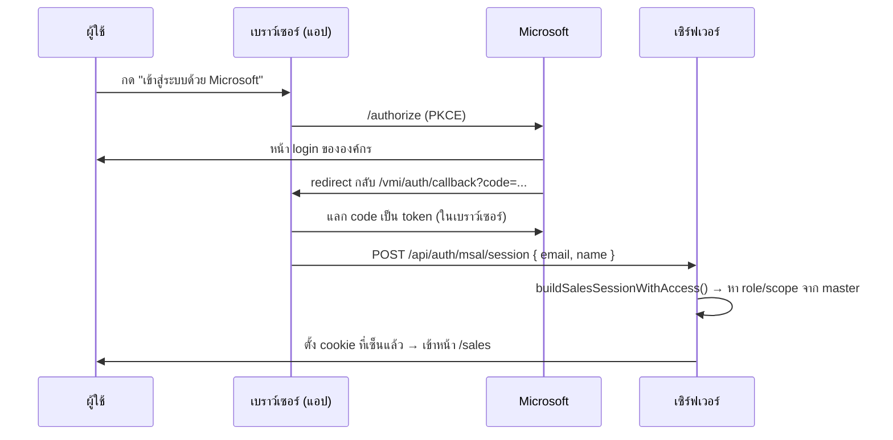

[← กลับหน้าแรก](./00-home.md)

# 03 — การยืนยันตัวตน

ระบบมี 3 เส้นทางล็อกอินที่แยกกันสิ้นเชิง แต่ละเส้นทางเก็บ cookie คนละตัว

| บทบาท | วิธีเข้า | Cookie | ไฟล์หลัก |
|---|---|---|---|
| ร้านค้า / คลัง VDA | อีเมล + password (`StoreAccount`) | store session (เซ็นแล้ว) | `lib/auth/store-session.ts`, `store-password.ts` |
| แอดมินเข้าดูร้าน | เลือกรหัส VDA — **ต้องมี sales session role=admin ก่อน** | `CUSTOMER_STORE_COOKIE` | `lib/auth/customer-session.ts` |
| เซลล์ / Admin | Microsoft Entra ID (OAuth) | `SALES_SESSION_COOKIE` | `lib/auth/microsoft-oauth.ts`, `sales-session.ts` |

## 1. เลือกรหัส VDA — เฉพาะแอดมิน (โหมดเข้าดูร้าน)

`POST /api/auth/customer/login` → ตั้ง cookie เก็บ `storeId`

**เดิมเส้นทางนี้ไม่มีการตรวจสอบสิทธิ์ใด ๆ** การส่งค่า `{vda: "vda1"}` เข้ามาจะได้รับ session
ของร้านค้าโดยสมบูรณ์ ซึ่งสามารถสั่งสินค้า แก้ไขราคา และยกเลิกคำสั่งซื้อได้
ประกอบกับ `GET /api/vda` เปิดให้เรียกดูรายชื่อ VDA ได้โดยไม่ต้องยืนยันตัวตน
เอกสารฉบับเดิมระบุว่าออกแบบไว้สำหรับเครื่อง kiosk ภายในคลัง ซึ่งไม่สอดคล้องกับระบบ
ที่เปิดให้เข้าถึงผ่าน hostname สาธารณะ

**ตั้งแต่วันที่ 28 สิงหาคม 2569 ต้องมี sales session ที่มี `role === "admin"` เท่านั้น**
ร้านค้าทุกแห่งเข้าสู่ระบบด้วยอีเมลและรหัสผ่าน (`StoreAccount`) โดยผู้ดูแลระบบเป็นผู้สร้างบัญชี
ให้จากหน้า `/admin/stores/accounts`

### ตัวตนของร้านค้ามาจาก session ที่ลงลายเซ็นแล้วเท่านั้น

`lib/auth/store-context.ts` → `getAuthorizedStore()` เป็นช่องทางเดียวที่ API ฝั่งร้านค้า
ใช้ระบุว่าเป็นร้านใด โดยรับเฉพาะ StoreSession ที่ลงลายเซ็น HMAC แล้ว
หรือผู้ดูแลระบบที่อยู่ในโหมดเข้าดูข้อมูลร้านค้า

**ห้ามอ่าน cookie `vmi_store_id` โดยตรงในโค้ดใหม่** เนื่องจากเป็นค่า cuid ที่ไม่ได้ลงลายเซ็น
คุณสมบัติ httpOnly ป้องกันการเข้าถึงจาก JavaScript ได้ แต่ไม่สามารถป้องกัน HTTP request
ที่ประกอบขึ้นเองได้ เดิมทั้งระบบใช้ค่านี้เป็นตัวระบุตัวตน ทำให้ผู้ที่กำหนด cookie เป็นรหัส
ของร้านอื่นสามารถเข้าถึงและแก้ไขข้อมูลของร้านนั้นได้ และ `GET /api/stock?storeId=`
สามารถเรียกใช้ได้โดยไม่ต้องมี session แต่อย่างใด

## 2. ร้านค้าที่มีบัญชี

ร้านที่ต้องการความปลอดภัยกว่าใช้ `StoreAccount` (มี password hash)

| ขั้นตอน | API |
|---|---|
| ขอเปิดบัญชี | `POST /api/auth/store/request` |
| ตั้งรหัสผ่าน | `POST /api/auth/store/set-password` |
| ล็อกอิน | `POST /api/auth/store/login` |
| ขอรีเซ็ตรหัส | `POST /api/auth/store/request-reset` |

## 3. เซลล์ / Admin — Microsoft Entra ID

ใช้ **authorization code + PKCE ฝั่งเบราว์เซอร์** (SPA flow) — `lib/auth/microsoft-oauth-client.ts`
เบราว์เซอร์เป็นคนแลก code เป็น token เอง แล้วส่งแค่อีเมล/ชื่อมาให้เซิร์ฟเวอร์ออก session



> ⚠️ **ข้อควรทราบสำหรับนักพัฒนา:** `POST /api/auth/msal/session` รับค่า `{ email, name }`
> และเชื่อถือค่าดังกล่าวโดยยังไม่ได้ตรวจสอบ `id_token` จาก Microsoft ที่ฝั่งเซิร์ฟเวอร์
> ส่วน `lib/auth/microsoft-oauth.ts` (โค้ด server-side flow เดิม) และ route
> `/api/auth/microsoft/*` ปัจจุบันไม่มีการเรียกใช้งานแล้ว
> หากต้องการเพิ่มความปลอดภัยในอนาคต จุดนี้คือตำแหน่งที่ต้องปรับปรุง

### session token
`lib/auth/sales-session.ts` เซ็น payload ด้วย HMAC-SHA256 โดยใช้ `NEXTAUTH_SECRET`
อายุ 7 วัน · ตอน verify จะประกอบ object กลับ**ทีละฟิลด์** ไม่ spread
เพื่อไม่ให้ฟิลด์แปลกปลอมใน token หลุดเข้ามาเป็นสิทธิ์

### บทบาทถูกคำนวณ ไม่ได้เก็บไว้
`buildSalesSessionWithAccess()` ดูจาก master `cross_salesman_reference_email`:

- มีลูกทีมที่ระบุ `managerCode` เป็นเรา → **manager**
- มีลูกทีมที่ระบุ `superCode` เป็นเรา → **supervisor**
- ไม่มีลูกทีม → **sales**
- อีเมลอยู่ใน `ADMIN_EMAILS` → **admin** (ข้ามทุกเงื่อนไข)

manager/supervisor จะได้ `scopeSalesmanCodes` และ `scopeEmails` ของลูกทีมลึก 2 ชั้น

## สิทธิ์เข้าถึงออเดอร์

อยู่ที่ `lib/orders/access.ts` — `assertOrderAccess(orderId, session)`

1. admin ผ่านหมด
2. ถ้าร้านเป็น VDA → เช็คจากทะเบียนที่จับคู่จาก `cross_target_current_month` ว่ารหัสเซลล์ของเราดูแล VDA นั้นไหม
3. ถ้าไม่ใช่ VDA → เช็คว่า `store.salesRep.email` อยู่ใน scope ของเราไหม

> สิทธิ์มาจาก **master ของ Fabric** ไม่ใช่ตารางใน DB — ย้ายเขตที่ต้นทางแล้วสิทธิ์ตามทันทีโดยไม่ต้อง sync

## โหมดทดสอบของ Admin

Admin ดูระบบในมุมของคนอื่นได้โดยไม่ต้องรู้รหัสผ่านใคร

| อะไร | API | ผลลัพธ์ |
|---|---|---|
| ดูเป็นเซลล์คนอื่น | `POST /api/auth/admin/preview-sales` | มีแบนเนอร์เตือนบนหัวจอ |
| ออกจากโหมดเซลล์ | `POST /api/auth/admin/exit-sales-preview` | |
| ออกจากโหมด VDA | `POST /api/auth/admin/exit-preview` | |

## ตั้งค่า Azure Portal

Redirect URI ต้องตรงกับค่าที่ระบบใช้งานจริง คือ **มี basePath `/vmi` และลงท้ายด้วย
`/auth/callback`** (ไม่ใช่ `/auth/microsoft/callback` ซึ่งเป็น route เดิมที่คงไว้สำหรับ redirect เท่านั้น)

```
https://<โดเมน>/vmi/auth/callback
http://localhost:3000/vmi/auth/callback   ← สำหรับ dev
```

ลงทะเบียนภายใต้ประเภท **Single-page application (SPA)** ไม่ใช่ Web และห้ามมีเครื่องหมาย
`/` ปิดท้าย

ค่าที่ระบบใช้จริงมาจาก `getMicrosoftCallbackPath()` ใน `lib/auth/microsoft-oauth-client.ts`
หากมีการเปลี่ยนแปลง path ต้องแก้ไขทั้งใน Azure และค่า `NEXT_PUBLIC_AZURE_REDIRECT_URI`

env ที่ต้องมี: `NEXTAUTH_SECRET`, `ADMIN_EMAILS`

client id / tenant id **ไม่ได้อยู่ใน env** — อยู่ในโค้ดที่ `lib/auth/azure-app.ts`
เพราะเป็นตัวระบุสาธารณะ (ถูกส่งให้ทุกเบราว์เซอร์อยู่แล้ว) และเพราะ `NEXT_PUBLIC_*`
ตั้งบน server ไม่ได้ ดูหัวข้อถัดไป

> **`NEXTAUTH_SECRET` มีเงื่อนไขเพิ่มเติมนอกเหนือจากการมีค่า** ระบบ production
> จะ**ไม่เริ่มทำงาน** หากไม่ได้กำหนด สั้นกว่า 32 ตัวอักษร หรือยังเป็นค่าตัวอย่าง
> (`vmi-dev-secret`, `your-random-secret-here`) รายละเอียดที่ `lib/auth/session-secret.ts`
> การออกแบบให้หยุดทำงานทันทีเป็นไปเพื่อป้องกันกรณีที่ cookie ทุกใบสามารถถูกปลอมแปลงได้

> ⚠️ `NEXT_PUBLIC_*` ถูกฝังลง JS ตอน `next build` **และ `.dockerignore` กัน `.env`
> ออกจาก build context** — ตั้งใน `.env` บน server จึงไม่มีผลกับฝั่งเบราว์เซอร์เลย
> (เคยทำให้ปุ่ม Sign in เด้ง "ยังไม่ได้ตั้ง NEXT_PUBLIC_AZURE_AD_CLIENT_ID" ทั้งที่
> ตัวแปรอยู่ครบใน `.env`) ค่าจึงย้ายไปอยู่ในโค้ดที่ `lib/auth/azure-app.ts` แล้ว
