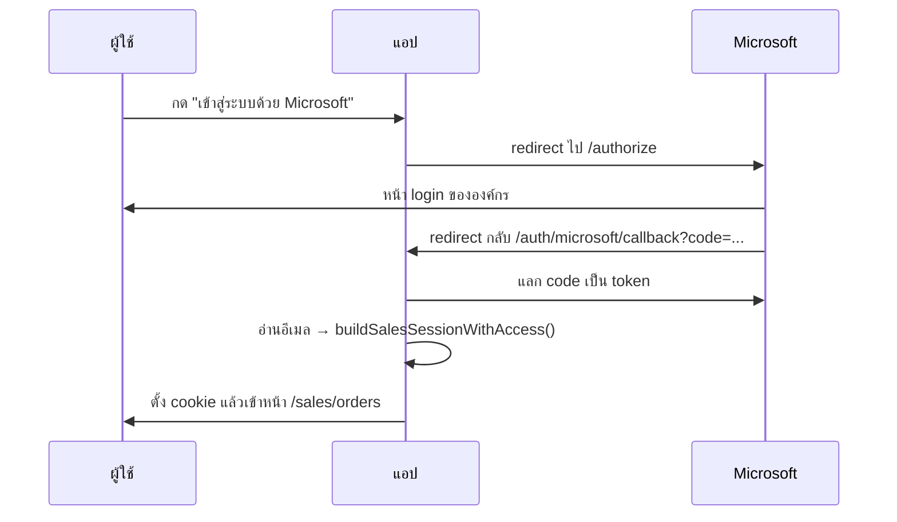

[← กลับหน้าแรก](./00-home.md)

# 03 — การยืนยันตัวตน

ระบบมี 3 เส้นทางล็อกอินที่แยกกันสิ้นเชิง แต่ละเส้นทางเก็บ cookie คนละตัว

| บทบาท | วิธีเข้า | Cookie | ไฟล์หลัก |
|---|---|---|---|
| คลัง VDA | เลือกรหัส VDA จากรายการ (ไม่มี password) | `CUSTOMER_STORE_COOKIE` | `lib/auth/customer-session.ts` |
| ร้านค้าที่มีบัญชี | รหัสร้าน + password | store session | `lib/auth/store-session.ts`, `store-password.ts` |
| เซลล์ / Admin | Microsoft Entra ID (OAuth) | `SALES_SESSION_COOKIE` | `lib/auth/microsoft-oauth.ts`, `sales-session.ts` |

## 1. คลัง VDA — ไม่ใช้ password

ออกแบบมาให้เร็วที่สุดสำหรับหน้างานคลัง เลือกรหัสแล้วเข้าได้เลย
เหมาะกับเครื่องที่วางอยู่ในคลังซึ่งควบคุมการเข้าถึงทางกายภาพอยู่แล้ว

`POST /api/auth/customer/login` → ตั้ง cookie เก็บ `storeId`

## 2. ร้านค้าที่มีบัญชี

ร้านที่ต้องการความปลอดภัยกว่าใช้ `StoreAccount` (มี password hash)

| ขั้นตอน | API |
|---|---|
| ขอเปิดบัญชี | `POST /api/auth/store/request` |
| ตั้งรหัสผ่าน | `POST /api/auth/store/set-password` |
| ล็อกอิน | `POST /api/auth/store/login` |
| ขอรีเซ็ตรหัส | `POST /api/auth/store/request-reset` |

## 3. เซลล์ / Admin — Microsoft Entra ID

ใช้ OAuth authorization-code ฝั่ง server (ไม่ใช่ MSAL ฝั่งเบราว์เซอร์)



### session token
`lib/auth/sales-session.ts` เซ็น payload ด้วย HMAC-SHA256 โดยใช้ `NEXTAUTH_SECRET`
อายุ 7 วัน · ตอน verify จะประกอบ object กลับ**ทีละฟิลด์** ไม่ spread
เพื่อไม่ให้ฟิลด์แปลกปลอมใน token หลุดเข้ามาเป็นสิทธิ์

### บทบาทถูกคำนวณ ไม่ได้เก็บไว้
`buildSalesSessionWithAccess()` ดูจาก master `cross_salesman_reference_email`:

- มีลูกทีมที่ระบุ `managerCode` เป็นเรา → **manager**
- มีลูกทีมที่ระบุ `superCode` เป็นเรา → **supervisor**
- ไม่มีลูกทีม → **sales**
- อีเมลอยู่ใน `ADMIN_EMAILS` → **admin** (ข้ามทุกเงื่อนไข)

manager/supervisor จะได้ `scopeSalesmanCodes` และ `scopeEmails` ของลูกทีมลึก 2 ชั้น

## สิทธิ์เข้าถึงออเดอร์

อยู่ที่ `lib/orders/access.ts` — `assertOrderAccess(orderId, session)`

1. admin ผ่านหมด
2. ถ้าร้านเป็น VDA → เช็คจาก `vda_aos_bill` ว่ารหัสเซลล์ของเราดูแล VDA นั้นไหม
3. ถ้าไม่ใช่ VDA → เช็คว่า `store.salesRep.email` อยู่ใน scope ของเราไหม

> สิทธิ์มาจาก **master ของ Fabric** ไม่ใช่ตารางใน DB — ย้ายเขตที่ต้นทางแล้วสิทธิ์ตามทันทีโดยไม่ต้อง sync

## โหมดทดสอบของ Admin

Admin ดูระบบในมุมของคนอื่นได้โดยไม่ต้องรู้รหัสผ่านใคร

| อะไร | API | ผลลัพธ์ |
|---|---|---|
| ดูเป็นเซลล์คนอื่น | `POST /api/auth/admin/preview-sales` | มีแบนเนอร์เตือนบนหัวจอ |
| ออกจากโหมดเซลล์ | `POST /api/auth/admin/exit-sales-preview` | |
| ออกจากโหมด VDA | `POST /api/auth/admin/exit-preview` | |

## ตั้งค่า Azure Portal

Redirect URI ต้องตรงกับที่แอปใช้จริง (มี basePath `/vmi`)

```
https://<โดเมน>/vmi/auth/microsoft/callback
http://localhost:3000/vmi/auth/microsoft/callback   ← สำหรับ dev
```

env ที่ต้องมี: `NEXT_PUBLIC_AZURE_AD_CLIENT_ID`, `NEXT_PUBLIC_AZURE_AD_TENANT_ID`, `NEXTAUTH_SECRET`, `ADMIN_EMAILS`

> `NEXT_PUBLIC_*` ถูก bake ตอน build — Docker ต้องมี `.env` ครบ**ก่อน** `docker compose build`
