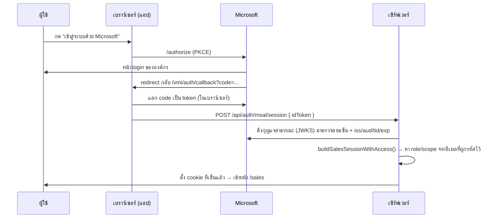

[← กลับหน้าแรก](./00-home.md)

# 03 — การยืนยันตัวตน

ระบบมี 3 เส้นทางล็อกอินที่แยกกันสิ้นเชิง แต่ละเส้นทางเก็บ cookie คนละตัว

| บทบาท | วิธีเข้า | Cookie | ไฟล์หลัก |
|---|---|---|---|
| ร้านค้า / คลัง VDA | อีเมล + password (`StoreAccount`) | store session (เซ็นแล้ว) | `lib/auth/store-session.ts`, `store-password.ts` |
| แอดมินเข้าดูร้าน | เลือกรหัส VDA — **ต้องมี sales session role=admin ก่อน** | `CUSTOMER_STORE_COOKIE` | `lib/auth/customer-session.ts` |
| เซลล์ / Admin | Microsoft Entra ID (OAuth) | `SALES_SESSION_COOKIE` | `lib/auth/microsoft-oauth.ts`, `sales-session.ts` |

## 1. เลือกรหัส VDA — เฉพาะแอดมิน (โหมดเข้าดูร้าน)

`POST /api/auth/customer/login` → ตั้ง cookie เก็บ `storeId`

**เดิมเส้นทางนี้ไม่มีการตรวจสอบสิทธิ์ใด ๆ** การส่งค่า `{vda: "vda1"}` เข้ามาจะได้รับ session
ของร้านค้าโดยสมบูรณ์ ซึ่งสามารถสั่งสินค้า แก้ไขราคา และยกเลิกออเดอร์ได้
ประกอบกับ `GET /api/vda` เปิดให้เรียกดูรายชื่อ VDA ได้โดยไม่ต้องยืนยันตัวตน
เอกสารฉบับเดิมระบุว่าออกแบบไว้สำหรับเครื่อง kiosk ภายในคลัง ซึ่งไม่สอดคล้องกับระบบ
ที่เปิดให้เข้าถึงผ่าน hostname สาธารณะ

**ตั้งแต่วันที่ 28 สิงหาคม 2569 ต้องมี sales session ที่มี `role === "admin"` เท่านั้น**
ร้านค้าทุกแห่งเข้าสู่ระบบด้วยอีเมลและรหัสผ่าน (`StoreAccount`) โดยผู้ดูแลระบบเป็นผู้สร้างบัญชี
ให้จากหน้า `/admin/stores/accounts`

### ตัวตนของร้านค้ามาจาก session ที่ลงลายเซ็นแล้วเท่านั้น

`lib/auth/store-context.ts` → `getAuthorizedStore()` เป็นช่องทางเดียวที่ API ฝั่งร้านค้า
ใช้ระบุว่าเป็นร้านใด โดยรับเฉพาะ StoreSession ที่ลงลายเซ็น HMAC แล้ว
หรือผู้ดูแลระบบที่อยู่ในโหมดเข้าดูข้อมูลร้านค้า

**ห้ามอ่าน cookie `vmi_store_id` โดยตรงในโค้ดใหม่** เนื่องจากเป็นค่า cuid ที่ไม่ได้ลงลายเซ็น
คุณสมบัติ httpOnly ป้องกันการเข้าถึงจาก JavaScript ได้ แต่ไม่สามารถป้องกัน HTTP request
ที่ประกอบขึ้นเองได้ เดิมทั้งระบบใช้ค่านี้เป็นตัวระบุตัวตน ทำให้ผู้ที่กำหนด cookie เป็นรหัส
ของร้านอื่นสามารถเข้าถึงและแก้ไขข้อมูลของร้านนั้นได้ และ `GET /api/stock?storeId=`
สามารถเรียกใช้ได้โดยไม่ต้องมี session แต่อย่างใด

## 2. ร้านค้าที่มีบัญชี

ร้านที่ต้องการความปลอดภัยกว่าใช้ `StoreAccount` (มี password hash)

| ขั้นตอน | API |
|---|---|
| ขอเปิดบัญชี | `POST /api/auth/store/request` |
| ตั้งรหัสผ่าน | `POST /api/auth/store/set-password` `{ email, setupCode, password }` |
| ล็อกอิน | `POST /api/auth/store/login` |
| ขอรีเซ็ตรหัส | `POST /api/auth/store/request-reset` |

login / ตั้งรหัสของร้าน**ไม่ต้องรอข้อมูลจาก Fabric** (อ่านแค่ `StoreAccount`) — เดิมดัก `fabricStockReady()`
ไว้ sync ล้มครั้งเดียวร้านทุกร้านเข้าระบบไม่ได้ · หน้าสต็อกแสดงว่าข้อมูลยังไม่พร้อมเอง

### รหัสตั้งค่าครั้งแรก (ตั้งแต่ 28 ก.ย. 2569)
ตั้งรหัสผ่านครั้งแรก/หลังรีเซ็ต **ต้องมีรหัสตั้งค่า** ที่แอดมินส่งให้ — เดิมรู้แค่อีเมลของบัญชีที่เพิ่งสร้าง/รีเซ็ตก็ยึดบัญชีได้
- ออกให้อัตโนมัติตอน เพิ่มบัญชี / อนุมัติคำขอ / รีเซ็ตรหัส (`lib/auth/store-account.ts`) · 8 ตัว `XXXX-XXXX`
  ใช้ครั้งเดียว หมดอายุ 72 ชม. เก็บแค่ sha256 · แอดมินเห็นครั้งเดียวในกล่องสีเขียวแล้วส่งต่อร้านเอง (ระบบยังส่งอีเมลไม่ได้)
- หาย/หมดอายุ → ปุ่ม «ออกรหัสตั้งค่าใหม่» (action `reset-password` เดิม) อันเก่าใช้ไม่ได้ทันที
- `set-password` จำกัด 5 ครั้ง/15 นาที ต่ออีเมล และ 20 ครั้ง/15 นาที ต่อ IP · ไม่มีบัญชีกับรหัสผิดตอบข้อความเดียวกัน

### session ร้านตรวจกับบัญชีทุก request
token เก็บ `sessionVersion` ของบัญชี · `getStoreSession()` อ่านบัญชีทุกครั้ง (`reconcileStoreSession`) — ถูกปฏิเสธ / ลบ /
รีเซ็ตรหัส / ย้าย VDA / เปลี่ยนรหัส / แก้อีเมล แล้ว token เดิมใช้ไม่ได้ทันที · สิทธิ์ min/max อ่านค่าปัจจุบันเสมอ
· rate limit ใช้ IP จาก `x-real-ip` (nginx ตั้ง) → hop สุดท้ายของ `x-forwarded-for` — **แอปต้องอยู่หลัง nginx เท่านั้น**

## 3. เซลล์ / Admin — Microsoft Entra ID

ใช้ **authorization code + PKCE ฝั่งเบราว์เซอร์** (SPA flow) — `lib/auth/microsoft-oauth-client.ts`
เบราว์เซอร์เป็นคนแลก code เป็น token เอง แล้วส่ง **id_token ดิบ** มาให้เซิร์ฟเวอร์ตรวจลายเซ็นเอง
ก่อนออก session (เซิร์ฟเวอร์จึงต้องออกอินเทอร์เน็ตไป `login.microsoftonline.com` ได้ —
เส้นทางเดียวกับที่ใช้ sync Fabric)


```mermaid
sequenceDiagram
    participant U as ผู้ใช้
    participant B as เบราว์เซอร์ (แอป)
    participant M as Microsoft
    participant S as เซิร์ฟเวอร์
    U->>B: กด "เข้าสู่ระบบด้วย Microsoft"
    B->>M: /authorize (PKCE)
    M->>U: หน้า login ขององค์กร
    M->>B: redirect กลับ /vmi/auth/callback?code=...
    B->>M: แลก code เป็น token (ในเบราว์เซอร์)
    B->>S: POST /api/auth/msal/session { idToken }
    S->>M: ดึงกุญแจสาธารณะ (JWKS) มาตรวจลายเซ็น + iss/aud/tid/exp
    S->>S: buildSalesSessionWithAccess() → หา role/scope จากอีเมลที่ผูกรหัสไว้
    S->>U: ตั้ง cookie ที่เซ็นแล้ว → เข้าหน้า /sales
```

> **ตัวตนพิสูจน์ที่เซิร์ฟเวอร์:** `POST /api/auth/msal/session` รับ `{ idToken }` แล้วตรวจ
> ลายเซ็น RS256 กับกุญแจสาธารณะของ tenant (JWKS · cache 24 ชม. · โหลดใหม่เมื่อเจอ kid
> ที่ไม่รู้จัก) พร้อมเช็ค `iss` / `aud` / `tid` / `exp` ก่อนเชื่อว่าอีเมลในนั้นเป็นของจริง —
> `lib/auth/microsoft-id-token.ts` เทสต์ที่ `tests/microsoft-id-token.test.ts`
>
> เดิมรับ `{ email }` มาตรง ๆ แล้วเซ็น cookie ให้เลย ใครยิง API ถึงและรู้อีเมลที่อยู่ใน
> `ADMIN_EMAILS` ก็เป็นแอดมินได้โดยไม่ต้องผ่าน Microsoft (middleware กันแต่หน้าเว็บ)
>
> `lib/auth/microsoft-oauth.ts` (server-side flow เดิม) และ route `/api/auth/microsoft/*`
> ยังไม่มีใครเรียก แต่ปลอดภัยอยู่แล้วเพราะแลก code ฝั่งเซิร์ฟเวอร์เอง

### session token
`lib/auth/sales-session.ts` เซ็น payload ด้วย HMAC-SHA256 โดยใช้ `NEXTAUTH_SECRET`
อายุ 7 วัน · ตอน verify จะประกอบ object กลับ**ทีละฟิลด์** ไม่ spread
เพื่อไม่ให้ฟิลด์แปลกปลอมใน token หลุดเข้ามาเป็นสิทธิ์

### บทบาทถูกคำนวณ ไม่ได้เก็บไว้ — ไม่ใช้ cross_salesman master แล้ว (28 ก.ย. 2569)
รหัส SXXX ที่ใช้จริงไม่มีใน master · `buildSalesSessionWithAccess()` ดูจาก**อีเมลที่ผูกไว้เท่านั้น**
(ตาราง `SalesmanEmailAssignment` แก้ที่แท็บ «สิทธิ์เซลล์-VDA») · รหัส ↔ VDA ยังมาจากทะเบียน VDA (cross_target / `VDA_SALESMAN_MAP`)

- อีเมลใน `ADMIN_EMAILS` (.env) → **creator** = `role: "admin"` + `adminAccess: "creator"` (ผูกรหัสไว้ก็ได้ ไม่ผูกก็ได้)
- อีเมลที่ผูกรหัสไว้ → **sales** เสมอ · ผูกหลายรหัส = เห็นทุกรหัส (ใช้แทนสาย manager/supervisor เดิม ซึ่งไม่มีแล้ว)
  รหัสหลัก = รหัสแรกที่ดูแลคลัง (`pickPrimaryCode`) · ชื่อที่แสดง = "รหัส SXXX" · ชื่อคนมาจากบัญชี Microsoft
- อีเมลในตาราง `Admin` (ไม่อยู่ใน .env) → **admin** = `role: "sales"` + `adminAccess: "admin"` · ไม่ผูกรหัสก็ login ได้
  (ขอบเขตว่าง เข้าได้แต่หน้าตั้งค่า)
- ไม่ใช่ทั้งหมดข้างบน → **login ไม่ได้** ("อีเมลนี้ยังไม่ได้ผูกกับรหัสเซลล์ …")
- cookie ที่ออกตอนยังใช้ master (รหัสที่ใช้อยู่ไม่ได้ผูกกับอีเมล หรือ role manager/supervisor) ถูกคำนวณใหม่ใน request แรก
  — ผูกไว้แล้วได้สิทธิ์ตามที่ผูก · ไม่ได้ผูก = ต้อง login ใหม่ (`revalidateManualCodes`)

### Creator กับ Admin (ตัดสิน 28 ก.ย. 2569)

สิทธิ์ทั้งหมดอยู่ที่ `lib/auth/permissions.ts` (`can`, `hasSettingsAccess`, `hasSalesView`, `homePathFor`)

| ตำแหน่ง | หน้าแรก | หน้าตั้งค่า (/admin) | หน้าเซลล์ |
|---|---|---|---|
| Creator (.env) | `/admin` | ทุกแท็บ ทุก action | ได้ เห็นทุกร้าน (เหมือนเดิม) |
| Admin | `/admin/stores/accounts` | บัญชีร้านค้า + โปร C4 + สิทธิ์เซลล์-VDA | ไม่ได้ |
| Admin + เซลล์ | `/sales/orders` | เหมือน Admin (ปุ่ม «ตั้งค่า» ใน header) | เฉพาะรหัสตัวเอง |

- **`role === "admin"` = creator เท่านั้น** — โค้ดเดิมราว 75 จุดใช้เงื่อนไขนี้ให้สิทธิ์เต็ม admin ใหม่ถือ role
  ของเซลล์แทน จุดไหนที่ไม่ได้เปิดให้ admin ไว้จึง "ทำไม่ได้" โดยปริยาย ไม่ใช่ "ได้เกิน"
- แท็บร้านค้าของ admin: เห็นรออนุมัติ + อนุมัติแล้ว (ไม่เห็นที่ถูกปฏิเสธ) · ทำได้แค่ อนุมัติคำขอที่รออยู่ (เลือก VDA
  ได้) · รีเซ็ตรหัส · เพิ่มบัญชีใหม่ (ไม่มีสิทธิ์ min/max) — ปฏิเสธ/ลบ/แก้ VDA/แก้อีเมล/min-max เป็นของ creator
  ตรวจที่ `app/api/admin/store-accounts/route.ts` ไม่ใช่แค่ซ่อนปุ่ม
- แท็บโปร: `resolvePromoVdaScope` ให้ทุกคลังเมื่อ `can(session, "promotions.view")`
- แท็บสิทธิ์เซลล์-VDA: admin ดูได้และ**เพิ่ม**อีเมลให้รหัสเซลล์ได้ · เอาอีเมลออก (`DELETE`) เป็นของ creator ·
  admin กำหนดรหัสให้อีเมลที่เป็นผู้ดูแลระบบไม่ได้ (403) — ตั้ง admin เป็นเซลล์เป็นของ creator เท่านั้น
  ตรวจที่ `app/api/admin/salesman-assignments/route.ts` · หน้า «ระบบ › ผู้ดูแล» ยังเป็นของ creator
  (กันที่ `app/admin/system/admins/layout.tsx`) · «ระบบ › บันทึกการทำงาน» ก็ของ creator เท่านั้น
  (`app/admin/system/audit/layout.tsx` + API ตรวจ `isCreator` เอง)
- หมวดที่ creator เท่านั้น (ข้อมูล · MIN/MAX · มุมมองทดสอบ · ระบบ) กันด้วย `layout.tsx` ของหมวด
  (`CreatorOnlyLayout`) · เพิ่มแท็บใหม่ให้ admin เห็นได้ต้องใส่ `permission` ใน `lib/admin/admin-nav.ts`
  **และ** เปิด API ที่หน้านั้นเรียกด้วย `can()`
- creator ตั้ง admin เป็นเซลล์ได้ที่ «ระบบ › ผู้ดูแล» (ปุ่ม «เป็นเซลล์» = เพิ่มแถว `SalesmanEmailAssignment`)
- **มีผลทันที:** `revalidateManualCodes` เทียบระดับแอดมินตอนนี้กับใน cookie ด้วย — creator เพิ่ม/ลบ admin
  แล้วไม่ต้องรอ login ใหม่ · cookie ก่อน 28 ก.ย. 69 ของ admin ใน DB (เคยถือ role admin) ถูกลดสิทธิ์ใน request แรก
  เทส: `tests/permissions.test.ts`, `tests/sales-session-revalidate.test.ts`

### แอดมินกำหนดรหัสเซลล์ให้อีเมลเอง (ทับการจับคู่อัตโนมัติ)

ก่อนดูตามลำดับข้างบน `buildSalesSessionWithAccess()` เรียก `getManualSalesmanCodes(email)`
(`lib/auth/manual-salesman-assignments.ts`) ซึ่งอ่านตาราง `SalesmanEmailAssignment` (แก้ที่
`/admin/system/vda-sales`)

- มีแถว `active` อย่างน้อย 1 แถว → ใช้รหัสพวกนั้น**แทน**ผลอัตโนมัติจาก cross_target ทั้งหมด และใส่ทุกรหัสลง
  `scopeSalesmanCodes` ตรงๆ (รหัสที่ไม่ได้เป็นหัวหน้า/ลูกทีมกันก็ไม่หาย)
- ไม่มีแถว → พฤติกรรมเดิมทุกประการ
- รหัสที่กำหนดไม่อยู่ใน master `cross_salesman` → **ยัง login ได้** (อีเมลอ้างอิง — ผู้ใช้ตัดสิน 25 ก.ย. 2569)
  เป็น role `sales` เห็นเฉพาะรหัสที่กำหนด (ไม่มีข้อมูลหัวหน้า/ลูกทีมใน master) · หน้า `/admin/system/vda-sales`
  ใช้อีเมลเหล่านี้เป็นเจ้าของรหัสด้วย (`buildVdaSalesDirectory(manual)`)
- **มีผลทันที:** `getRawSalesSession()` เทียบรหัสที่กำหนดตอนนี้กับ `session.manualCodes` ที่ติดมาใน cookie
  (query เดียวต่อ request) ต่างกัน → คำนวณสิทธิ์ใหม่ด้วย `buildSalesSessionWithAccess` สำหรับ request นั้น ·
  คำนวณไม่ได้แล้ว (ไม่เหลือรหัสใน master) → คืน `null` ผู้ใช้ถูกพาไป login · DB อ่านไม่ได้ชั่วคราว → ใช้ session เดิม
  (ไม่เขียน cookie ใหม่ตรงนั้นเพราะห้ามแก้ cookie ระหว่าง render — จึงคำนวณซ้ำทุก request จน login ใหม่)
  เทส: `tests/sales-session-revalidate.test.ts`
- **แทนที่ ไม่ใช่เพิ่ม:** ทุกจุดที่ดึง "รหัสทั้งหมดของคนนี้" (`getPersonSalesCodes` → ปุ่มดูทุก VDA ของฉัน,
  ตัวสลับรหัส, `assertOrderAccess`, หน้า PO, แจ้งเตือน, ขอบเขตโปร) ส่ง `session.manualCodes` ไปด้วย
  มีค่า = ใช้เฉพาะรหัสที่แอดมินกำหนด · สลับรหัส (`/api/sales/active-code`) ได้เฉพาะในชุดนี้
- หน้าแรกหลัง login ดู `homePathFor()` — Creator `/admin` · Admin ที่มีรหัส `/sales/orders` · Admin ไม่มีรหัส `/admin/stores/accounts`

## สิทธิ์เข้าถึงออเดอร์

อยู่ที่ `lib/orders/access.ts` — `assertOrderAccess(orderId, session)`

1. Creator ผ่านหมด
2. ร้าน VDA → เช็คจากทะเบียนที่จับคู่จาก `cross_target_current_month` ว่ารหัสเซลล์ของเราดูแล VDA นั้นไหม
3. ร้านที่ไม่ใช่ VDA หรือทะเบียน VDA ยังไม่โหลด → **ปฏิเสธ** (fail closed · เดิมถอยไปเทียบ `Store.salesRep`
   ซึ่งค้างเก่าได้ — เลิกใช้ `Store.salesRep` ทั้งระบบแล้วตั้งแต่ 29 ก.ย. 2569)

> สิทธิ์มาจาก **master ของ Fabric** ไม่ใช่ตารางใน DB — ย้ายเขตที่ต้นทางแล้วสิทธิ์ตามทันทีโดยไม่ต้อง sync

## โหมดทดสอบของ Creator

Creator (ไม่ใช่ Admin) ดูระบบในมุมของคนอื่นได้โดยไม่ต้องรู้รหัสผ่านใคร · **มุมมองเซลล์ดูได้อย่างเดียว** —
route เขียนทุกตัวฝั่งเซลล์ตอบ 403 (`salesPreviewReadOnly`, ตัดสินจาก `session.previewBy` ที่ไม่อยู่ใน cookie จึงปลอมไม่ได้)

| อะไร | API | ผลลัพธ์ |
|---|---|---|
| ดูเป็นเซลล์คนอื่น | `POST /api/auth/admin/preview-sales` | มีแบนเนอร์เตือนบนหัวจอ |
| ออกจากโหมดเซลล์ | `POST /api/auth/admin/exit-sales-preview` | |
| ออกจากโหมด VDA | `POST /api/auth/admin/exit-preview` | |

## ตั้งค่า Azure Portal

Redirect URI ต้องตรงกับค่าที่ระบบใช้งานจริง คือ **มี basePath `/vmi` และลงท้ายด้วย
`/auth/callback`** (ไม่ใช่ `/auth/microsoft/callback` ซึ่งเป็น route เดิมที่คงไว้สำหรับ redirect เท่านั้น)

```
https://<โดเมน>/vmi/auth/callback
http://localhost:3000/vmi/auth/callback   ← สำหรับ dev
```

ลงทะเบียนภายใต้ประเภท **Single-page application (SPA)** ไม่ใช่ Web และห้ามมีเครื่องหมาย
`/` ปิดท้าย

ค่าที่ระบบใช้จริงมาจาก `getMicrosoftCallbackPath()` ใน `lib/auth/microsoft-oauth-client.ts`
หากมีการเปลี่ยนแปลง path ต้องแก้ไขทั้งใน Azure และค่า `NEXT_PUBLIC_AZURE_REDIRECT_URI`

env ที่ต้องมี: `NEXTAUTH_SECRET`, `ADMIN_EMAILS`

client id / tenant id **ไม่ได้อยู่ใน env** — อยู่ในโค้ดที่ `lib/auth/azure-app.ts`
เพราะเป็นตัวระบุสาธารณะ (ถูกส่งให้ทุกเบราว์เซอร์อยู่แล้ว) และเพราะ `NEXT_PUBLIC_*`
ตั้งบน server ไม่ได้ ดูหัวข้อถัดไป

> **`NEXTAUTH_SECRET` มีเงื่อนไขเพิ่มเติมนอกเหนือจากการมีค่า** ระบบ production
> จะ**ไม่เริ่มทำงาน** หากไม่ได้กำหนด สั้นกว่า 32 ตัวอักษร หรือยังเป็นค่าตัวอย่าง
> (`vmi-dev-secret`, `your-random-secret-here`) รายละเอียดที่ `lib/auth/session-secret.ts`
> การออกแบบให้หยุดทำงานทันทีเป็นไปเพื่อป้องกันกรณีที่ cookie ทุกใบสามารถถูกปลอมแปลงได้

> ⚠️ `NEXT_PUBLIC_*` ถูกฝังลง JS ตอน `next build` **และ `.dockerignore` กัน `.env`
> ออกจาก build context** — ตั้งใน `.env` บน server จึงไม่มีผลกับฝั่งเบราว์เซอร์เลย
> (เคยทำให้ปุ่ม Sign in เด้ง "ยังไม่ได้ตั้ง NEXT_PUBLIC_AZURE_AD_CLIENT_ID" ทั้งที่
> ตัวแปรอยู่ครบใน `.env`) ค่าจึงย้ายไปอยู่ในโค้ดที่ `lib/auth/azure-app.ts` แล้ว
