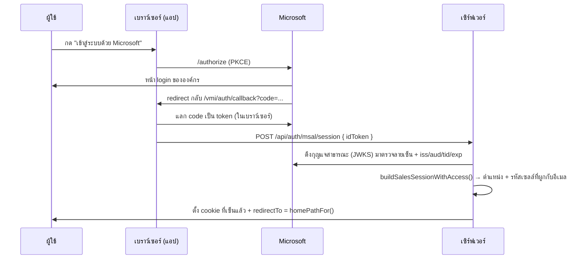

[← กลับหน้าแรก](./00-home.md)

# 03 — การยืนยันตัวตน

ระบบมี 2 เส้นทางล็อกอินจริงที่แยกกันสิ้นเชิง + โหมดทดสอบของ Creator อีก 2 แบบ แต่ละแบบเก็บ cookie คนละตัว
ทุก cookie ที่เป็นตัวตนเซ็นด้วย HMAC-SHA256 จาก `NEXTAUTH_SECRET` (`lib/auth/session-secret.ts`)

| บทบาท | วิธีเข้า | Cookie หลัก | ไฟล์หลัก |
|---|---|---|---|
| ร้านค้า / คลัง VDA | อีเมล + password (`StoreAccount`) | `vmi_store_session` (เซ็นแล้ว) | `lib/auth/store-session.ts`, `store-account.ts`, `store-password.ts` |
| เซลล์ / Admin / Creator | Microsoft Entra ID (id_token) | `vmi_sales_session` (เซ็นแล้ว) | `lib/auth/microsoft-oauth-client.ts`, `microsoft-id-token.ts`, `sales-session.ts` |
| Creator เข้าดูร้าน | เลือกรหัส VDA — **ต้องมี sales session ของ Creator** | `vmi_store_id` + `vmi_store_code` + `vmi_admin_preview` | `lib/auth/customer-session.ts`, `admin-preview.ts` |
| Creator ดูเป็นเซลล์ | เลือกอีเมล/รหัสเซลล์ | `vmi_sales_preview` (เซ็นแล้ว) + `vmi_sales_preview_info` | `lib/auth/sales-preview.ts` |

## Cookie และอายุ

ชื่อ cookie อยู่ที่ `lib/auth/roles.ts` (และถูกประกาศซ้ำใน `middleware.ts` เพราะ Edge import Prisma ไม่ได้)

| Cookie | ใครตั้ง | httpOnly | อายุ | หมายเหตุ |
|---|---|---|---|---|
| `vmi_store_session` | store login / set-password / change-password | ✓ | 7 วัน (ใน token + maxAge) | ตัวตนร้านที่เชื่อถือได้ · มี `sessionVersion` |
| `vmi_store_id` | store login + Creator เข้าดูร้าน | ✓ | 7 วัน | cuid ดิบ **ไม่ได้เซ็น** — เชื่อได้เฉพาะเมื่อ raw session เป็น Creator |
| `vmi_store_code` | เหมือนข้างบน | ✗ | 7 วัน | ให้ UI อ่านรหัสร้าน |
| `vmi_sales_session` | `POST /api/auth/msal/session` · `/api/sales/active-code` · `/api/auth/microsoft/callback` | ✓ | 7 วัน | `/api/dev/login` ออกให้ 8 ชม. |
| `vmi_sales_preview` | `POST /api/auth/admin/preview-sales` | ✗ | 8 ชม. | เซ็นแล้ว · มีผลเฉพาะเมื่อ raw session เป็น Creator |
| `vmi_sales_preview_info` | เหมือนข้างบน | ✗ | 8 ชม. | JSON ให้แบนเนอร์อ่าน — ไม่ใช้ตัดสินสิทธิ์ |
| `vmi_admin_preview` | `POST /api/auth/customer/login` | ✗ | 8 ชม. | ค่า `"1"` ไว้ให้ UI รู้ว่าอยู่ในโหมดเข้าดูร้าน — **ห้ามใช้ตัดสินสิทธิ์** (ปลอมได้) |
| `ms_oauth_state` · `ms_oauth_pkce` | `/api/auth/microsoft/login` (flow เดิม) | ✓ | 10 นาที | |

`secure` เปิดเมื่อ `NODE_ENV === "production"` · `sameSite: lax` · `path: /`

### middleware (`middleware.ts`)

ด่านหน้าเท่านั้น — Edge ตรวจลายเซ็นเองไม่ได้ ตัวตนจริงตัดสินฝั่งเซิร์ฟเวอร์อีกชั้นเสมอ

- `/stock` `/order` `/manage` `/history` — ไม่มี `vmi_store_id` **และ** ไม่มี `vmi_store_session` → `/login?mode=customer`
  (ดูทั้งสองตัว ไม่งั้นเกิดวง redirect เมื่อ cookie สองตัวหลุดไม่พร้อมกัน)
- `/sales` `/admin` — ไม่มี `vmi_sales_session` ที่หน้าตาเป็น token → `/login?mode=sales`
- เข้า `/admin/*` = **ลบ cookie มุมมองทดสอบเซลล์ทิ้ง** (กลับหน้าตั้งค่า = ออกจากมุมมองเซลล์อัตโนมัติ)
- ไม่ครอบ `/api/*` — route API ตรวจสิทธิ์เองทุกตัว (ดู [05](./05-api-reference.md))

## 1. ร้านค้า — บัญชี `StoreAccount`

ร้านค้าทุกแห่งเข้าสู่ระบบด้วยอีเมลและรหัสผ่าน · บัญชีสร้างโดยผู้ดูแลที่ `/admin/stores/accounts`
หรือร้านขอเองแล้วรออนุมัติ

| ขั้นตอน | API |
|---|---|
| ขอเปิดบัญชี / ดูว่าต้องทำอะไรต่อ | `POST /api/auth/store/request` `{ email, vdaCode? }` → `step`: `pending` · `rejected` · `set-password` · `login` |
| ตั้งรหัสผ่านครั้งแรก / หลังรีเซ็ต | `POST /api/auth/store/set-password` `{ email, setupCode, password }` → ล็อกอินให้เลย |
| ล็อกอิน | `POST /api/auth/store/login` `{ email, password }` |
| เปลี่ยนรหัสเอง (ล็อกอินอยู่) | `POST /api/auth/store/change-password` `{ currentPassword, newPassword }` — อีเมลมาจาก session เท่านั้น |
| ขอรีเซ็ตรหัส | `POST /api/auth/store/request-reset` — แค่บันทึก `resetRequestedAt` ให้แอดมินเห็น |
| ออกจากระบบ | `POST /api/auth/customer/logout` (ลบ cookie ร้านทั้ง 3 ตัว) |

- รหัสผ่าน hash ด้วย **scrypt** (`scrypt$<salt>$<hash>`) · ตั้งใหม่ต้องยาว 8–128 ตัว (`lib/auth/password-rules.ts`) —
  รหัสเดิมที่สั้นกว่านี้ยังล็อกอินได้
- login / ตั้งรหัสของร้าน**ไม่ต้องรอข้อมูลจาก Fabric** (อ่านแค่ `StoreAccount`) — เดิมดัก `fabricStockReady()`
  ไว้ sync ล้มครั้งเดียวร้านทุกร้านเข้าระบบไม่ได้ · หน้าสต็อกแสดงว่าข้อมูลยังไม่พร้อมเอง
- login สำเร็จ (`establishStoreSession` ใน `lib/auth/store-login-helper.ts`) → สร้าง/หา `Store` ตามรหัส VDA, sync สต็อกของร้าน,
  ตั้ง `vmi_store_id` `vmi_store_code` `vmi_store_session`

### รหัสตั้งค่าครั้งแรก (ตั้งแต่ 28 ก.ย. 2569)
ตั้งรหัสผ่านครั้งแรก/หลังรีเซ็ต **ต้องมีรหัสตั้งค่า** ที่แอดมินส่งให้ — เดิมรู้แค่อีเมลของบัญชีที่เพิ่งสร้าง/รีเซ็ตก็ยึดบัญชีได้
- ออกให้อัตโนมัติตอน เพิ่มบัญชี / อนุมัติคำขอ (ถ้ายังไม่เคยตั้งรหัส) / รีเซ็ตรหัส (`lib/auth/store-account.ts`) ·
  8 ตัว `XXXX-XXXX` จาก 31 ตัวอักษรที่ไม่สับสนกัน (ไม่มี 0/O 1/I/L) · ใช้ครั้งเดียว · หมดอายุ 72 ชม. · เก็บแค่ sha256
- แอดมินเห็นครั้งเดียวในกล่องสีเขียวแล้วส่งต่อร้านเอง (ระบบยังส่งอีเมลไม่ได้) · **ไม่จดลง audit log**
- หาย/หมดอายุ → ปุ่ม «ออกรหัสตั้งค่าใหม่» (action `reset-password` เดิม) อันเก่าใช้ไม่ได้ทันที
- ใช้รหัสด้วย compare-and-set บน hash เดิม — สองคนกดพร้อมกันได้คนเดียว · ไม่มีบัญชีกับรหัสผิดตอบข้อความเดียวกัน

### session ร้านตรวจกับบัญชีทุก request
token เก็บ `sessionVersion` ของบัญชี · `getStoreSession()` อ่านบัญชีทุกครั้ง (query เดียว) แล้วส่งให้
`reconcileStoreSession()` — token ใช้ไม่ได้ทันทีถ้า:

- บัญชีถูกลบ หรือ `status !== "approved"`
- `mustSetPassword` หรือไม่มี `passwordHash` (ถูกรีเซ็ต)
- `vdaCode` ไม่ตรงกับใน token (ถูกย้าย VDA)
- `sessionVersion` ไม่ตรง — เพิ่มทุกครั้งที่ อนุมัติ / ปฏิเสธ / ย้าย VDA / รีเซ็ตรหัส / ตั้งรหัสครั้งแรก / เปลี่ยนรหัส
  (เปลี่ยนรหัสเอง = เครื่องอื่นหลุดหมด เครื่องที่เปลี่ยนได้ cookie ใหม่)

ผ่าน = คืน session ที่ `canManageMinMax` เป็น**ค่าปัจจุบัน**จาก DB (เปลี่ยนสิทธิ์ min/max จึงไม่ต้องเพิ่ม version) ·
DB อ่านไม่ได้ชั่วคราว → ใช้ token ไปก่อน (ไม่เตะทุกร้านออก) · ห้ามลบ cookie ใน `getStoreSession()` เพราะถูกเรียกระหว่าง render

### ตัวตนของร้านค้ามาจาก session ที่ลงลายเซ็นแล้วเท่านั้น

`lib/auth/store-context.ts` → `getAuthorizedStore()` เป็นช่องทางเดียวที่ API ฝั่งร้านค้าใช้ระบุว่าเป็นร้านใด:

1. `vmi_store_session` ที่ผ่าน `getStoreSession()` → ร้านนั้น (`viaAdminPreview: false`)
2. ไม่มี → raw sales session เป็น **Creator** (`role === "admin"`) จึงเชื่อ `vmi_store_id` ได้ (`viaAdminPreview: true`)
3. นอกนั้น = ไม่มีสิทธิ์

**ห้ามอ่าน cookie `vmi_store_id` โดยตรงในโค้ดใหม่** เนื่องจากเป็นค่า cuid ที่ไม่ได้ลงลายเซ็น
httpOnly ป้องกัน JavaScript ได้ แต่ไม่ป้องกัน HTTP request ที่ประกอบขึ้นเอง — เดิมทั้งระบบใช้ค่านี้เป็นตัวระบุตัวตน
ใครตั้ง cookie เป็นรหัสร้านอื่นก็อ่าน/แก้ข้อมูลร้านนั้นได้ และ `GET /api/stock?storeId=` เรียกได้โดยไม่มี session เลย

### Rate limit (`lib/auth/rate-limit.ts`)

sliding window ในหน่วยความจำของ process เดียว (รีสตาร์ทแล้วรีเซ็ต · หลาย container ต่างตัวต่างนับ) · เกิน = **429** + `Retry-After`

| Route | เพดาน | key |
|---|---|---|
| `store/login` | 10 ครั้ง / 15 นาที | IP + อีเมล |
| `store/change-password` | 10 ครั้ง / 15 นาที | IP + อีเมลใน session |
| `store/set-password` | 20 ครั้ง / 15 นาที **และ** 5 ครั้ง / 15 นาที | IP · อีเมล (ตัวที่กันเดารหัสตั้งค่าจริง) |
| `store/request` | 5 ครั้ง / ชม. | IP |
| `store/request-reset` | 5 ครั้ง / ชม. | IP |

IP มาจาก `clientIp()`: `x-real-ip` (nginx ตั้งจาก `$remote_addr`) → hop **สุดท้าย** ของ `x-forwarded-for` → `"unknown"` —
**ห้ามใช้ hop แรก** (client พิมพ์เองได้ เคยหลบเพดานได้จริง) · แอปต้องอยู่หลัง nginx ชั้นเดียวเท่านั้น

## 2. เซลล์ / Admin / Creator — Microsoft Entra ID

ใช้ **authorization code + PKCE ฝั่งเบราว์เซอร์** (SPA flow) — `lib/auth/microsoft-oauth-client.ts`
เบราว์เซอร์เป็นคนแลก code เป็น token เอง แล้วส่ง **id_token ดิบ** มาให้เซิร์ฟเวอร์ตรวจลายเซ็นเอง
ก่อนออก session (เซิร์ฟเวอร์จึงต้องออกอินเทอร์เน็ตไป `login.microsoftonline.com` ได้ —
เส้นทางเดียวกับที่ใช้ sync Fabric)


```mermaid
sequenceDiagram
    participant U as ผู้ใช้
    participant B as เบราว์เซอร์ (แอป)
    participant M as Microsoft
    participant S as เซิร์ฟเวอร์
    U->>B: กด "เข้าสู่ระบบด้วย Microsoft"
    B->>M: /authorize (PKCE)
    M->>U: หน้า login ขององค์กร
    M->>B: redirect กลับ /vmi/auth/callback?code=...
    B->>M: แลก code เป็น token (ในเบราว์เซอร์)
    B->>S: POST /api/auth/msal/session { idToken }
    S->>M: ดึงกุญแจสาธารณะ (JWKS) มาตรวจลายเซ็น + iss/aud/tid/exp
    S->>S: buildSalesSessionWithAccess() → ตำแหน่ง + รหัสเซลล์ที่ผูกกับอีเมล
    S->>U: ตั้ง cookie ที่เซ็นแล้ว + redirectTo = homePathFor()
```

> **ตัวตนพิสูจน์ที่เซิร์ฟเวอร์:** `POST /api/auth/msal/session` รับ `{ idToken }` แล้วตรวจ
> ลายเซ็น RS256 กับกุญแจสาธารณะของ tenant (JWKS · cache 24 ชม. · โหลดใหม่เมื่อเจอ kid
> ที่ไม่รู้จัก) พร้อมเช็ค `iss` / `aud` / `tid` / `exp` ก่อนเชื่อว่าอีเมลในนั้นเป็นของจริง (ผิด = 401) —
> `lib/auth/microsoft-id-token.ts` เทสต์ที่ `tests/microsoft-id-token.test.ts` · อีเมลไม่มีสิทธิ์ = 403
>
> เดิมรับ `{ email }` มาตรง ๆ แล้วเซ็น cookie ให้เลย ใครยิง API ถึงและรู้อีเมลที่อยู่ใน
> `ADMIN_EMAILS` ก็เป็นแอดมินได้โดยไม่ต้องผ่าน Microsoft (middleware กันแต่หน้าเว็บ)
>
> `lib/auth/microsoft-oauth.ts` (server-side flow เดิม) และ route `/api/auth/microsoft/login` · `/callback`
> หน้าเว็บไม่เรียกแล้ว แต่ยังทำงานได้และปลอดภัยเพราะแลก code ฝั่งเซิร์ฟเวอร์เอง (มี state + PKCE cookie)

### session token
`lib/auth/sales-session.ts` เซ็น payload ด้วย HMAC-SHA256 โดยใช้ `NEXTAUTH_SECRET`
อายุ 7 วัน · ตอน verify จะประกอบ object กลับ**ทีละฟิลด์** ไม่ spread
เพื่อไม่ให้ฟิลด์แปลกปลอมใน token (เช่น `previewBy`) หลุดเข้ามาเป็นสิทธิ์

### บทบาทถูกคำนวณจากอีเมล — ไม่ใช้ cross_salesman master แล้ว (28 ก.ย. 2569)
`buildSalesSessionWithAccess(email)` ดูสองอย่าง:
**ระดับแอดมิน** (`resolveAdminAccess` — `.env` ชนะ DB เสมอ) และ **รหัสเซลล์ที่ผูกกับอีเมล** (`getManualSalesmanCodes`)

| อีเมลนี้ | session ที่ได้ |
|---|---|
| อยู่ใน `ADMIN_EMAILS` (หรือ `APP_ADMINS`) ใน .env | **Creator** = `role: "admin"` + `adminAccess: "creator"` · ผูกรหัสไว้ก็ได้ ไม่ผูกก็ได้ |
| อยู่ในตาราง `Admin` (ไม่อยู่ใน .env) + ผูกรหัส | **Admin + เซลล์** = `role: "sales"` + `adminAccess: "admin"` · เห็นเฉพาะรหัสที่ผูก |
| อยู่ในตาราง `Admin` ไม่ผูกรหัส | **Admin** = `role: "sales"` + `adminAccess: "admin"` · ขอบเขตว่าง เข้าได้แต่หน้าตั้งค่า |
| ผูกรหัสไว้ ไม่ใช่แอดมิน | **เซลล์** `role: "sales"` · 1 อีเมลผูกได้ 1 รหัส (`POST /api/admin/salesman-assignments` ตอบ 409 ถ้าผูกรหัสอื่นอยู่แล้ว · ตั้งแต่ 30 ก.ย. 69) |
| ไม่เข้าข้อไหนเลย | **login ไม่ได้** (403 "อีเมลนี้ยังไม่ได้ผูกกับรหัสเซลล์ …") |

- รหัสหลัก = รหัสแรกที่ดูแลคลัง (`pickPrimaryCode`) · ชื่อที่แสดง = "รหัส SXXX" · ชื่อคนมาจากบัญชี Microsoft
- `session.manualCodes` = รหัสที่ผูก ณ ตอนออก session (เรียงแล้ว) — ใช้ตรวจการเปลี่ยนแปลงด้านล่าง
- หน้าแรกหลัง login ดู `homePathFor()` — Creator `/admin` · Admin ที่มีรหัส `/sales/orders` · Admin ไม่มีรหัส `/admin/stores/accounts` · เซลล์ `/sales/orders`

### `SalesmanEmailAssignment` = แหล่งเดียวของรหัสเซลล์

`getManualSalesmanCodes(email)` (`lib/auth/manual-salesman-assignments.ts`) อ่านแถว `active` ของอีเมลนี้ในตาราง
`SalesmanEmailAssignment` (แก้ที่แท็บ «สิทธิ์เซลล์-VDA» `/admin/system/vda-sales` ผ่าน `/api/admin/salesman-assignments`)

- **ไม่มีการจับคู่อัตโนมัติ**จาก `cross_salesman` / `cross_target` แล้ว — ไม่มีแถว = อีเมลนี้ไม่ใช่เซลล์
- รหัสไม่จำเป็นต้องมีใน master ใด ๆ (รหัส SXXX ที่ใช้จริงไม่มีใน master)
- รหัส → VDA ยังมาจากทะเบียน VDA (Fabric `cross_target` / `VDA_SALESMAN_MAP`) — ไม่มีคลัง = ล็อกอินได้แต่ไม่เห็นออเดอร์
- ทุกจุดที่ดึง "รหัสทั้งหมดของคนนี้" (`getPersonSalesCodes` → ปุ่มดูทุก VDA ของฉัน, ตัวสลับรหัส, `assertOrderAccess`,
  หน้า PO, แจ้งเตือน, ขอบเขตโปร) ส่ง `session.manualCodes` ไปด้วย · สลับรหัส (`POST /api/sales/active-code`) ได้เฉพาะในชุดนี้

### `revalidateManualCodes` — แก้สิทธิ์แล้วมีผลใน request ถัดไป

`getRawSalesSession()` เรียก `revalidateManualCodes(session)` ทุก request (query ตารางที่มี index ที่ `email`):

- เทียบ **รหัสที่ผูกตอนนี้** กับ `session.manualCodes` และ **ระดับแอดมินตอนนี้** กับ `adminAccess` / `role` ใน cookie
- cookie ที่ออกตอนยังใช้ master (role manager/supervisor, รหัส active หรือ `scopeSalesmanCodes` ที่ไม่อยู่ในชุดที่ผูก,
  `scopeEmails` ที่ไม่ใช่ตัวเอง) ถือว่าไม่ตรงเช่นกัน — ขอบเขตใน cookie ห้ามกว้างกว่าที่ผูกอยู่ตอนนี้
- ตรงกันหมด → ใช้ session เดิม · ไม่ตรง → คำนวณใหม่ด้วย `buildSalesSessionWithAccess` สำหรับ request นั้น ·
  คำนวณไม่ได้แล้ว (ไม่เหลือรหัสและไม่ใช่แอดมิน) → คืน `null` ผู้ใช้ถูกพาไป login · DB อ่านไม่ได้ชั่วคราว → ใช้ session เดิม
- ไม่เขียน cookie ใหม่ตรงนั้น (ห้ามแก้ cookie ระหว่าง render) จึงคำนวณซ้ำทุก request จน login ใหม่
- ผล: creator เพิ่ม/ลบ admin หรือแอดมินเพิ่ม/เอาอีเมลออกจากรหัส → **มีผลทันที** ไม่ต้องรอ cookie หมดอายุ
- เทส: `tests/permissions.test.ts`, `tests/sales-session-revalidate.test.ts`

`getSalesSession()` = `getRawSalesSession()` แล้วซ้อนมุมมองทดสอบเซลล์ (ถ้ามี) · route ที่ต้องรู้ "คนที่กดจริง"
(หน้าตั้งค่า, audit log, โหมดทดสอบ, สลับรหัส) ใช้ **raw** เสมอ

### Creator กับ Admin (ตัดสิน 28 ก.ย. 2569)

สิทธิ์ทั้งหมดอยู่ที่ `lib/auth/permissions.ts` (`isCreator`, `isStaffAdmin`, `can`, `hasSettingsAccess`, `hasSalesView`, `homePathFor`)
— ไฟล์ .ts ล้วน ไม่ import Prisma ใช้ได้ทั้ง server/client

| ตำแหน่ง | หน้าแรก | หน้าตั้งค่า (/admin) | หน้าเซลล์ (/sales) |
|---|---|---|---|
| Creator (.env) | `/admin` | ทุกแท็บ ทุก action | ได้ เห็นทุกร้าน |
| Admin | `/admin/stores/accounts` | บัญชีร้านค้า + โปร C4 + สิทธิ์เซลล์-VDA (ตามสิทธิ์ด้านล่าง) | ไม่ได้ (`hasSalesView` = false → API หน้าเซลล์ตอบ 403) |
| Admin + เซลล์ | `/sales/orders` | เหมือน Admin (ปุ่ม «ตั้งค่า» ใน header) | เฉพาะรหัสตัวเอง |

`can(session, permission)` — Creator ผ่านทุกสิทธิ์ · Admin ผ่านเฉพาะ `ADMIN_PERMISSIONS`:

| สิทธิ์ | ใช้ที่ | Creator | Admin |
|---|---|---|---|
| `stores.view` | ดูรายการบัญชีร้าน (Admin เห็นแค่ รออนุมัติ + อนุมัติแล้ว) | ✓ | ✓ |
| `stores.approve` | อนุมัติคำขอที่ `pending` (เลือก VDA ได้) | ✓ | ✓ |
| `stores.resetPassword` | ออกรหัสตั้งค่าใหม่ให้บัญชีที่ `approved` | ✓ | ✓ |
| `stores.create` | เพิ่มบัญชีใหม่ (Admin ติ๊กสิทธิ์ min/max ไม่ได้) | ✓ | ✓ |
| `promotions.view` | ดูโปร C4 ทุกคลัง (`resolvePromoVdaScope`, `/api/promo/inspector`) | ✓ | ✓ |
| `salesCodes.view` | ดูตาราง รหัสเซลล์ ↔ อีเมล ↔ VDA | ✓ | ✓ |
| `salesCodes.addEmail` | เพิ่มอีเมลให้รหัสเซลล์ (ห้ามอีเมลที่เป็นผู้ดูแลระบบ → 403) | ✓ | ✓ |
| — (Creator เท่านั้น) | ปฏิเสธ/ลบ/แก้ VDA/แก้อีเมล/สิทธิ์ min-max ของบัญชีร้าน · เอาอีเมลออกจากรหัส (`DELETE`) · ผู้ดูแล · บันทึกการทำงาน · ข้อมูล/Sync/ทะเบียนคลัง · MIN/MAX & หยุดสั่ง · มุมมองทดสอบ · กรองออเดอร์ตามรหัสเซลล์ | ✓ | ✗ |

- **`role === "admin"` = Creator เท่านั้น** — โค้ดเดิมราว 75 จุดใช้เงื่อนไขนี้ให้สิทธิ์เต็ม Admin ใหม่ถือ role
  ของเซลล์แทน จุดไหนที่ไม่ได้เปิดให้ Admin ไว้จึง "ทำไม่ได้" โดยปริยาย ไม่ใช่ "ได้เกิน"
- สิทธิ์ตรวจที่ API เสมอ ไม่ใช่แค่ซ่อนปุ่ม: `app/api/admin/store-accounts/route.ts`, `app/api/admin/salesman-assignments/route.ts`,
  `app/api/admin/audit-log/route.ts` (`isCreator`)
- หมวดที่ Creator เท่านั้น (ข้อมูล · MIN/MAX · มุมมองทดสอบ · ผู้ดูแล · บันทึกการทำงาน) กันด้วย `layout.tsx` ของหมวด
  (`CreatorOnlyLayout` — `app/admin/data`, `app/admin/stores/thresholds`, `app/admin/preview`, `app/admin/system/admins`,
  `app/admin/system/audit`) · เพิ่มแท็บใหม่ให้ Admin เห็นได้ต้องใส่ `permission` ใน `lib/admin/admin-nav.ts`
  **และ** เปิด API ที่หน้านั้นเรียกด้วย `can()`
- Creator ตั้ง Admin เป็นเซลล์ได้ที่ «ระบบ › ผู้ดูแล» (ปุ่ม «เป็นเซลล์» = เพิ่มแถว `SalesmanEmailAssignment`)
- อีเมลใน `ADMIN_EMAILS` ถูก bootstrap ลงตาราง `Admin` ด้วย (`fromEnv=true` · ลบจากหน้าเว็บไม่ได้) แต่ยังเป็น
  **Creator** เพราะ `.env` ชนะ DB เสมอ · แถวที่ `fromEnv=false` คือ Admin ที่ Creator เพิ่ม

## สิทธิ์เข้าถึงออเดอร์

อยู่ที่ `lib/orders/access.ts` — `assertOrderAccess(orderId, session)`

1. Creator (`role === "admin"`) ผ่านหมด
2. ร้าน VDA → รหัสเซลล์ของเรา (รหัส active + `scopeSalesmanCodes` หรือทุกรหัสที่ผูกกับอีเมล) ดูแล VDA นั้นตามทะเบียน VDA ไหม
3. ร้านที่ไม่ใช่ VDA หรือทะเบียน VDA ยังไม่โหลด → **ปฏิเสธ** (fail closed · เดิมถอยไปเทียบ `Store.salesRep`
   ซึ่งค้างเก่าได้ — เลิกใช้ `Store.salesRep` ทั้งระบบแล้วตั้งแต่ 29 ก.ย. 2569)

> "อีเมลนี้คือรหัสไหน" มาจากตาราง `SalesmanEmailAssignment` ใน DB · "รหัสนี้ดูแลคลังไหน" มาจากทะเบียน VDA ของ Fabric
> — ย้ายเขตที่ต้นทางแล้วสิทธิ์ตามทันทีหลัง sync โดยไม่ต้อง login ใหม่

## โหมดทดสอบของ Creator

Creator (ไม่ใช่ Admin — ทุก route ตรวจ raw `role === "admin"`) ดูระบบในมุมของคนอื่นได้โดยไม่ต้องรู้รหัสผ่านใคร

| อะไร | API | ผลลัพธ์ |
|---|---|---|
| ดูเป็นเซลล์ | `POST /api/auth/admin/preview-sales` `{ email, code? }` หรือ `{ code }` | ตั้ง `vmi_sales_preview` (8 ชม.) · มีแบนเนอร์เตือนบนหัวจอ |
| ออกจากมุมมองเซลล์ | `POST /api/auth/admin/exit-sales-preview` (หรือเปิดหน้า `/admin/*` — middleware ลบให้) | |
| เข้าดูร้าน (VDA) | `POST /api/auth/customer/login` `{ vda }` | ตั้ง `vmi_store_id` `vmi_store_code` `vmi_admin_preview` · 503 ถ้ายังไม่ sync สต็อก |
| ออกจากโหมดดูร้าน | `POST /api/auth/admin/exit-preview` | ลบ cookie ร้าน → redirect `/admin` |

### มุมมองทดสอบเซลล์ — ดูได้อย่างเดียว
- `applySalesPreview()` ซ้อน session **เฉพาะเมื่อ raw session เป็น Creator** — ได้ `role: "sales"`, อีเมล/รหัสของเซลล์นั้น,
  `manualCodes: [รหัสนั้น]` (ไม่งั้นติดคลังของ Creator เอง) และ `previewBy` = อีเมลจริงของ Creator
- `previewBy` ไม่เคยอยู่ใน cookie ที่เซ็น (verify ไม่อ่านฟิลด์นี้) จึงปลอมไม่ได้
- **route เขียนทุกตัวฝั่งเซลล์ตอบ 403** ผ่าน `salesPreviewReadOnly(session)` — อนุมัติ/ปฏิเสธ/แก้/ลบ/ส่ง ERP/erp-resolve/
  clone-for-erp/รับทราบแจ้งเตือน · เดิมเขียนได้และบันทึกเป็นอีเมลของเซลล์ที่ถูกทดสอบ (QA 28 ก.ย. 69)
- ตามรหัสอย่างเดียว (รหัสในทะเบียน VDA ที่ยังไม่มีคนผูก) ใช้อีเมลสังเคราะห์ `__code_preview__:SXXX`
- หน้าตั้งค่า / audit log ใช้ raw session — Creator ที่อยู่ในมุมมองทดสอบยังจัดการบัญชีได้และถูกจดเป็นตัวเอง

### โหมดเข้าดูร้าน
- ตัวตนร้านมาจาก `getAuthorizedStore()` ข้อ 2 (Creator + `vmi_store_id`) · ถ้าเครื่องนั้นมี store session อยู่ด้วย store session ชนะ
- เปิดกระดิ่งร้านไม่ทำให้แจ้งเตือนถูกอ่าน (PATCH ตอบสำเร็จแต่ไม่เขียน) · MIN/MAX ดูได้อย่างเดียว ·
  หยุดสั่งทำได้และบันทึกอีเมลของ Creator เป็นผู้ตั้ง · ส่งออเดอร์ / ยกเลิก / ตอบรายการรอยืนยันได้เหมือนร้าน

## DEV_LOGIN — ล็อกอินบนเครื่อง dev โดยไม่ผ่าน Microsoft

`GET /api/dev/login?email=someone@sahapat.co.th` (`app/api/dev/login/route.ts`) — เปิดเมื่อครบทั้ง 3 ข้อ ไม่งั้นตอบ **404**:

1. ไม่ใช่ production build (`NODE_ENV !== "production"`)
2. `.env` ตั้ง `DEV_LOGIN=1`
3. เรียกจาก `localhost` / `127.0.0.1` / `[::1]`

สิทธิ์คำนวณด้วย `buildSalesSessionWithAccess` ตัวจริง — ได้ตำแหน่ง Creator / Admin / Admin+เซลล์ / เซลล์ ตรงกับ login จริง ·
cookie อายุ 8 ชม. แล้ว redirect ไป `homePathFor()`

## ตั้งค่า Azure Portal

Redirect URI ต้องตรงกับค่าที่ระบบใช้งานจริง คือ **มี basePath `/vmi` และลงท้ายด้วย
`/auth/callback`** (ไม่ใช่ `/api/auth/microsoft/callback` ซึ่งเป็น route ของ flow เดิม)

```
https://<โดเมน>/vmi/auth/callback
http://localhost:3000/vmi/auth/callback   ← สำหรับ dev
```

ลงทะเบียนภายใต้ประเภท **Single-page application (SPA)** ไม่ใช่ Web และห้ามมีเครื่องหมาย
`/` ปิดท้าย

ค่าที่ระบบใช้จริงมาจาก `getMicrosoftCallbackPath()` ใน `lib/auth/microsoft-oauth-client.ts`
หากมีการเปลี่ยนแปลง path ต้องแก้ไขทั้งใน Azure และค่า `NEXT_PUBLIC_AZURE_REDIRECT_URI`

env ที่ต้องมี: `NEXTAUTH_SECRET`, `ADMIN_EMAILS` (รับ `APP_ADMINS` เป็นชื่อสำรอง · คั่นด้วย `,` หรือ `;`)

client id / tenant id **ไม่ได้อยู่ใน env** — อยู่ในโค้ดที่ `lib/auth/azure-app.ts`
เพราะเป็นตัวระบุสาธารณะ (ถูกส่งให้ทุกเบราว์เซอร์อยู่แล้ว) และเพราะ `NEXT_PUBLIC_*`
ตั้งบน server ไม่ได้ ดูหัวข้อถัดไป

> **`NEXTAUTH_SECRET` มีเงื่อนไขเพิ่มเติมนอกเหนือจากการมีค่า** ระบบ production
> จะ**ไม่เริ่มทำงาน** หากไม่ได้กำหนด สั้นกว่า 32 ตัวอักษร หรือยังเป็นค่าตัวอย่าง
> (`vmi-dev-secret`, `your-random-secret-here`) รายละเอียดที่ `lib/auth/session-secret.ts`
> การออกแบบให้หยุดทำงานทันทีเป็นไปเพื่อป้องกันกรณีที่ cookie ทุกใบสามารถถูกปลอมแปลงได้ ·
> เปลี่ยนค่านี้ = token ของทุกคน (ร้าน/เซลล์/มุมมองทดสอบ) ใช้ไม่ได้พร้อมกัน ต้อง login ใหม่หมด

> ⚠️ `NEXT_PUBLIC_*` ถูกฝังลง JS ตอน `next build` **และ `.dockerignore` กัน `.env`
> ออกจาก build context** — ตั้งใน `.env` บน server จึงไม่มีผลกับฝั่งเบราว์เซอร์เลย
> (เคยทำให้ปุ่ม Sign in เด้ง "ยังไม่ได้ตั้ง NEXT_PUBLIC_AZURE_AD_CLIENT_ID" ทั้งที่
> ตัวแปรอยู่ครบใน `.env`) ค่าจึงย้ายไปอยู่ในโค้ดที่ `lib/auth/azure-app.ts` แล้ว
