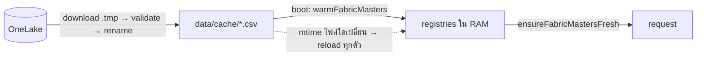

[← กลับหน้าแรก](./00-home.md)

# 06 — Fabric / OneLake

ข้อมูล master ทั้งหมดมาจาก Microsoft Fabric แบบ **อ่านอย่างเดียว** ระบบไม่เคยเขียนกลับ
โค้ดอยู่ที่ `lib/fabric/**` · รายชื่อชุดข้อมูลมีแหล่งความจริงเดียวคือ `lib/fabric/datasets.ts`

## ชุดข้อมูลที่ดึงมา (`lib/fabric/datasets.ts`)

| dataset id | ไฟล์ใน `data/cache/` | อยู่ที่ (workspace / SP) | required | ใช้ทำอะไร |
|---|---|---|---|---|
| `customer_master` | `dim_customer.csv` | masters (`ONELAKE_*`) | ✅ | ชื่อร้าน ภาค (`Area_NameEnglish`) ค้นหาลูกค้า |
| `sku_master` | `item_barcode_map_v2.csv` (~68MB ใหญ่สุด) | masters | ✅ | ชื่อ บาร์โค้ด ขนาดหีบ ราคา `VatStatus` |
| `stock_cover_day` | `stock_cover_day.csv` | stock (`STOCK_ONELAKE_*`) | ✅ | สต็อก + ขายเฉลี่ย L7/L30 → CVD |
| `promotion_c4` | `cft_promotion_cash.csv` | Bronze_OrderAgent · SP stock | ✅ | ขั้นโปร C4 ส่วนลด ของแถม |
| `assorted_mapping` | `cft_assorted_mapping.csv` | Bronze_OrderAgent · SP stock | ❌ | ชื่อกลุ่มโปร (`ASSORTEDPRODUCTGROUP` → `DESCRIPTIONASSORTED`) ขาด = โชว์รหัสกลุ่มแทน |
| `cross_target_current_month` | `cross_target_current_month.csv` | Bronze_OrderAgent · SP stock | ❌ | แท็บ "ควรมีขาย" **และ** จับคู่ "เซลล์คนไหนดูแล VDA ไหน" (ดูทะเบียน VDA) |
| `factsales_odoo` | `factsales_odoo.csv` | lakehouse ของ stock · SP stock | ❌ | ยอดขายรายวัน กราฟ ขายเฉลี่ยตามช่วง |
| `vdaN_product_product` | `vda1_product_product.csv` … | stock · SP stock | ❌ | มูลค่าสต็อกจริง (`bi_stock_value`) ขาด = คิดจากราคาขาย |
| `salesman_registry` | `cross_salesman_reference_email.csv` | masters | ❌ | **ไม่ใช้แล้ว** (28 ก.ย. 2569) — ยังดึงมาไว้ดูที่ «ข้อมูลดิบ» แต่ไม่มีโค้ดอ่าน · สิทธิ์เซลล์มาจาก `SalesmanEmailAssignment` |

- **required** = ถ้าตัวนี้ล้ม รอบ sync ทั้งรอบนับว่าล้ม (`requiredRefreshSucceeded`) → retry + อีเมลแจ้ง ·
  ตัวที่ไม่ required ล้มได้โดยไม่ทำให้รอบล้ม (เดิมใช้ `some(r.ok)` ไฟล์เล็กสำเร็จตัวเดียวกลบการล้มของ master ได้)
- `vdaN_product_product` เป็น dynamic ตาม `getVdaKeys()` (vda1–vda5 ในโค้ด + คลังในทะเบียน + คลังที่โผล่ใน
  `stock_cover_day` · `VDA_CODES` ทับได้ถ้าต้องการชุดตายตัว)
- ชื่อไฟล์ต้นทางทุกตัว**ปักไว้ในโค้ด** (`fixedOrDefault` ใน `onelake-refresh.ts`) ไม่สแกนโฟลเดอร์หาไฟล์ที่คอลัมน์ตรง —
  การสแกนเคยหยิบ `cft_promotion_credit.csv` (ตารางเก่า) มาเป็นตาราง C4 แบบเงียบ ๆ (25 ส.ค. 2569)
  ไฟล์ผิดที่ตอนนี้จะเป็น 404 ที่เห็นบนหน้า sync แทน · `*_ONELAKE_PATH` ยัง override ได้
- `cft_promotion_credit.csv` และ `cross_sold_history_2y_qu.csv` **ไม่อยู่ในรายการดึงแล้ว** — ถ้ายังมีในเครื่องคือไฟล์ค้างเก่า
  (rollback โปรไปไฟล์อื่นได้ด้วย `PROMOTION_CSV=` ชี้ไฟล์ในเครื่อง)

## OneLake — service principal สองชุด

`lib/fabric/env.ts` + `lib/fabric/onelake-credential.ts` · token scope `https://storage.azure.com/.default`

| profile | env | อ่านได้ | หมายเหตุ |
|---|---|---|---|
| `masters` | `ONELAKE_TENANT_ID` / `ONELAKE_CLIENT_ID` / `ONELAKE_CLIENT_SECRET` (ถอยไป `AZURE_*`) | workspace masters (`ONELAKE_WORKSPACE_ID` + `ONELAKE_LAKEHOUSE_ID`) | **เข้า Bronze_OrderAgent ไม่ได้ (403)** |
| `stock` | `STOCK_ONELAKE_TENANT_ID` / `_CLIENT_ID` / `_CLIENT_SECRET` | workspace stock (`STOCK_ONELAKE_WORKSPACE_ID` + `STOCK_ONELAKE_LAKEHOUSE_ID`) **และ** Bronze_OrderAgent | ใช้กับ C4 / assorted / cross_target / factsales / vda product |

- ที่อยู่ของ Bronze_OrderAgent (workspace `18ff6d42…` / lakehouse `92789a85…`) เป็น**ค่า default ในโค้ด**
  ไม่ต้องตั้ง `CFT_*` · ตั้ง `CFT_WORKSPACE_ID` / `CFT_LAKEHOUSE_ID` / `CROSS_TARGET_*` เฉพาะเมื่อย้ายที่
- profile ของชุด Bronze = `stock` เป็น default (`CFT_AUTH_PROFILE`, `ASSORTED_AUTH_PROFILE`, `CROSS_TARGET_AUTH_PROFILE` ทับได้)
- ⚠️ **กับดัก:** ถ้าไม่ได้ตั้ง `STOCK_ONELAKE_*` เลย profile `stock` จะ**ถอยไปใช้ SP ของ masters เงียบ ๆ**
  แล้วได้ 403 ที่ Bronze · ข้อความ error บนหน้า sync จะบอก client_id ที่ยิงจริง + workspace + "STOCK_ONELAKE_* ไม่ได้ตั้ง → ใช้ SP ของ masters แทน"
- SP ต้องมีสิทธิ์อ่าน **ไฟล์** ใน OneLake: role Contributor ขึ้นไป หรือ Viewer + ReadAll ที่ lakehouse
  (Viewer เฉย ๆ อ่านไฟล์ไม่ได้)
- server ไม่มี TTY → ห้าม interactive login (`allowInteractive: false` จาก HTTP path เสมอ) ไม่ครบ credential = ถอยไป `DefaultAzureCredential`
- `factsales_odoo` ใช้ lakehouse ของ stock (ถอยจาก `getStockOnelakeConfig()`) · `AI_LH_*` ยังทับได้

## วงจรการโหลด



ลำดับตอน boot (`instrumentation.ts`)

1. `assertSessionSecret()` — secret ไม่ปลอดภัย = ไม่ start
2. `bootstrapAdminsFromEnv()` (`ADMIN_EMAILS`)
3. `initVdaWarehouseRegistry()` — โหลดทะเบียนคลัง VDA จาก DB (seed จาก `VDA_CUSTOMER_MAP` ครั้งเดียวถ้าตารางว่าง) **ต้องมาก่อน warm**
4. `startMasterRefreshScheduler()`
5. `warmFabricMasters()` — parse ทุกไฟล์เข้า RAM นอก request path แล้ว `checkPromoContextCoverage()`
6. `catchUpIfStale()` (ไม่ await) — ดึงไฟล์ที่ยังไม่มีในเครื่องทันที (`bootstrapMissingMasters`) และถ้า
   `lastSuccessAt` เก่ากว่า `MASTER_REFRESH_MAX_AGE_HOURS` จะไล่ sync ใหม่ในอีก 30 วิ (retry 1 ครั้ง)

ทุก request `ensureFabricMastersFresh()` เช็ค mtime ของทุกไฟล์ (stat อย่างเดียว) — ไม่เปลี่ยน = ใช้ของใน RAM ·
**ไฟล์ใดไฟล์หนึ่งเปลี่ยน → `reloadFabricMasters()` โหลดใหม่ทั้งชุด** (ไม่ใช่เฉพาะไฟล์นั้น) ตามลำดับ:
customer / promo / sku / sold history / stock cover → `cross_target` → ทะเบียน VDA (`VdaAosBill`) → มูลค่าสต็อก VDA

> ถ้าไม่ preload ตอน boot ผู้ใช้คนแรกจะต้องรอ parse ไฟล์ 68MB บน request thread
> (วัดได้ 2,852ms → หลัง preload เหลือ 0ms)

client รู้ว่ามีข้อมูลใหม่จาก `/api/data-version` (hash ของ mtime ทุกไฟล์ + `globalDataVersion`) — แท็บที่เปิดค้าง poll ทุก 5 นาที

## ทะเบียน (registries)

| ทะเบียน | ไฟล์ | ที่มา | หมายเหตุ |
|---|---|---|---|
| คลัง VDA → รหัสลูกค้า | `vda-warehouse-registry.ts` | ตาราง `VdaWarehouse` (DB) แก้ที่ `/admin/data/warehouses` | `VDA_CUSTOMER_MAP` = seed ตอนตารางว่าง + ตาข่ายตอน DB อ่านไม่ได้ · **แถวใน DB ชนะ env เสมอ** · snapshot เก็บบน `globalThis` (instrumentation กับ route เป็นคนละ bundle) · หลายรหัสลูกค้าคั่นด้วย `\|` |
| VDA ↔ รหัสเซลล์ | `vda-aos-bill.ts` | รหัสลูกค้าของคลัง → `cross_target_current_month` (`WarehouseCode`) → `SalesManCode` | เรียงตามจำนวนแถว ตัวแรก = เซลล์หลัก · `VDA_SALESMAN_MAP` เป็น fallback เฉพาะคลังที่จับคู่จากไฟล์ไม่ได้ (log ขึ้น ⚠) · log `[VdaAosBill] จับคู่เซลล์ให้ N VDA` |
| เป้าขายเดือนนี้ | `cross-target.ts` | `cross_target_current_month.csv` | `WarehouseCode` อาจมี prefix 4 ตัว (`G004` + รหัส 7 หลัก) · ตัดศูนย์นำหน้ารหัสลูกค้า · ข้ามสินค้าที่ขึ้นต้นด้วย `0` (ของแถม) · โหลดพังห้าม throw (แค่แท็บ "ควรมีขาย" ว่าง) |
| สินค้า | `sku-master.ts` | `item_barcode_map_v2.csv` | หนึ่งรหัสมีหลายแถวตาม `PRODUCTSIZE` (0 หีบ / 1 แพ็ค / 9 ชิ้น) **ราคาต่อหีบต้องอ่านจากแถว 0** · `VatStatus` นอกจาก Y/N = ไม่รู้ (ห้ามเดา Y) |
| โปร C4 | `promotion-credit.ts`, `promotion-lookup.ts`, `promotion-context.ts` | `cft_promotion_cash.csv` | บริบท (`DIVISIONSALE\|CUSTOMERGROUP`) อ่านจากไฟล์เองเมื่อมีชุดเดียว (ตาราง cash = `E\|98` ทั้งใบ) · ภาคจาก `dim_customer` ของรหัสลูกค้าคลัง · `COUNTRY=Y` = ทั้งประเทศ · ขั้นจริงใช้ `MINIMUMPURCHASE` ไม่ใช่ `from` ดิบ |
| มูลค่าสต็อก VDA | `vda-product-value.ts` | `vdaN_product_product.csv` | `bi_stock_value` เป็นมูลค่ารวมแล้ว ห้ามคูณคงเหลือซ้ำ |

> ⚠️ **ทะเบียน VDA ↔ เซลล์พึ่ง `cross_target_current_month`** ซึ่ง `required: false` —
> ไฟล์นี้ดึงไม่ได้รอบ sync ยังขึ้นว่าสำเร็จ แต่ถ้าไฟล์ในเครื่องหาย/ว่าง เซลล์จะไม่เห็นออเดอร์ของ VDA ใดเลย
> (ตั้งใจไม่ถอยไปใช้ข้อมูลเก่า) · ดูอาการที่ [10 — แก้ปัญหา](./10-operations-troubleshooting.md)

### ยามเฝ้าโปร

- `promo-context-check.ts` — ตอน boot ตรวจว่าบริบทที่ใช้ค้นมีในไฟล์จริง และไฟล์ที่โหลดคือตาราง cash
  (ตาราง credit เก่ามี 7-8 บริบท = ลายนิ้วมือ) → หน้า `/admin/promotions/c4` ขึ้นแถบแดง
- `promo-coverage.ts` — หลังทุกรอบ sync นับ SKU ที่ได้โปรจริง เทียบกับรอบก่อน ตกเกิน `PROMO_COVERAGE_DROP_ALERT_PCT` → เตือน

## การ sync

ทุกทริกเกอร์ (scheduler / boot / ปุ่มแอดมิน / ปุ่มร้าน "ตรวจข้อมูลใหม่" / CLI) ผ่าน `runMasterRefresh()` ตัวเดียว
มี in-flight guard บน `globalThis` — กดพร้อมกัน 20 คนก็ดาวน์โหลดครั้งเดียว

### สั่งเอง
```bash
npm run sync:masters          # CLI (อ่าน .env)
```
หรือหน้าเว็บ `/admin/data/sync` → ดึงทั้งหมด หรือเลือกเฉพาะบางชุด · ดูสถานะรายชุด (แถว ขนาด อายุ error ไฟล์ต้นทาง) ·
ดูเนื้อไฟล์ได้ที่ `/admin/data/raw` · การกดดึงจดลง audit log (`masters.refresh`)

### อัตโนมัติ — `lib/fabric/scheduler.ts`

| env | ค่าเริ่มต้น | หมายเหตุ |
|---|---|---|
| `MASTER_REFRESH_ENABLED` | เปิด (ทุก environment) | ปิดด้วยค่า `false` เท่านั้น · ⚠️ **ใน Docker ค่านี้ฮาร์ดโค้ด `"true"` ใน `docker-compose.yml` (`environment:` ชนะ `env_file:`)** — จะปิดต้องแก้ compose |
| `MASTER_REFRESH_HOUR` / `_MINUTE` | `3` / `30` | เวลา **Asia/Bangkok** ค่าผิดช่วงถอยเป็น 03:30 |
| `MASTER_REFRESH_MAX_AGE_HOURS` | `20` | เกินนี้ = ข้อมูลค้าง: boot ไล่ตาม · ปุ่มร้านสั่งดึงจริง · ป้าย "ข้อมูล ณ" เปลี่ยนสี |
| `ALERT_EMAIL` | — | ผู้รับ (คั่น `,` หรือ `;`) · ไม่ตั้ง = ส่งถึง `SENDER_EMAIL` เอง |
| `SENDER_EMAIL` | — | mailbox ผู้ส่ง (Graph `Mail.Send` ด้วย SP ของ masters) · **ไม่ตั้ง = ไม่มีอีเมลออกเลย** เหลือแค่ log `[VMI alert]` |

- ไม่มี workspace ตั้งไว้เลย (`hasAnyOnelakeTargets()` = false) scheduler ข้ามเอง
- รอบ scheduler ล้ม → retry 5 → 15 → 30 นาที (รวม ~50 นาที) แล้วจึงส่งอีเมลแจ้ง
- **รอบ scheduler สำรอง DB ทุกครั้งไม่ว่าผลจะเป็นอย่างไร** (`scripts/backup-db.mjs`) · ปุ่มที่คนกดไม่ backup (ต้องตอบเร็ว)
- สถานะเขียนที่ `data/logs/master-refresh-status.json` (`VMI_STATUS_DIR` ทับได้) — merge รายชุด
- log: `[VMI scheduler] ...` ตอนตั้งเวลา · `[VMI refresh] trigger=... ok=... <ms> <ชุด>:ok|error` ทุกรอบ

## กลไกกันข้อมูลพัง

| กลไก | ทำอะไร |
|---|---|
| ดาวน์โหลดลง `.tmp` แล้ว rename | ไฟล์ใหม่ไม่ผ่านด่าน = ลบ `.tmp` ทิ้ง **ไฟล์เดิมในเครื่องไม่ถูกแตะ** (ไม่มีการ backup CSV แยก) |
| `requiredColumns` | คอลัมน์ที่ใช้จริงต้องมีครบ (บังคับเฉพาะที่ใช้ — ต้นทางเพิ่มคอลัมน์อื่นได้ไม่พัง) |
| `*_MIN_ROWS` | แถวน้อยกว่าเกณฑ์ = ถือว่าดึงพลาด (`too_few_rows`) · default: customer 20000 · salesman 1000 · stock 100 · C4 1000 · sku 50000 · assorted 50 · cross_target 100 · factsales/vda product 1 |
| 404 | `no_remote_file` นับเป็น skipped (ต้นทางยังไม่ export) ต่างจาก 401/403 ที่บอก SP + workspace |
| retry | ระดับรอบ (scheduler) ไม่ใช่ระดับไฟล์ — 5/15/30 นาที |
| streaming parse | อ่าน CSV แบบ stream (`streamCsvFile`) · นับแถวด้วยการสแกน byte (`countCsvRecords`) ไม่ parse ทั้งไฟล์ |

> ตัวอ่าน CSV ของ repo รับไฟล์ต้นทางที่มี quote ไม่ escape — เคยฉีกแถวและกลืนแถวมาแล้ว แก้ parser ต้องมีเทสต์คุม

## เรื่องวันที่ที่ต้องระวัง

- **โซนเวลา** ใช้ `lib/fabric/bkk-date.ts` (`bangkokDateStr` ฯลฯ) เทียบวันที่แบบ Asia/Bangkok เสมอ
  เคยมีบั๊กที่โปรวันสุดท้ายดับตอน 7 โมงเช้าเพราะเทียบ UTC
- **ยอดขายเก็บ 120 วัน** (`MAX_DAYS_KEPT` ใน `sold-history.ts`) นับถอยหลังจาก**วันล่าสุดในไฟล์** ไม่ใช่วันนี้
- **ต้นทางส่งมาแค่ 30 วัน** — notebook `notebooks/factsales_odoo_daily_etl.py` ตั้ง `LOOKBACK_DAYS = 30`
  หน้าต่าง `[batch_date − 30, batch_date − 1]` (ไม่รวมวันนี้) ให้ตรงกับ L7/L30 ของ `stock_cover_day` ·
  ขอช่วง 90 วันจึงได้จริงแค่ 30 — `clampWindowToCoverage()` ตัดช่วงให้เท่าข้อมูลที่มี ไม่เติม 0 ปลอมแล้วหาร 90
  (อยากได้ย้อนหลังยาวกว่านี้ต้องแก้ `LOOKBACK_DAYS` ใน notebook ฝั่ง Fabric ไม่ใช่ในแอป)
- **วันสุดท้ายของ series** คือวันล่าสุดในไฟล์ ไม่ใช่วันนี้ (กันข้อมูลที่มาช้า)

## env ที่เกี่ยวข้อง

ตั้งจริงแค่ชุดนี้ ที่เหลือมีค่าที่ถูกอยู่ในโค้ดแล้ว (ดูหัว `.env.example`)

```bash
DATA_SOURCE=fabric          # dummy = ใช้ seed · fabric = เปิด USE_FABRIC_MASTERS/USE_FABRIC_STOCK ให้เอง
ONELAKE_TENANT_ID= ONELAKE_CLIENT_ID= ONELAKE_CLIENT_SECRET=
ONELAKE_WORKSPACE_ID= ONELAKE_LAKEHOUSE_ID=
STOCK_ONELAKE_TENANT_ID= STOCK_ONELAKE_CLIENT_ID= STOCK_ONELAKE_CLIENT_SECRET=
STOCK_ONELAKE_WORKSPACE_ID= STOCK_ONELAKE_LAKEHOUSE_ID=
VDA_CUSTOMER_MAP=           # seed ทะเบียนคลังครั้งแรกเท่านั้น — หลังจากนั้นแก้ที่ /admin/data/warehouses
ALERT_EMAIL= SENDER_EMAIL=
```

override ที่มีไว้เผื่อเท่านั้น (**ค่าใน .env ชนะโค้ดเสมอและเงียบเวลาตั้งผิด** — ตั้งแล้วต้องเปิด `/admin/data/sync` กับ `/admin/promotions/c4` ตรวจ):
`CFT_*`, `CROSS_TARGET_*`, `*_ONELAKE_PATH`, `*_AUTH_PROFILE`, `*_MIN_ROWS`, `C4_DEFAULT_*`, `C4_VDA_DIVISION_MAP`,
`VDA_CODES`, `VDA_SALESMAN_MAP`, `AI_LH_*`, `PROMOTION_CSV` และ `*_CSV` (ชี้ไฟล์ในเครื่อง), `FABRIC_CACHE_DIR`

> ตั้ง `CFT_ONELAKE_PATH` ผิดไฟล์ + `C4_VDA_DIVISION_MAP` ผิดบริบท คือสาเหตุที่โปรผิดทั้งระบบสองวันบน production (25-26 ส.ค. 2569)
> ทั้งที่ sync ขึ้นเขียวทุกวัน

## สคริปต์ตรวจสอบ (อ่านอย่างเดียว)

| คำสั่ง | ตรวจอะไร |
|---|---|
| `npm run verify:sales-cover` | ยอดขายกับสต็อกครบทุก SKU ไหม |
| `npm run verify:promo-context` | โปรถูกจับคู่กับเขต/กลุ่มลูกค้าถูกต้องไหม |
| `npm run verify:promo-parity` | โปรที่ร้านเห็นหน้าสั่งของ (`stock-rows.ts`) ตรงกับที่แอดมิน/เซลล์เห็น (`promo-month.ts`) ไหม |
| `npm run snapshot:promo` | เก็บ baseline โปรไว้เทียบก่อน/หลังเปลี่ยนโค้ด |
| `npm run probe:stock-onelake` | ทดสอบการเชื่อมต่อ OneLake ฝั่ง stock |
| `npm run probe:promo-cash` | ดูข้อมูลโปรดิบ + เทียบกับตาราง credit (ใช้พิสูจน์ว่า SP ไหนเข้า Bronze ได้) |
| `npm run probe:region-promos` | โปรเฉพาะภาคเดือนนี้ตกกับ SKU ไหน คลังไหนสต็อกไว้ |

## โหมด dummy

ตั้ง `DATA_SOURCE=dummy` แล้ว `npm run db:setup` จะ seed ข้อมูลจำลอง
พัฒนา UI ได้โดยไม่ต้องต่อ Azure (scheduler ข้ามเองเพราะไม่มี workspace)
