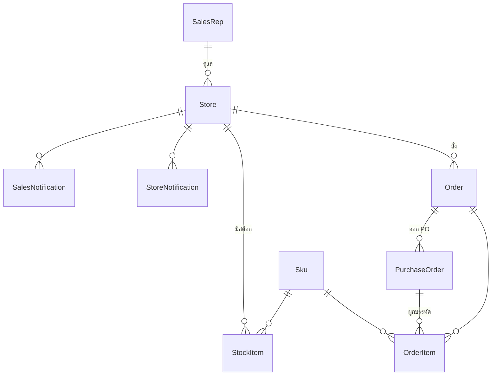

[← กลับหน้าแรก](./00-home.md)

# 07 — Data Model

**Prisma 6 + SQLite** (`prisma/dev.db`) เก็บเฉพาะสิ่งที่ระบบนี้สร้างเอง
ข้อมูล master (สินค้า ราคา โปร ยอดขาย) อยู่ใน Fabric ไม่ได้อยู่ใน DB นี้

## ความสัมพันธ์หลัก

## ตารางสำคัญ

### `Order` — ออเดอร์ที่ร้านส่ง
| ฟิลด์ | หมายเหตุ |
|---|---|
| `status` | `pending_approval` · `approved` · `rejected` — ไม่มี `cancelled` เพราะร้านยกเลิก = ลบแถวทิ้ง |
| `createdAt` | เวลาที่ร้านกดส่ง |
| `approvedAt` | เวลาที่อนุมัติ (null เมื่อถูกปฏิเสธ) |
| `decidedAt` | เวลาที่ตัดสิน **ทั้งอนุมัติและปฏิเสธ** |
| `decidedBy` | อีเมลพนักงานที่ตัดสิน |
| `rejectReason` | เหตุผลที่ปฏิเสธ |

> `decidedAt` เพิ่มทีหลัง — เดิมการปฏิเสธไม่เขียนเวลาเลย ทำให้ timeline แสดง "รอดำเนินการ" ตลอด
> ฝั่งอ่านจึง fallback เป็น `decidedAt ?? approvedAt` เพื่อให้ข้อมูลเก่ายังถูก

### `OrderItem` — บรรทัดสินค้า พร้อมสแนปช็อต

นี่คือตารางที่สำคัญที่สุด เพราะเก็บ**หลักฐาน ณ เวลาที่ร้านกดส่ง**

| กลุ่มฟิลด์ | ฟิลด์ | ทำไมต้องแช่ |
|---|---|---|
| จำนวน | `suggestedQty` `finalQty` | เทียบได้ว่าร้าน/เซลล์แก้จากที่ระบบแนะนำไปเท่าไร |
| จำนวนที่ร้านขอ | `requestedQty` | `finalQty` ตอนร้านส่ง แช่ไว้ไม่แก้อีก · `0` = พนักงานเพิ่มสินค้านี้เอง (ร้านไม่เคยสั่ง) · `null` = ออเดอร์เก่าก่อนมีฟีเจอร์ (ถือว่าไม่เคยแก้) · ใช้แยก PO-C/D และตัดสินว่าต้องรอร้านยืนยันไหม |
| รอร้านยืนยัน | `qtyIncreasePendingConfirm` | `true` เมื่อพนักงานตั้ง `finalQty > requestedQty` (รวมสินค้าที่เพิ่มเอง) · ค้างอยู่ = **อนุมัติทั้งใบไม่ได้** (422) · ลดกลับ ≤ `requestedQty` ปลดเอง |
| ปฏิเสธรายการ | `rejectedAt` `rejectReason` | บันทึกย้อนหลังเท่านั้น — ตัวที่กันไม่ให้เข้า PO คือ `finalQty=0` ตามเดิม |
| CVD | `cvdEstimate` `minDays` `maxDays` | ให้เซลล์เห็นสีธงตรงกับที่ร้านเห็น แม้ threshold จะถูกแก้ทีหลัง |
| ราคาร้าน | `unitPriceOverride` | ราคาที่ร้านขอ |
| ราคา C4 | `c4UnitPrice` `c4DiscountBaht` `c4DiscountPct` `c4NetUnitPrice` `c4PriceExpired` | ราคามาสเตอร์เปลี่ยนรายวัน |
| ธงราคา | `priceFlagged` `priceFlagReason` | ตัดสินฝั่ง server ตอนส่ง ไม่คำนวณใหม่ |
| ราคาเซลล์ | `salesPriceOverride` `salesPriceBy` `salesPriceAt` | แยกช่องจากของร้าน เพื่อไม่ทับหลักฐานว่าร้าน "ขอ" เท่าไร |
| **โปร** | `c4PromoLabel` `c4PromoKind` `c4PromoGroup` `c4PromoGroupMembers` `c4PooledQty` | แคมเปญเปลี่ยนตลอด |
| **ของแถม** | `c4FreeGoodCode` `c4FreeGoodName` `c4FreeGoodQty` `c4FreeGoodUnit` | ต้องพิสูจน์ได้ว่าร้านควรได้อะไร |
| PO | `poGroup` `purchaseOrderId` | บรรทัดนี้อยู่ PO ใบไหน |

> ⚠️ ออเดอร์ที่สร้างก่อน 31 ก.ค. 2569 ไม่มีข้อมูลโปร — ต้องแสดงเป็น `—` ไม่ใช่ "ไม่มีโปร"

### `PurchaseOrder` — ใบสั่งซื้อที่ออกจริง
| ฟิลด์ | หมายเหตุ |
|---|---|
| `poNumber` | unique |
| `groupKey` | `A`, `B`, … ตรงกับ `OrderItem.poGroup` |
| `priceKind` | `c4` (ตรงหมด) · `override` (ไม่ตรงหมด) · `mixed` |
| `itemCount` `totalQty` `totalAmount` | ยอดสรุป |
| `exportPath` | ที่อยู่ไฟล์ JSON หลักฐาน |
| `status` `statusAt` `statusBy` `statusNote` | สถานะติดตาม |
| `issuedBy` `issuedAt` | ใครออก เมื่อไร |

**สร้างตอนอนุมัติเท่านั้น** — ก่อนอนุมัติ การแบ่งกลุ่มอยู่ที่ `OrderItem.poGroup`
เพื่อไม่ให้มีแถว draft ค้างเมื่อเซลล์เปลี่ยนใจ

`status` เป็น `String` ไม่ใช่ enum โดยตั้งใจ — ค่าที่ใช้ได้อยู่ใน `lib/po/po-status.ts`
เปลี่ยน flow ได้โดยไม่ต้อง migrate

### `PoSequence` — running number
`bucket` = (คลัง, วัน) · `lastN` = ลำดับล่าสุด
**ต้อง mint ทีละใบ ห้ามขนาน** ไม่งั้นเลข PO ชนกัน

### แจ้งเตือน 2 ทิศทาง

| ตาราง | ทิศทาง | kind |
|---|---|---|
| `StoreNotification` | พนักงาน → ร้าน | `approved` `rejected` `item_rejected` `deleted` `price_changed` `qty_changed` `qty_increase_pending` `item_added_pending` `po_issued` `po_cancelled` `po_received` |
| `SalesNotification` | ร้าน → พนักงาน | `order_created` `order_cancelled` `qty_increase_confirmed` `qty_increase_rejected` `item_added_confirmed` `item_added_rejected` |

`kind` เป็น `String` — เพิ่มชนิดใหม่ไม่ต้อง migrate แต่ต้องเพิ่มใน union type
(`lib/orders/store-notify.ts` / `sales-notify.ts`) และตารางป้าย (`store-notify-display.ts` /
`sales-notifications-client.tsx`) ไม่งั้นชิปจะขึ้นเป็นชื่อ kind ดิบๆ
`StoreNotification.orderId` ใช้พาไปเปิดออเดอร์จากกระดิ่ง (`/history?order=<id>`)

ทั้งคู่เก็บ**ข้อความเป็น snapshot** ไม่ผูก FK กับ `Order` เพราะออเดอร์ที่ถูกลบก็ยังต้องแจ้งให้รู้ว่าถูกลบ

`SalesNotification` ผูกกับ `storeId` ไม่ใช่ตัวเซลล์ เพราะสิทธิ์เซลล์คำนวณจาก VDA registry ตอน query
ถ้าเก็บ `salesCode` ไว้ ข้อมูลจะเพี้ยนเมื่อมีการย้ายเขต

### ตารางอื่น

| ตาราง | หน้าที่ |
|---|---|
| `Store` `Sku` `StockItem` | เงาของ master ที่ต้องอ้างอิงด้วย FK |
| `StoreAccount` | บัญชีร้านที่มี password |
| `Admin` `AllowedSalesCode` | รายชื่อผู้มีสิทธิ์ |
| `StoreGroupThreshold` | MIN/MAX ระดับกลุ่มสินค้า |
| `StoreSkuBlock` | รายการหยุดสั่ง (มี `acknowledgedAt` ให้เซลล์รับทราบ) |
| `PromoTier` | ขั้นโปรแบบเก่า ราย SKU (โปรจริงมาจาก Fabric) |
| `SalesmanEmailAssignment` | **แอดมินกำหนดอีเมล ↔ รหัสเซลล์เอง** (`email` ตัวเล็ก, `salesmanCode` ตัวใหญ่, `active`) · unique `[email, salesmanCode]` · อีเมลที่มีแถว active = ใช้รหัสพวกนี้แทนผลอัตโนมัติจาก cross_target ทั้งหมด (`lib/auth/manual-salesman-assignments.ts`) |
| `VdaWarehouse` | **ทะเบียนคลัง VDA ↔ รหัสลูกค้า** แก้จาก `/admin/data/warehouses` · ค่าใน `.env` (`VDA_CUSTOMER_MAP`) ใช้เป็น seed/fallback เท่านั้น แถวใน DB ชนะเสมอ |

### Index ที่ใส่ไว้ตั้งใจ

SQLite ไม่สร้าง index ให้ FK อัตโนมัติ — คิวรีหลักเคยเป็น full scan ทั้งหมด

| ตาราง | Index | ใช้กับ |
|---|---|---|
| `Order` | `[storeId, createdAt]` | ประวัติของร้าน |
| `Order` | `[status, createdAt]` | badge ออเดอร์รอตรวจ (poll ทุก 60 วิ) + แดชบอร์ด |
| `PurchaseOrder` | `[status]` ฯลฯ | ตัวกรองสถานะในหน้า PO |

## Migrations

รันด้วย `npx prisma migrate dev` · ไฟล์อยู่ใน `prisma/migrations/`

| Migration | เพิ่มอะไร |
|---|---|
| `20260617022603_init` | โครงแรก |
| `20260617093224_allowed_sales_codes` | รหัสเซลล์ที่อนุญาต |
| `20260708090000_store_accounts` | บัญชีร้าน |
| `20260710024057_new_products_and_sku_blocklist` | ป้ายสินค้าใหม่ + รายการหยุดสั่ง |
| `20260710030654_normalize_sku_createdat` | จัดรูป `Sku.createdAt` |
| `20260714035025_order_item_cvd_thresholds` | แช่ MIN/MAX ลงบรรทัด |
| `20260729022223_store_sku_block_effective_to` | วันสิ้นสุดของรายการหยุดสั่ง |
| `20260729093651_order_item_price_override` | ราคาที่ร้านแก้ |
| `20260730040841_po_split_and_sales_price` | แบ่ง PO + ราคาเซลล์ |
| `20260730045109_store_notifications` | แจ้งเตือนร้าน |
| `20260731021725_sales_notifications` | แจ้งเตือนเซลล์ |
| `20260731031133_order_promo_snapshot_and_decided_at` | สแนปช็อตโปร/ของแถม + `decidedAt` |
| `20260731065557_po_status` | สถานะ PO |
| `20260826075310_vda_warehouse` | ตาราง `VdaWarehouse` |
| `20260826080500_seed_vda_warehouses` | ย้ายค่าจาก `.env` เข้าตาราง |
| `20260827085727_order_po_indexes` | index ของ `Order` / `PurchaseOrder` |
| `20260902090000_order_client_request_id` | `Order.clientRequestId` กันส่งซ้ำ |
| `20260911040440_po_erp_delivery_result` | ผลการส่ง ERP บน `PurchaseOrder` |
| `20260911085205_order_delivery_date` | `Order.deliveryDate` |
| `20260914041746_po_erp_clone` | ขอเลข PO ใหม่เมื่อ ERP ปฏิเสธ |
| `20260914043021_po_erp_failure_kind` | `erpFailureKind` |
| `20260918092659_order_item_discount_flag` | `discountFlagged` / `discountFlagReason` |
| `20260924030537_salesman_email_assignment` | ตาราง `SalesmanEmailAssignment` |
| `20260924031934_order_item_reject` | `OrderItem.rejectedAt` / `rejectReason` |
| `20260924032550_order_item_requested_qty` | `OrderItem.requestedQty` |
| `20260924063722_order_item_qty_increase_pending` | `OrderItem.qtyIncreasePendingConfirm` |

> ทุก migration ที่เพิ่มคอลัมน์เป็น **nullable หรือมีค่า default** เสมอ — ข้อมูลเดิมไม่พัง
