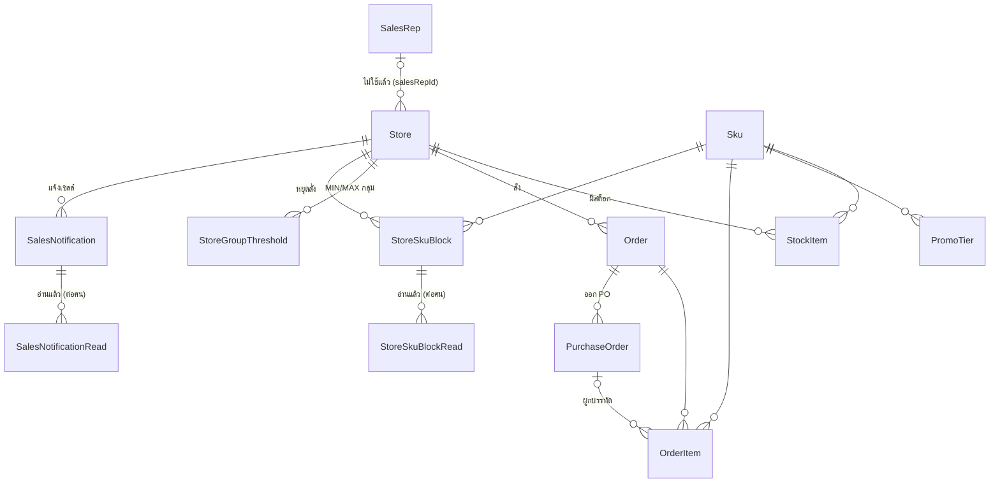

[← กลับหน้าแรก](./00-home.md)

# 07 — Data Model

**Prisma 6 + SQLite** (`prisma/schema.prisma` · ไฟล์ DB ตาม `DATABASE_URL` เช่น `prisma/dev.db`) เก็บเฉพาะสิ่งที่ระบบนี้สร้างเอง
ข้อมูล master (สินค้า ราคา โปร ยอดขาย ทะเบียน รหัสเซลล์ → VDA) อยู่ใน Fabric ไม่ได้อยู่ใน DB นี้

## ความสัมพันธ์หลัก

ตรงกับ `@relation` ใน schema ทุกเส้น (ตรวจ 29 ก.ย. 2569) — ตารางที่ไม่มีเส้นคือ**ไม่มี FK โดยตั้งใจ**

```mermaid
erDiagram
    SalesRep |o--o{ Store : "ไม่ใช้แล้ว (salesRepId)"
    Store ||--o{ StockItem : "มีสต็อก"
    Store ||--o{ Order : "สั่ง"
    Store ||--o{ StoreGroupThreshold : "MIN/MAX กลุ่ม"
    Store ||--o{ StoreSkuBlock : "หยุดสั่ง"
    Store ||--o{ SalesNotification : "แจ้งเซลล์"
    Sku ||--o{ StockItem : ""
    Sku ||--o{ PromoTier : ""
    Sku ||--o{ OrderItem : ""
    Sku ||--o{ StoreSkuBlock : ""
    Order ||--o{ OrderItem : ""
    Order ||--o{ PurchaseOrder : "ออก PO"
    PurchaseOrder |o--o{ OrderItem : "ผูกบรรทัด"
    SalesNotification ||--o{ SalesNotificationRead : "อ่านแล้ว (ต่อคน)"
    StoreSkuBlock ||--o{ StoreSkuBlockRead : "อ่านแล้ว (ต่อคน)"
```

ไม่มี FK (เก็บค่าเป็นข้อความเฉย ๆ): `StoreNotification` (`storeId`, `orderId`) · `SalesNotification.orderId` ·
`StoreAccount` (`vdaCode`) · `SalesmanEmailAssignment` · `AdminAuditLog` · `Admin` · `VdaWarehouse` · `PoSequence` · `AllowedSalesCode`

การลบแบบ cascade: ลบ `Store` → `StockItem` `StoreGroupThreshold` `StoreSkuBlock` `SalesNotification` หายตาม
(แต่ `Order` **ไม่** cascade) · ลบ `Order` → `OrderItem` + `PurchaseOrder` หายตาม · ลบ `Sku` → `StockItem` `PromoTier` `StoreSkuBlock`
หายตาม (`OrderItem` ไม่ cascade) · ลบแจ้งเตือน/รายการหยุดสั่ง → แถว `*Read` หายตาม

> ตาราง `SalesRep` กับคอลัมน์ `Store.salesRepId` ยังอยู่ใน schema แต่**ไม่ได้ใช้แล้ว** (29 ก.ย. 2569) —
> ใครดูแลร้านไหนตัดสินจาก รหัสเซลล์ → VDA ตามทะเบียน VDA อย่างเดียว · คงไว้เพื่อไม่ต้อง migrate
> ลบได้ในรอบที่มี migration อื่นอยู่แล้ว (ไม่มีโค้ดเขียน/อ่านค่านี้แล้ว นอกจากหน้าเปิดดูตารางดิบ)

## ตารางทั้งหมด

| ตาราง | หน้าที่ | คีย์ / constraint / index |
|---|---|---|
| `Store` | เงาของร้าน/คลัง VDA ที่ต้องอ้างอิงด้วย FK (สร้างเมื่อร้านล็อกอินครั้งแรก — `ensurePrismaStore`) | `code` unique (ตัวเล็ก เช่น `vda1`) |
| `Sku` | เงาของสินค้าที่ต้องอ้างอิงด้วย FK · `createdAt` ใช้ติดป้าย "สินค้าใหม่" | `code` unique |
| `StockItem` | สต็อก/ยอดขายเฉลี่ย/MIN-MAX ราย SKU ต่อร้าน (ใช้ตอนไม่มีข้อมูล Fabric) | PK `[storeId, skuId]` · `minDays` 7 · `maxDays` 15 |
| `PromoTier` | ขั้นโปรแบบเก่า ราย SKU (โปรจริงมาจาก Fabric) | — |
| `Order` | ออเดอร์ที่ร้านส่ง (ดูด้านล่าง) | `clientRequestId` unique · index `[storeId, createdAt]` `[status, createdAt]` |
| `OrderItem` | บรรทัดสินค้า + สแนปช็อต (ดูด้านล่าง) | index `[orderId]` `[purchaseOrderId]` |
| `PurchaseOrder` | ใบสั่งซื้อที่ออกจริง (ดูด้านล่าง) | `poNumber` unique · unique `[orderId, groupKey]` · index `[orderId]` `[issuedAt]` `[status]` |
| `PoSequence` | running number ของเลข PO | PK `bucket` |
| `StoreNotification` | แจ้งเตือน พนักงาน → ร้าน | index `[storeId, readAt]` `[storeId, createdAt]` |
| `SalesNotification` | แจ้งเตือน ร้าน → พนักงาน | index `[storeId, acknowledgedAt]` `[createdAt]` |
| `SalesNotificationRead` | เซลล์คนไหนอ่านแจ้งเตือนไหนแล้ว | PK `[notificationId, email]` · index `[email]` |
| `StoreSkuBlock` | รายการหยุดสั่ง/เอาออกจากคลัง ต่อร้านต่อ SKU (`effectiveFrom` / `effectiveTo` null = ถาวร) | unique `[storeId, skuId]` · index `[storeId]` |
| `StoreSkuBlockRead` | เซลล์คนไหนรับทราบรายการหยุดสั่งไหนแล้ว | PK `[blockId, email]` · index `[email]` |
| `StoreGroupThreshold` | MIN/MAX ระดับกลุ่มสินค้า (Section) ต่อร้าน — ค่าตั้งต้นก่อน override รายตัว | unique `[storeId, section]` |
| `StoreAccount` | บัญชีร้านค้า (ดูด้านล่าง) | `email` unique · index `[vdaCode]` |
| `Admin` | Admin ที่ creator เพิ่ม + แถว bootstrap จาก `ADMIN_EMAILS` (`fromEnv=true` ลบจากหน้าเว็บไม่ได้) | PK `email` |
| `SalesmanEmailAssignment` | **แหล่งเดียวของ "อีเมลนี้คือเซลล์รหัสไหน"** (ดูด้านล่าง) | unique `[email, salesmanCode]` · index `[email]` `[salesmanCode]` |
| `VdaWarehouse` | ทะเบียนคลัง VDA ↔ รหัสลูกค้า (`customerCodes` คั่นด้วย `\|`) แก้จาก `/admin/data/warehouses` · ค่าใน `.env` (`VDA_CUSTOMER_MAP`) ใช้เป็น seed/fallback เท่านั้น แถวใน DB ชนะเสมอ | PK `code` |
| `AdminAuditLog` | บันทึกการทำงานของผู้ดูแล (ดูด้านล่าง) | index `[createdAt]` `[actorEmail]` `[action]` |
| `AllowedSalesCode` | ตารางเดิมจาก migration ที่ 2 — **ไม่มีโค้ดใช้แล้ว** (เหลือแค่ให้เปิดดูใน data explorer) | PK `code` |
| `SalesRep` | **ไม่ใช้แล้ว** — ดูกล่องด้านบน | `email` unique |

## ตารางสำคัญ

### `Order` — ออเดอร์ที่ร้านส่ง
| ฟิลด์ | หมายเหตุ |
|---|---|
| `status` | `pending_approval` · `approved` · `rejected` — ไม่มี `cancelled` เพราะร้านยกเลิก = ลบแถวทิ้ง |
| `clientRequestId` | รหัสต่อดราฟต์จาก client — unique กันส่งซ้ำแม้สอง request ชนกันพอดี · null = ใบเก่า |
| `deliveryDate` | วันที่ร้านอยากรับของ เก็บเป็นเที่ยงคืนเวลาไทย (ERP รับเป็น DATE) · null = ใบก่อน 11 ก.ย. 69 หรือ client ไม่ส่งมา → PO ยังส่ง ERP ไม่ได้ |
| `createdAt` | เวลาที่ร้านกดส่ง |
| `approvedAt` | เวลาที่อนุมัติ (null เมื่อถูกปฏิเสธ) |
| `decidedAt` | เวลาที่ตัดสิน **ทั้งอนุมัติและปฏิเสธ** |
| `decidedBy` | อีเมลพนักงานที่ตัดสิน |
| `rejectReason` | เหตุผลที่ปฏิเสธ |

> `decidedAt` เพิ่มทีหลัง — เดิมการปฏิเสธไม่เขียนเวลาเลย ทำให้ timeline แสดง "รอดำเนินการ" ตลอด
> ฝั่งอ่านจึง fallback เป็น `decidedAt ?? approvedAt` เพื่อให้ข้อมูลเก่ายังถูก

### `OrderItem` — บรรทัดสินค้า พร้อมสแนปช็อต

นี่คือตารางที่สำคัญที่สุด เพราะเก็บ**หลักฐาน ณ เวลาที่ร้านกดส่ง**

| กลุ่มฟิลด์ | ฟิลด์ | ทำไมต้องแช่ |
|---|---|---|
| จำนวน | `suggestedQty` `finalQty` | เทียบได้ว่าร้าน/เซลล์แก้จากที่ระบบแนะนำไปเท่าไร |
| จำนวนที่ร้านขอ | `requestedQty` | `finalQty` ตอนร้านส่ง แช่ไว้ไม่แก้อีก · `0` = พนักงานเพิ่มสินค้านี้เอง (ร้านไม่เคยสั่ง) · `null` = ออเดอร์เก่าก่อนมีฟีเจอร์ (ถือว่าไม่เคยแก้) · ใช้แยก PO-C/D และตัดสินว่าต้องรอร้านยืนยันไหม |
| จำนวนที่ร้านตกลงล่าสุด | `agreedQty` | ตอนส่ง = `finalQty` · ร้านยืนยันการเพิ่ม = `finalQty` ณ ตอนนั้น · เป็นเส้นฐานของ "เพิ่มเกินต้องรอยืนยัน" และจำนวนที่คืนเมื่อร้านปฏิเสธ · `null` (แถวเก่า) → ใช้ `requestedQty` · สินค้าที่พนักงานเพิ่ม = `0` จนร้านยืนยัน |
| รอร้านยืนยัน | `qtyIncreasePendingConfirm` | `true` เมื่อพนักงานตั้ง `finalQty > agreedQty` (รวมสินค้าที่เพิ่มเอง) · ค้างอยู่ = **อนุมัติไม่ได้** (422) · ลดกลับ ≤ `agreedQty` ปลดเอง · ปฏิเสธรายการ (`rejectItem`) ล้างธงนี้ด้วย |
| ปฏิเสธรายการ | `rejectedAt` `rejectReason` | บันทึกย้อนหลังเท่านั้น — ตัวที่กันไม่ให้เข้า PO คือ `finalQty=0` ตามเดิม |
| CVD | `cvdEstimate` `minDays` `maxDays` | ให้เซลล์เห็นสีธงตรงกับที่ร้านเห็น แม้ threshold จะถูกแก้ทีหลัง |
| ราคาร้าน | `unitPriceOverride` | ราคาที่ร้านขอ — **ร้านแก้ราคาไม่ได้แล้ว** ใบใหม่เป็น null เสมอ (คงคอลัมน์ไว้ให้ใบเก่า) |
| ราคา C4 | `c4UnitPrice` `c4DiscountBaht` `c4DiscountPct` `c4NetUnitPrice` `c4PriceExpired` | ราคามาสเตอร์เปลี่ยนรายวัน |
| ธงราคา | `priceFlagged` `priceFlagReason` (`mismatch` \| `no_baseline` \| `unverified`) | ตัดสินฝั่ง server ตอนส่ง ไม่คำนวณใหม่ |
| ธงส่วนลด | `discountFlagged` `discountFlagReason` (`group_mismatch` \| `pooled_qty_mismatch`) | สมาชิกกลุ่มโปรเดียวกันได้ส่วนลด/ยอดรวมไม่ตรงกัน — เตือนเฉย ๆ ไม่บล็อก |
| ราคาเซลล์ | `salesPriceOverride` `salesPriceBy` `salesPriceAt` | แยกช่องจากของร้าน เพื่อไม่ทับหลักฐานว่าร้าน "ขอ" เท่าไร |
| **โปร** | `c4PromoLabel` `c4PromoKind` `c4PromoGroup` `c4PromoGroupMembers` `c4PooledQty` | แคมเปญเปลี่ยนตลอด |
| **ของแถม** | `c4FreeGoodCode` `c4FreeGoodName` `c4FreeGoodQty` `c4FreeGoodUnit` | ต้องพิสูจน์ได้ว่าร้านควรได้อะไร (โปรกลุ่มซ้ำทุกบรรทัด — dedupe ตอนอ่าน) |
| PO | `poGroup` (`A`–`Z`, null = ยังไม่จัด) `purchaseOrderId` | บรรทัดนี้อยู่ PO ใบไหน |

> ⚠️ ออเดอร์ที่สร้างก่อน 31 ก.ค. 2569 ไม่มีข้อมูลโปร — ต้องแสดงเป็น `—` ไม่ใช่ "ไม่มีโปร"

### `PurchaseOrder` — ใบสั่งซื้อที่ออกจริง
| ฟิลด์ | หมายเหตุ |
|---|---|
| `poNumber` | unique |
| `groupKey` | `A`, `B`, … ตรงกับ `OrderItem.poGroup` · unique คู่กับ `orderId` |
| `priceKind` | `c4` (ตรงหมด) · `override` (ไม่ตรงหมด) · `mixed` |
| `itemCount` `totalQty` `totalAmount` | ยอดสรุป |
| `exportPath` | ที่อยู่ไฟล์ JSON หลักฐาน (หายได้ — `?format=view` ประกอบใหม่จาก DB) |
| `status` `statusAt` `statusBy` `statusNote` | สถานะติดตาม (ดูตารางด้านล่าง) |
| `issuedBy` `issuedAt` | ใครออก เมื่อไร |
| `erpSentAt` | ส่งเข้า ERP สำเร็จเมื่อไร — ประทับด้วย compare-and-set บน `{ poNumber, erpSentAt: null }` กันส่งซ้ำ |
| `erpAttemptedAt` | พยายามส่งครั้งล่าสุด (รวมครั้งที่ล้ม) |
| `erpError` | ข้อความดิบจากปลายทางครั้งล่าสุดที่ล้ม (ตัดที่ 1000 ตัว) · ส่งสำเร็จแล้วไม่ล้าง |
| `erpFailureKind` | ชนิดความล้มเหลว (`ErpSendFailure` ใน `lib/po/erp-delivery.ts`) · ขอเลขใหม่ได้เฉพาะ `rejected` · `timeout`/`network`/null = ไม่รู้ว่าเข้าไปหรือยัง |
| `erpInsertedRows` | จำนวนแถวที่ปลายทางบอกว่า insert ไป |
| `erpReplacesPoNumber` · `replacedByPoNumber` · `erpVoidedAt` | คู่ใบเดิม ↔ ใบที่ขอเลขใหม่ (`clone-for-erp`) — ใบเดิมไม่ถูกลบ |

**สร้างตอนอนุมัติเท่านั้น** — ก่อนอนุมัติ การแบ่งกลุ่มอยู่ที่ `OrderItem.poGroup`
เพื่อไม่ให้มีแถว draft ค้างเมื่อเซลล์เปลี่ยนใจ

#### ค่า `PurchaseOrder.status` (`lib/po/po-status.ts` → `PO_STATUSES`)

`status` เป็น `String` ไม่ใช่ enum โดยตั้งใจ — เปลี่ยน flow ได้โดยไม่ต้อง migrate · ค่าที่ไม่รู้จักแสดงเป็น "ไม่ทราบสถานะ" ไม่พัง

| ค่า | ป้าย | ใครตั้ง |
|---|---|---|
| `issued` | ออกแล้ว | ค่าเริ่มต้นตอนอนุมัติ (`DEFAULT_PO_STATUS`) |
| `sent` | ส่งซัพแล้ว | คนเลือกเอง |
| `sending_erp` | กำลังส่ง ERP | **ระบบเท่านั้น** (send-erp) |
| `sent_erp` | เข้า ERP แล้ว (ยังไม่แปลว่าออกบิล) | **ระบบเท่านั้น** (send-erp / erp-resolve `in_erp`) |
| `erp_unknown` | ERP ไม่ตอบ — รอตรวจ | **ระบบเท่านั้น** — ส่งแล้วไม่รู้ผล (timeout/เน็ตหลุด/HTTP error) · ห้ามส่งซ้ำ แก้ด้วย `erp-resolve` |
| `received` | รับของแล้ว | คนเลือกเอง — ค่าเดียวที่ตั้งได้หลังใบอาจอยู่ใน ERP แล้ว (`PO_STATUSES_AFTER_ERP`) |
| `cancelled` | ยกเลิก | คนเลือกเอง (ห้ามถ้าใบอาจอยู่ใน ERP แล้ว) |

`SYSTEM_ONLY_PO_STATUSES` = `sending_erp` `sent_erp` `erp_unknown` — PATCH ด้วยมือได้ 400 ·
"อาจอยู่ใน ERP แล้ว" ตัดสินด้วย `poMayBeInErp()` (ส่งสำเร็จ หรือเคยลองส่งแล้วผลไม่ใช่ `rejected`)

### `PoSequence` — running number
`bucket` = (คลัง, วัน) · `lastN` = ลำดับล่าสุด
**ต้อง mint ทีละใบ ห้ามขนาน** ไม่งั้นเลข PO ชนกัน

### `StoreAccount` — บัญชีร้านค้า
| ฟิลด์ | หมายเหตุ |
|---|---|
| `email` | unique ตัวเล็ก |
| `vdaCode` | คลังที่ผูก (ไม่มี FK) |
| `status` | `pending` · `approved` · `rejected` |
| `passwordHash` | `scrypt$<salt>$<hash>` · null = ยังไม่ตั้ง/ถูกรีเซ็ต |
| `mustSetPassword` | ต้องตั้งรหัสด้วยรหัสตั้งค่าก่อน login |
| `canManageMinMax` | แก้ MIN/MAX เองได้ (อ่านค่าปัจจุบันทุก request) |
| `resetRequestedAt` | ร้านกดขอรีเซ็ต — ขึ้นตัวเลขบนเมนูแอดมิน |
| `setupCodeHash` `setupCodeExpiresAt` | รหัสตั้งค่าครั้งแรก — เก็บแค่ sha256 · ใช้ครั้งเดียว · หมดอายุ 72 ชม. |
| `sessionVersion` | เพิ่มทุกครั้งที่สิทธิ์/รหัสผ่านเปลี่ยน — session ร้านที่เลขไม่ตรงใช้ไม่ได้ทันที (ดู [03](./03-authentication.md)) |

### `SalesmanEmailAssignment` — อีเมล ↔ รหัสเซลล์
- `email` ตัวเล็กเสมอ · `salesmanCode` ตัวใหญ่เสมอ (`S091`) · `active` · `createdBy` = อีเมลแอดมินที่ตั้ง
- **แหล่งเดียว** ของรหัสเซลล์ของอีเมล ตั้งแต่ 28 ก.ย. 2569 (`getManualSalesmanCodes` ใน `lib/auth/manual-salesman-assignments.ts`)
  — ไม่มีการจับคู่อัตโนมัติจาก `cross_salesman` / `cross_target` แล้ว · ไม่มีแถว active = อีเมลนี้ไม่ใช่เซลล์
- รหัส → VDA ยังมาจากทะเบียน VDA (Fabric `cross_target` / `VDA_SALESMAN_MAP`) ไม่ได้เก็บในตารางนี้
- แก้ที่ `/admin/system/vda-sales` · เอาอีเมลออก = ลบแถวจริง (ไม่ได้ตั้ง `active=false`)

### แจ้งเตือน 2 ทิศทาง

ชนิดทั้งหมดตรงกับ union type ในโค้ด · ป้ายภาษาไทยอยู่ที่ `lib/orders/store-notify-display.ts` / `lib/orders/sales-notify-display.ts`

| ตาราง | ทิศทาง | `kind` (`lib/orders/store-notify.ts` / `sales-notify.ts`) |
|---|---|---|
| `StoreNotification` | พนักงาน → ร้าน | `approved` `rejected` `item_rejected` `deleted` `price_changed` `qty_changed` `qty_increase_pending` `item_added_pending` `order_split` `item_cleared` `po_issued` `po_cancelled` `po_received` `po_reopened` `po_replaced` `po_sent_erp` |
| `SalesNotification` | ร้าน → พนักงาน | `order_created` `order_cancelled` `qty_increase_confirmed` `qty_increase_rejected` `item_added_confirmed` `item_added_rejected` `erp_failed` `sku_unblocked` |

- `po_issued` **ไม่ได้สร้างใหม่แล้ว** (29 ก.ย. 2569 — อนุมัติ + ออก PO รวมเป็น `approved` อันเดียว) คงไว้ให้แถวเก่าแสดงผลได้
- `order_split` = อนุมัติบางรายการ `orderId` ชี้ไปใบใหม่ที่รออนุมัติ · `po_replaced` → `poNumbers` = [เลขเดิม, เลขใหม่]
- `erp_failed` = ส่ง PO เข้า ERP ไม่สำเร็จ (`lib/po/erp-notify.ts`) `orderId` = ออเดอร์ต้นทาง · `sku_unblocked` = ยกเลิกหยุดสั่ง (`orderId` = null)
- `StoreNotification.orderId` ใช้พาไปเปิดออเดอร์จากกระดิ่ง (`/history?order=<id>`) · `poNumbers` คั่นด้วย comma
- `kind` เป็น `String` — เพิ่มชนิดใหม่ไม่ต้อง migrate แต่ต้องเพิ่มทั้งใน union type **และ**ตารางป้ายของ `*-notify-display.ts`
  ไม่งั้นชิปจะขึ้นเป็นชื่อ kind ดิบๆ

สถานะ "อ่านแล้ว" ของฝั่งเซลล์เก็บ**ต่อผู้ใช้**ใน `SalesNotificationRead` / `StoreSkuBlockRead` (ตั้งแต่ 28 ก.ย. 2569) ·
`acknowledgedAt` บนแถวเดิมยังนับว่าอ่านแล้วสำหรับทุกคน (ข้อมูลก่อนหน้านั้น) · ฝั่งร้านใช้ `StoreNotification.readAt` (ต่อร้าน)

ทั้งคู่เก็บ**ข้อความเป็น snapshot** ไม่ผูก FK กับ `Order` เพราะออเดอร์ที่ถูกลบก็ยังต้องแจ้งให้รู้ว่าถูกลบ
(ร้านยกเลิกออเดอร์เอง → route ลบแจ้งเตือนของใบนั้นเองในทรานแซกชันเดียวกัน)

`SalesNotification` ผูกกับ `storeId` ไม่ใช่ตัวเซลล์ เพราะสิทธิ์เซลล์คำนวณจาก VDA registry ตอน query
ถ้าเก็บ `salesCode` ไว้ ข้อมูลจะเพี้ยนเมื่อมีการย้ายเขต

### บันทึกการทำงาน `AdminAuditLog` (29 ก.ย. 2569)

ใคร (`actorEmail` + `actorRole` = `creator` / `admin` / `sales`) ทำอะไร (`action`) กับอะไร (`target` ≤ 500 ตัว) เมื่อไหร่ ·
`detail` เป็น JSON สั้น ๆ (แต่ละค่าตัดที่ 300 ตัว / 30 รายการ · ทั้งก้อนตัดที่ 2,000 ตัวอักษร) · ไม่ผูก FK เพราะต้องจดการลบด้วย ·
**ไม่เก็บรหัสตั้งค่า/รหัสผ่าน** · ผู้เรียกส่ง raw session — มุมมองทดสอบจดชื่อคนที่กดจริง ·
`recordAudit()` (`lib/admin/audit-log.ts`) ไม่โยน error และเรียกหลังทำสำเร็จเท่านั้น — จดล้มไม่ทำให้งานล้ม ·
ดูได้ที่ «ระบบ › บันทึกการทำงาน» (creator เท่านั้น)

`action` ทั้งหมด (`AUDIT_ACTION_LABELS` ใน `lib/admin/audit-log-labels.ts` — เพิ่ม action ใหม่ต้องเพิ่มป้ายตรงนี้):

| action | ป้าย | จดจาก |
|---|---|---|
| `store.create` | เพิ่มบัญชีร้านค้า | `POST /api/admin/store-accounts` |
| `store.approve` · `store.reject` · `store.setVda` · `store.setCanManage` · `store.resetPassword` · `store.setEmail` | อนุมัติ / ปฏิเสธ / เปลี่ยน VDA / เปลี่ยนสิทธิ์ MIN/MAX / รีเซ็ตรหัสผ่าน / เปลี่ยนอีเมล | `PATCH /api/admin/store-accounts` |
| `store.delete` | ลบบัญชีร้านค้า | `DELETE /api/admin/store-accounts` |
| `admin.add` · `admin.remove` | เพิ่ม / ลบผู้ดูแล | `/api/admin/admins` |
| `salesCode.assign` · `salesCode.unassign` | ผูก / ยกเลิกการผูกรหัสเซลล์ | `/api/admin/salesman-assignments` |
| `warehouses.save` | แก้ทะเบียนคลัง VDA | `PUT /api/admin/vda-warehouses` |
| `thresholds.update` | แก้ MIN/MAX ของร้าน | `PATCH /api/admin/store-thresholds` |
| `blocklist.add` · `blocklist.remove` | ตั้ง / ยกเลิกหยุดสั่งสินค้า | `/api/admin/store-blocklist` |
| `masters.refresh` | สั่งดึงข้อมูล Fabric | `POST /api/admin/refresh-masters` |
| `orders.delete` | ลบออเดอร์ (ใครก็ตามที่ลบ รวมลบผ่าน PO) | `lib/orders/delete-orders.ts` |
| `po.erpResolve` | แก้สถานะ ERP ไม่ตอบ | `POST …/[poNumber]/erp-resolve` |

## Index ที่ใส่ไว้ตั้งใจ

SQLite ไม่สร้าง index ให้ FK อัตโนมัติ — คิวรีหลักเคยเป็น full scan ทั้งหมด

| ตาราง | Index | ใช้กับ |
|---|---|---|
| `Order` | `[storeId, createdAt]` | ประวัติของร้าน |
| `Order` | `[status, createdAt]` | badge ออเดอร์รอตรวจ (poll ทุก 60 วิ) + แดชบอร์ด |
| `PurchaseOrder` | `[issuedAt]` · `[status]` · `[orderId]` | ตัวกรอง/เรียง/แบ่งหน้าในหน้า PO |
| `OrderItem` | `[orderId]` · `[purchaseOrderId]` | โหลดบรรทัดของออเดอร์ / PO |
| `SalesNotificationRead` · `StoreSkuBlockRead` | `[email]` | "ฉันอ่านอะไรไปแล้ว" |
| `SalesmanEmailAssignment` | `[email]` | `revalidateManualCodes` query ทุก request ของเซลล์ |
| `AdminAuditLog` | `[createdAt]` · `[actorEmail]` · `[action]` | หน้าบันทึกการทำงาน (เรียงใหม่สุด / กรองตามคน / ประเภท) |

## Migrations

สร้างด้วย `npm run db:migrate` (= `prisma migrate dev`) · ไฟล์อยู่ใน `prisma/migrations/` ·
ตอน container start รัน `prisma migrate deploy` (`docker/entrypoint.sh`) — **แก้ schema ต้องมีไฟล์ migration จริงเสมอ** (`db push` เฉย ๆ = deploy แล้ว 500)

| # | Migration | เพิ่มอะไร |
|---|---|---|
| 1 | `20260617022603_init` | โครงแรก (`Store` `Sku` `StockItem` `PromoTier` `Order` `OrderItem` `SalesRep`) |
| 2 | `20260617093224_allowed_sales_codes` | ตาราง `AllowedSalesCode` (ไม่ใช้แล้ว) |
| 3 | `20260708090000_store_accounts` | `StoreAccount` + `StoreGroupThreshold` + สร้าง `Admin` ถ้ายังไม่มี |
| 4 | `20260710024057_new_products_and_sku_blocklist` | `StoreSkuBlock` + `Sku.createdAt` (ของเดิม backfill เป็นปี 2020 = ไม่ใหม่) |
| 5 | `20260710030654_normalize_sku_createdat` | แปลง `Sku.createdAt` ที่ backfill เป็น TEXT ให้เป็นรูปแบบ ms ของ Prisma |
| 6 | `20260714035025_order_item_cvd_thresholds` | แช่ `minDays` / `maxDays` ลงบรรทัด |
| 7 | `20260729022223_store_sku_block_effective_to` | `StoreSkuBlock.effectiveTo` วันสิ้นสุดหยุดสั่ง |
| 8 | `20260729093651_order_item_price_override` | ราคาที่ร้านแก้ + สแนปช็อตราคา C4 + ธงราคา |
| 9 | `20260730040841_po_split_and_sales_price` | `PurchaseOrder` + `PoSequence` + ราคาเซลล์ + `OrderItem.poGroup` |
| 10 | `20260730045109_store_notifications` | `StoreNotification` |
| 11 | `20260731021725_sales_notifications` | `SalesNotification` |
| 12 | `20260731031133_order_promo_snapshot_and_decided_at` | สแนปช็อตโปร/ของแถม + `Order.decidedAt` |
| 13 | `20260731065557_po_status` | `PurchaseOrder.status` / `statusAt` / `statusBy` / `statusNote` |
| 14 | `20260826075310_vda_warehouse` | ตาราง `VdaWarehouse` |
| 15 | `20260826080500_seed_vda_warehouses` | data migration — ทะเบียนคลังชุดที่ใช้จริง (`INSERT OR IGNORE` ไม่ทับที่แอดมินแก้) |
| 16 | `20260827085727_order_po_indexes` | index ของ `Order` / `PurchaseOrder` |
| 17 | `20260902090000_order_client_request_id` | `Order.clientRequestId` (unique) กันส่งซ้ำ |
| 18 | `20260911040440_po_erp_delivery_result` | `erpSentAt` / `erpAttemptedAt` / `erpError` / `erpInsertedRows` |
| 19 | `20260911085205_order_delivery_date` | `Order.deliveryDate` |
| 20 | `20260914041746_po_erp_clone` | `erpReplacesPoNumber` / `replacedByPoNumber` / `erpVoidedAt` (ขอเลข PO ใหม่เมื่อ ERP ปฏิเสธ) |
| 21 | `20260914043021_po_erp_failure_kind` | `PurchaseOrder.erpFailureKind` |
| 22 | `20260918092659_order_item_discount_flag` | `discountFlagged` / `discountFlagReason` |
| 23 | `20260924030537_salesman_email_assignment` | ตาราง `SalesmanEmailAssignment` |
| 24 | `20260924031934_order_item_reject` | `OrderItem.rejectedAt` / `rejectReason` |
| 25 | `20260924032550_order_item_requested_qty` | `OrderItem.requestedQty` |
| 26 | `20260924063722_order_item_qty_increase_pending` | `OrderItem.qtyIncreasePendingConfirm` |
| 27 | `20260925030451_order_item_agreed_qty` | `OrderItem.agreedQty` |
| 28 | `20260928065258_store_setup_code` | `StoreAccount.setupCodeHash` / `setupCodeExpiresAt` / `sessionVersion` |
| 29 | `20260928114759_per_user_notification_reads` | `SalesNotificationRead` + `StoreSkuBlockRead` (อ่านแล้วต่อผู้ใช้) |
| 30 | `20260929021223_admin_audit_log` | ตาราง `AdminAuditLog` |

> ทุก migration ที่เพิ่มคอลัมน์เป็น **nullable หรือมีค่า default** เสมอ — ข้อมูลเดิมไม่พัง
